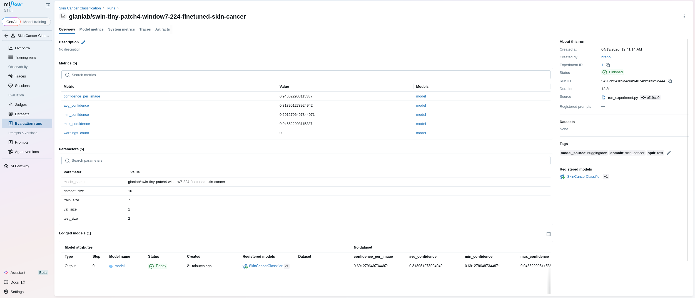

# Relatório de Entrega — Projeto Individual 2: Sistema de ML com MLflow

> **Aluno(a):** Breno Queiroz Lima
> **Matrícula:** 211063069
> **Data de entrega:** 15/04/2026

---

## 1. Resumo do Projeto

Este projeto implementa um sistema de machine learning end-to-end para classificação de câncer de pele, com foco em engenharia de ML Systems. O problema escolhido é clinicamente relevante: o diagnóstico precoce de lesões dermatológicas malignas pode salvar vidas. O modelo reutilizado é o `gianlab/swin-tiny-patch4-window7-224-finetuned-skin-cancer`, um Swin Transformer fine-tuned disponível no Hugging Face. O pipeline contempla ingestão automática de imagens via API do ISIC Archive, particionamento do dataset, pré-processamento, inferência com guardrails de confiança, rastreamento completo via MLflow (parâmetros, métricas, artefatos e Model Registry) e disponibilização para inferência via endpoint REST. Todo o pipeline foi estruturado de forma modular e reprodutível, com tracking URI configurado em banco SQLite local.

---

## 2. Escolha do Problema, Dataset e Modelo

### 2.1 Problema

Classificação automática de imagens dermatoscópicas para detecção de câncer de pele. O câncer de pele é o tipo mais comum de câncer no mundo; a detecção precoce aumenta significativamente as chances de cura. O uso de modelos de visão computacional para triagem é uma aplicação real e de alto impacto, tornando os guardrails e a observabilidade especialmente críticos neste domínio.

### 2.2 Dataset

| Item                | Descrição                                                                  |
| ------------------- | -------------------------------------------------------------------------- |
| **Nome do dataset** | ISIC Archive                                                               |
| **Fonte**           | [https://api.isic-archive.com/api/v2](https://api.isic-archive.com/api/v2) |
| **Tamanho**         | 10 imagens (configurável via parâmetro `limit`)                            |
| **Tipo de dado**    | Imagens JPEG de lesões dermatoscópicas                                     |

### 2.3 Modelo pré-treinado

| Item                       | Descrição                                                    |
| -------------------------- | ------------------------------------------------------------ |
| **Nome do modelo**         | `gianlab/swin-tiny-patch4-window7-224-finetuned-skin-cancer` |
| **Fonte**                  | Hugging Face Hub                                             |
| **Tipo**                   | Classificação de imagens (Swin Transformer)                  |
| **Fine-tuning realizado?** | Não — modelo utilizado diretamente para inferência           |

---

## 3. Pré-processamento

As seguintes decisões de pré-processamento foram aplicadas:

- **Validação do download:** verificação de HTTP status (`raise_for_status`) antes de salvar o arquivo, evitando persistir respostas de erro (HTML) como imagem
- **Skip de re-download:** arquivos já existentes em `data/raw/` são ignorados, garantindo idempotência na ingestão
- **Filtragem por extensão:** apenas arquivos `.jpg`, `.jpeg` e `.png` são incluídos no dataset, descartando arquivos espúrios
- **Particionamento reprodutível:** divisão 70/15/15 (treino/validação/teste) com `random.seed(42)`, garantindo reprodutibilidade entre execuções
- **Conversão RGB:** todas as imagens são convertidas para modo RGB via PIL, normalizando imagens em escala de cinza ou com canal alpha
- **Resize e normalização:** realizados pelo `AutoImageProcessor` do Hugging Face (resize para 224×224, normalização ImageNet), sem necessidade de implementação manual

---

## 4. Estrutura do Pipeline

```
Ingestão (ISIC API)
    ↓
Validação e Download (ISICClient)
    ↓
Particionamento 70/15/15 (SkinCancerDataset)
    ↓
Carregamento do modelo pré-treinado (ModelService)
    ↓
Pré-processamento por imagem (AutoImageProcessor)
    ↓
Inferência no split de teste
    ↓
Guardrails (validação de confiança)
    ↓
Registro no MLflow (params, métricas, artefatos, Model Registry)
    ↓
Deploy via MLflow serve (endpoint REST)
```

### Estrutura do código

```
projeto-2/
├── src/
│   ├── data/
│   │   ├── ingestion.py       # ISICClient: download de imagens via API
│   │   └── dataset.py         # SkinCancerDataset: particionamento e acesso
│   ├── model/
│   │   └── model_service.py   # ModelService: load, preprocess, inferência, guardrails
│   └── pipeline/
│       └── run_experiment.py  # Orquestração do pipeline e integração MLflow
├── data/
│   └── raw/                   # Imagens baixadas do ISIC Archive
├── templates/
│   └── relatorio-entrega.md
├── mlflow.db                  # Banco SQLite do MLflow tracking
├── mlruns/                    # Artefatos do MLflow
└── README.md
```

---

## 5. Uso do MLflow

### 5.1 Rastreamento de experimentos

O MLflow foi configurado com tracking URI apontando para banco SQLite local (`sqlite:///mlflow.db`), sob o experimento `"Skin Cancer Classification"`.

- **Parâmetros registrados:**
  - `model_name` — identificador do modelo no Hugging Face
  - `dataset_size` — total de imagens no dataset
  - `train_size`, `val_size`, `test_size` — tamanho de cada split

- **Métricas registradas:**
  - `avg_confidence` — confiança média nas predições do split de teste
  - `min_confidence` / `max_confidence` — distribuição da confiança
  - `warnings_count` — número de predições que acionaram guardrails
  - `confidence_per_image` (por step) — confiança individual por imagem, permitindo gráfico temporal na UI

- **Artefatos salvos:**
  - `sample_predictions.json` — primeiras 10 predições com label, confiança e probabilidades
  - Modelo PyTorch completo (`artifact_path="model"`)

- **Tags do run:**
  - `model_source: huggingface`
  - `domain: skin_cancer`
  - `split: test`

### 5.2 Versionamento e registro

O modelo é registrado automaticamente no **MLflow Model Registry** com o nome `SkinCancerClassifier` via `registered_model_name` no `mlflow.pytorch.log_model()`. A cada execução do pipeline, uma nova versão é criada e rastreada. A tag `task: image-classification` é adicionada ao modelo registrado via `MlflowClient`.

### 5.3 Evidências




Para visualizar os experimentos na UI do MLflow:

```bash
mlflow ui --backend-store-uri sqlite:///mlflow.db
```

Acesse `http://localhost:5000` para inspecionar runs, comparar métricas e visualizar o modelo registrado no Model Registry.

---

## 6. Deploy

- **Método de deploy:** MLflow serve — carrega o modelo registrado no Model Registry e expõe endpoint REST

- **Como executar inferência:**

```bash
# 1. Identificar a versão do modelo registrado
mlflow models list -n SkinCancerClassifier

# 2. Servir o modelo via endpoint REST (porta 5001)
mlflow models serve \
  --model-uri "models:/SkinCancerClassifier/latest" \
  --port 5001 \
  --no-conda

# 3. Enviar requisição de inferência
curl -X POST http://localhost:5001/invocations \
  -H "Content-Type: application/json" \
  -d '{"inputs": [...]}'
```

---

## 7. Guardrails e Restrições de Uso

Os seguintes mecanismos foram implementados em `ModelService._apply_guardrails()`:

- **Baixa confiança:** predições com `confidence < 0.6` geram aviso explícito (`"Baixa confiança na predição"`), sinalizando ao usuário que o resultado não deve ser usado como diagnóstico definitivo
- **Validação de imagem na ingestão:** imagens corrompidas ou não-imagem (ex: HTML) são rejeitadas antes de chegar ao modelo, evitando erros silenciosos
- **Domínio sensível declarado:** o sistema trata classificação de câncer de pele, domínio de saúde onde falsos positivos/negativos têm impacto clínico — o campo `warnings` retornado em cada predição permite que sistemas downstream tomem decisões informadas

---

## 8. Observabilidade

- **Comparação de execuções:** cada run registrado no MLflow contém params, métricas e tags padronizados, permitindo comparação direta entre diferentes modelos ou configurações na UI (`mlflow ui`)
- **Análise de métricas:** a métrica `confidence_per_image` logada por step permite visualizar a distribuição de confiança ao longo do conjunto de teste como gráfico na UI do MLflow
- **Capacidade de inspeção:** o artefato `sample_predictions.json` registra label, confiança e vetor de probabilidades completo por predição; o modelo versionado no Model Registry pode ser recarregado para re-inspeção a qualquer momento

---

## 9. Limitações e Riscos

- **Dataset pequeno:** o pipeline baixa 10 imagens por padrão — insuficiente para avaliação estatisticamente significativa; aumentar `limit` na ingestão para produção
- **Sem ground truth:** não há labels reais associadas às imagens baixadas, impossibilitando cálculo de acurácia ou F1 — a confiança do modelo é usada como proxy
- **Dependência de API externa:** a ingestão depende da disponibilidade do ISIC Archive; falhas na API interrompem o pipeline
- **Guardrail de domínio limitado:** não há verificação se a imagem enviada é de fato dermatoscópica — qualquer imagem é aceita pelo modelo
- **Risco clínico:** o sistema não deve ser usado como ferramenta diagnóstica sem validação médica; predições com `warnings` devem ser obrigatoriamente revisadas por profissional de saúde

---

## 10. Como executar

```bash
# 1. Criar e ativar ambiente virtual
python -m venv venv
source venv/bin/activate

# 2. Instalar dependências
pip install -r requirements.txt

# 3. Executar o pipeline completo (ingestão + avaliação + registro MLflow)
python src/pipeline/run_experiment.py

# 4. Visualizar experimentos na UI do MLflow
mlflow ui --backend-store-uri sqlite:///mlflow.db
# Acesse http://localhost:5000

# 5. Servir o modelo para inferência
mlflow models serve \
  --model-uri "models:/SkinCancerClassifier/latest" \
  --port 5001 \
  --no-conda
```

---

## 11. Referências

1. ISIC Archive API — [https://api.isic-archive.com](https://api.isic-archive.com)
2. Hugging Face Model — [gianlab/swin-tiny-patch4-window7-224-finetuned-skin-cancer](https://huggingface.co/gianlab/swin-tiny-patch4-window7-224-finetuned-skin-cancer)
3. MLflow Documentation — [https://mlflow.org/docs/latest/index.html](https://mlflow.org/docs/latest/index.html)
4. Liu, Z. et al. (2021). Swin Transformer: Hierarchical Vision Transformer using Shifted Windows. ICCV 2021.
5. Codella, N. et al. (2018). Skin Lesion Analysis Toward Melanoma Detection. ISIC 2018 Challenge.

---

## 12. Checklist de entrega

- [x] Código-fonte completo
- [x] Pipeline funcional
- [x] Configuração do MLflow
- [x] Evidências de execução (logs, prints ou UI)
- [x] Modelo registrado
- [x] Script ou endpoint de inferência
- [x] Relatório de entrega preenchido
- [x] Pull Request aberto
