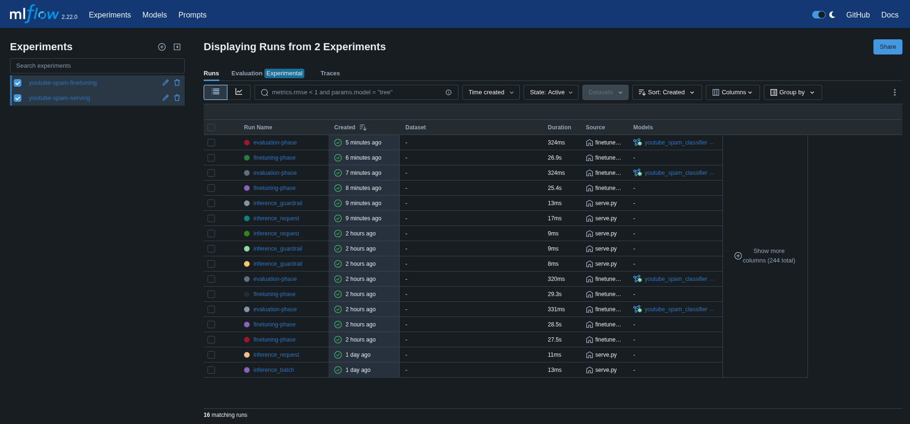
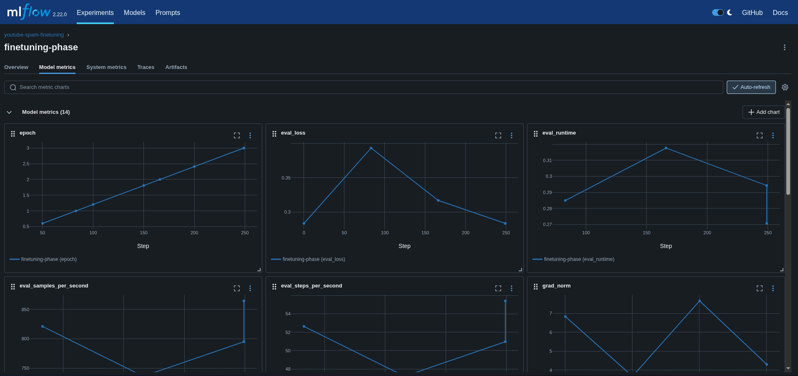
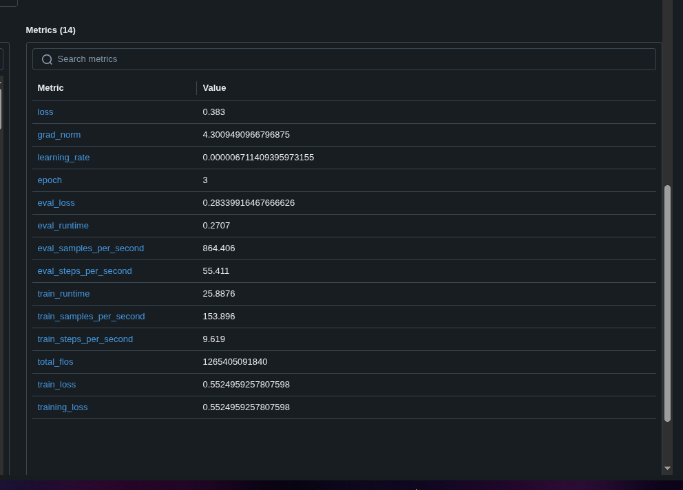
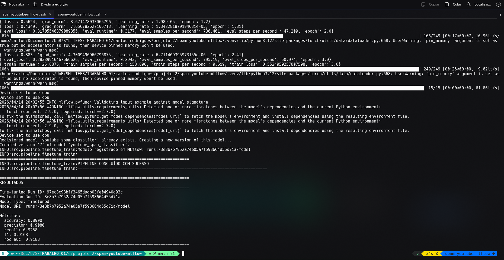
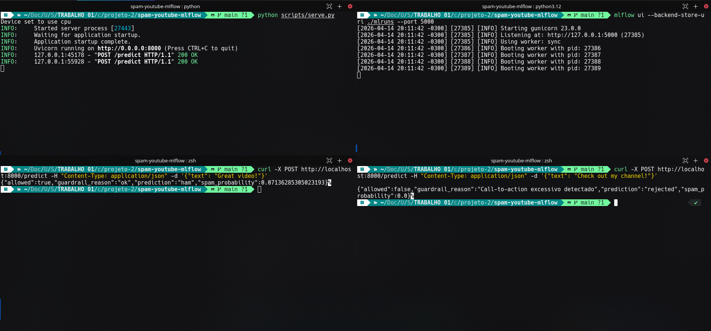

# Relatório de Entrega - Projeto 2: Sistema de ML com MLflow

> **Aluno:** Carlos Eduardo Rodrigues
> **Matrícula:** 221031265 
<br>
> **Aluna:** Patrícia Helena Macedo da Silva
> **Matrícula:** 221037993
<br>
> **Data de entrega:** 15/04/2026

---

## 1. Resumo do Projeto

Este projeto implementa um sistema de machine learning end-to-end para classificação de comentários de YouTube em spam ou não-spam, com foco em engenharia de ML Systems. O pipeline inclui ingestão de múltiplos arquivos CSV, validação e limpeza de dados, particionamento temporal, avaliação de modelo, registro no MLflow e serviço de inferência via API FastAPI.  

Foi reutilizado o modelo pré-treinado `mrm8488/bert-tiny-finetuned-sms-spam-detection` (Hugging Face), com **fine-tuning** nos dados de comentários do YouTube antes da avaliação e do registro no MLflow.  

O sistema registra parâmetros, métricas e artefatos no MLflow, além de versões de modelo no Model Registry. Também implementa guardrails para bloquear entradas fora de escopo e observabilidade de inferência (latência, taxa de rejeição/aceitação e origem do modelo servido).

---

## 2. Escolha do Problema, Dataset e Modelo

### 2.1 Problema

Detecção automática de spam em comentários de YouTube.  
Esse problema é relevante para moderação de conteúdo, redução de abuso em plataformas sociais e melhoria da qualidade das interações.

### 2.2 Dataset

| Item | Descrição |
|------|-----------|
| **Nome do dataset** | YouTube Spam Collection |
| **Fonte** | [UCI Machine Learning Repository](https://archive.ics.uci.edu/dataset/380/youtube+spam+collection) |
| **Tamanho** | 159.7KB |
| **Tipo de dado** | Arquivos csv com texto curto, com rótulo binário (`class`: 0=ham, 1=spam) |


### 2.3 Modelo pré-treinado

| Item | Descrição |
|------|-----------|
| **Nome do modelo** | `mrm8488/bert-tiny-finetuned-sms-spam-detection` |
| **Fonte** | Hugging Face |
| **Tipo**  | NLP para classificação de texto binária |
| **Fine-tuning realizado?** | Sim |

---

## 3. Pré-processamento

As principais decisões de pré-processamento foram:

- Leitura e concatenação de múltiplos CSVs com padronização de nomes de colunas em minúsculo.
- Validação de schema mínimo (`comment_id`, `author`, `date`, `content`, `class`).
- Tratamento de qualidade:
  - remoção de textos vazios;
  - coerção de rótulos para numérico;
  - filtro de rótulos válidos (`0` e `1`);
  - deduplicação por `comment_id` + `content`;
  - geração de relatório de qualidade (proporção de classes, datas ausentes, duplicatas).
- Particionamento temporal (`train`/`test`) com `test_size=0.2`.

---

## 4. Estrutura do Pipeline

Fluxo implementado:

```text
Ingestão -> Qualidade/Pré-processamento -> Split temporal -> Carregamento do modelo
-> Fine-tuning -> Avaliação -> Registro no MLflow -> Registro no Model Registry
-> Deploy FastAPI para inferência -> Monitoramento de serving no MLflow
```

### Estrutura do código

```text
spam-youtube-mlflow/
├── .gitignore
├── .env.example
├── README.md
├── requirements.txt
├── data/                  
│   └── Youtube01-Psy.csv
│   └── Youtube02-KatyPerry.csv
│   └── Youtube03-LMFAO.csv
│   └── Youtube04-Eminem.csv
│   └── Youtube05-Shakira.csv
├── docs/
│   ├── relatorio-entrega.md
│   └── imgs/ # Evidências
├── src/
│   ├── api/
│   │   ├── __init__.py
│   │   └── app.py
│   ├── data/
│   │   ├── __init__.py
│   │   └── ingestion.py
│   ├── model/
│   │   ├── __init__.py
│   │   ├── classifier.py
│   │   └── finetuning.py
│   ├── pipeline/
│   │   ├── __init__.py
│   │   ├── evaluation.py
│   │   ├── finetune_train.py
│   │   ├── mlflow_model.py
│   │   └── monitoring.py
│   ├── preprocessing/
│   │   ├── __init__.py
│   │   └── guardrails.py
│   └── config.py
├── scripts/
│   ├── finetune.py
│   ├── serve.py
│   └── monitor.py
├── models/                
├── artifacts/
├── mlruns/   
└── docs/model_artifacts.md
```

---

## 5. Uso do MLflow

### 5.1 Rastreamento de experimentos

- **Parâmetros registrados:** modelo base, threshold, tamanhos de split, hiperparâmetros de fine-tuning, indicadores de qualidade de dados.
- **Métricas registradas:** `accuracy`, `precision`, `recall`, `f1`, `roc_auc`, `training_loss`, `eval_loss`; no serving: `latency_ms`, `accepted_ratio`, `rejected_ratio`, `avg_spam_probability`.
- **Artefatos salvos:** predições em CSV, resumo da execução em JSON, relatório de qualidade dos dados, artefatos do modelo pyfunc (MLmodel, requirements, input example).

### 5.2 Versionamento e registro

**Fluxo de registro:**
- Durante a etapa 3 (avaliação), o modelo fine-tuned é encapsulado como um artefato pyfunc (`SpamClassifierPyfuncModel`) e registrado no MLflow Model Registry com nome `youtube_spam_classifier`.
- O encapsulamento pyfunc integra automaticamente a lógica de guardrails, permitindo que predições respeitam todas as restrições de segurança.
- O modelo registrado inclui: assinatura de entrada/saída (`signature`), exemplo de entrada (`input_example`), dependências (`pip_requirements`).
- Cada run de fine-tuning + avaliação gera uma nova versão no Registry, com rastreamento automático de parâmetros, métricas e artefatos.

**Carregamento no serving:**
- A API FastAPI (`src/api/app.py`) carrega o modelo via variável de ambiente `SERVING_MODEL_URI` (ex: `models:/youtube_spam_classifier/5`).
- Se o modelo estiver disponível no Registry, é carregado como pyfunc MLflow via `mlflow.pyfunc.load_model()`, capturando metadados de origem caso falhe, a API carrega automaticamente o modelo base do Hugging Face, garantindo disponibilidade.
- Cada requisição registra no MLflow: parâmetros de origem do modelo, latência, predição e resultado do guardrail. Isso possibilita monitoramento de qual versão do modelo está servindo em produção e detecção de mudanças de origem.

### 5.3 Evidências







---

## 6. Deploy

- **Método de deploy:** API REST com FastAPI (`scripts/serve.py` -> `src/api/app.py`).

- **Como executar inferência:**

```bash
# 1) Ambiente e configuração
python -m venv .venv
source .venv/bin/activate
pip install -r requirements.txt
cp .env.example .env

# 2) Servir API
python scripts/serve.py

# 3) Teste de saúde
curl http://localhost:8000/health

# 4) Predição
curl -X POST http://localhost:8000/predict \
  -H "Content-Type: application/json" \
  -d '{"content": "subscribe to my channel now"}'

# 5) Abrir UI do MLflow
mlflow ui --backend-store-uri ./mlruns --port 5000
```



---

## 7. Guardrails e Restrições de Uso

O sistema implementa guardrails em múltiplas camadas para evitar uso indevido e detectar padrões de spam:

### Guardrails
1. **Conteúdo ausente** - Recusa valores nulos
2. **Texto muito curto** - Mínimo de 3 caracteres
3. **Texto muito longo** - Máximo de 1000 caracteres (limite de segurança)
4. **Sem caracteres alfabéticos** - Rejeita textos puramente numéricos/símbolos
5. **Predominância de links** - Recusa quando >80% dos tokens são URLs
6. **Indicadores de spam** - Detecta keywords de money-making, ofertas, etc.
   - Exemplos: "make money", "earn money", "cash now", "limited time"
7. **Repetição excessiva** - Rejeita padrões como "heyyyy!!!!" ou palavras repetidas >40%
8. **Caps lock excessivo** - Recusa quando >70% das letras estão em maiúsculas
9. **Emojis excessivos** - Limita a ≤15% do texto
10. **Call-to-action excessivo** - Limita CTA keywords a ≤20% dos tokens
    - Detecta: "subscribe", "check out", "like", "follow", "visit my", "my channel"

Exemplo de comportamento:
```bash
# REJEITADO
"subscribe subscribe SUBSCRIBE Check out my channel NOW!!!"

# ACEITO
"Great video, really loved the ending!"
```

Exemplo:
```bash
curl -X POST "http://127.0.0.1:8000/predict" \
  -H "Content-Type: application/json" \
  -d '{"content":"Check out my channel and subscribe"}'
```

Resposta:
```json
{
  "allowed":false,
  "guardrail_reason":"Call-to-action excessivo detectado","prediction":"rejected",
  "spam_probability":0.0
}
```

---

## 8. Observabilidade

Configuração de monitoramento:

### Comparação de execuções

- **Rastreamento binário:** o pipeline registra **2 runs por ciclo de treinamento**:
  - `finetuning-phase`: etapa de adaptação do modelo base aos dados de YouTube (treino + validação interna), registra `training_loss`, `eval_loss` e parâmetros de hiperparâmetros.
  - `evaluation-phase`: etapa de avaliação no conjunto de teste, registra métricas de performance final.
- **Acesso via MLflow Client:** a função `summarize_recent_runs()` em `src/pipeline/monitoring.py` busca runs por experimento using `MlflowClient.search_runs()`, ordenando por `start_time DESC` para análise temporal.
- **Comparação na UI:** a UI do MLflow (http://localhost:5000) permite visualizar lado-a-lado métricas, parâmetros e artefatos de diferentes runs, facilitando análise de progressão e tuning de hiperparâmetros.

### Análise de métricas

**Métricas de treinamento/avaliação** (`MLFLOW_EXPERIMENT_FINETUNING`):
- `training_loss`, `eval_loss`: convergência durante fine-tuning
- `accuracy`, `precision`, `recall`, `f1`, `roc_auc`: performance no conjunto de teste após adaptação
- Parâmetros contextuais: `base_model`, `num_epochs`, `batch_size`, `learning_rate`, `train_samples`, `test_size`, razão de classes, missing dates

**Métricas de serving** (`MLFLOW_EXPERIMENT_SERVING`):
- `latency_ms`: tempo total de processamento da requisição (validação + inferência)
- `spam_probability`: score de spam para cada predição aceita
- `allowed`: boolean indicando se guardrails bloquearam a requisição
- `model_source`: origem do modelo ("mlflow_registry" ou "huggingface_fallback")
- `model_ref`: URI ou identificador específico do modelo servido (permite rastrear qual versão produziu a predição)


### Capacidade de inspeção

**Artefatos registrados por run:**
- `test_predictions_finetuned.csv`: dataframe com `comment_id`, conteúdo, rótulo verdadeiro, `spam_probability`, predição final
- `run_summary_finetuned.json`: resumo estruturado (run_id, finetune_run_id, métricas calculadas, tamanho do dataset, metadata)
- `data_quality_report_finetuned.json`: proporção de classes (ham/spam), contagem de datas ausentes, duplicatas detectadas
- Artefatos de modelo: diretório `model/` contendo `MLmodel` (specification), `requirements.txt` (dependências), `input_example` (entrada padrão para validação)

O **script de monitoramento** (`scripts/monitor.py`) exibe os últimos 5 runs de fine-tuning e serving e calcula métricas agregadas das últimas 20 requisições de serving

Isso permite:
- **Diagnóstico pós-deploy:** debugar por que um modelo teve latência alta, quais requisiçõies foram rejeitadas, qual versão de modelo gerou um erro
- **Análise de qualidade:** validar distribuição de dados, detectar data drift comparando quality reports entre runs
- **Auditoria:** rastrear todas as predições feitas em produção, origem do modelo, tempo de resposta

---

## 9. Limitações e Riscos

- Guardrails heurísticos podem gerar falsos positivos/negativos em casos ambíguos.
- O modelo base é originalmente otimizado para SMS spam, exigindo adaptação para domínio de comentários.
- Multilíngue: Modelo treinado em inglês

---

## 10. Como executar

```bash
# 1) Entrar no projeto
cd carlos-rodrigues/projeto-2/spam-youtube-mlflow

# 2) Criar/ativar ambiente e instalar dependências
python -m venv .venv
source .venv/bin/activate
pip install -r requirements.txt

# 3) Configurar variáveis de ambiente
cp .env.example .env

# 4) Rodar pipeline (fine-tuning + avaliação + registro)
python scripts/finetune.py

# 5) Subir API de inferência
python scripts/serve.py

# 6) Monitorar runs recentes
python scripts/monitor.py

# 7) Abrir UI do MLflow
mlflow ui --backend-store-uri ./mlruns --port 5000
```

---

## 11. Referências

1. [MLflow Documentation](https://mlflow.org/docs/latest/index.html)
2. [Hugging Face Model - mrm8488/bert-tiny-finetuned-sms-spam-detection](https://huggingface.co/mrm8488/bert-tiny-finetuned-sms-spam-detection)
3. [UCI YouTube Spam Collection Dataset](https://archive.ics.uci.edu/ml/datasets/YouTube+Spam+Collection)

---

## 12. Checklist de entrega

- [x] Código-fonte completo
- [x] Pipeline funcional
- [x] Configuração do MLflow
- [x] Evidências de execução (logs, prints ou UI)
- [x] Modelo registrado
- [x] Script ou endpoint de inferência
- [x] Relatório de entrega preenchido
- [x] Pull Request aberto
