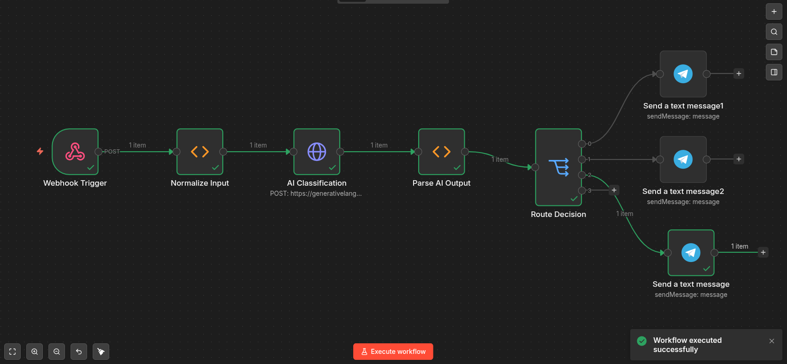
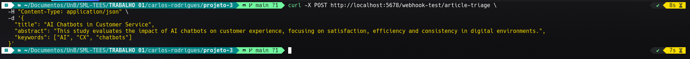
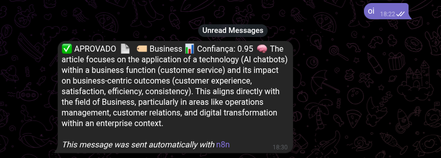
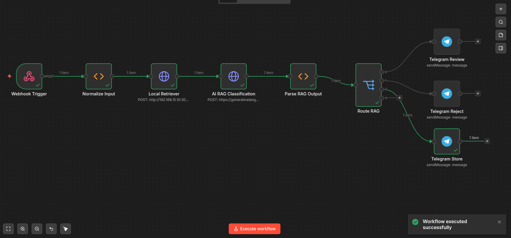
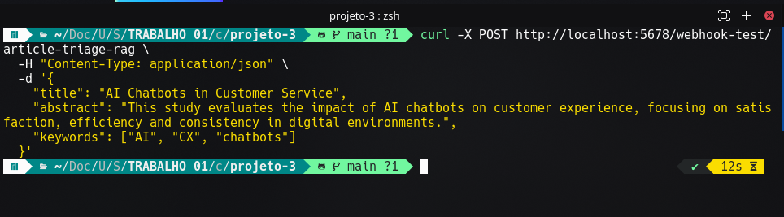
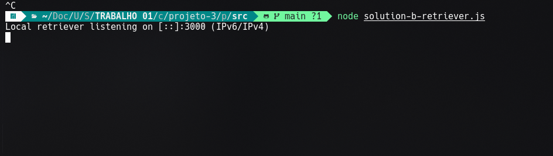
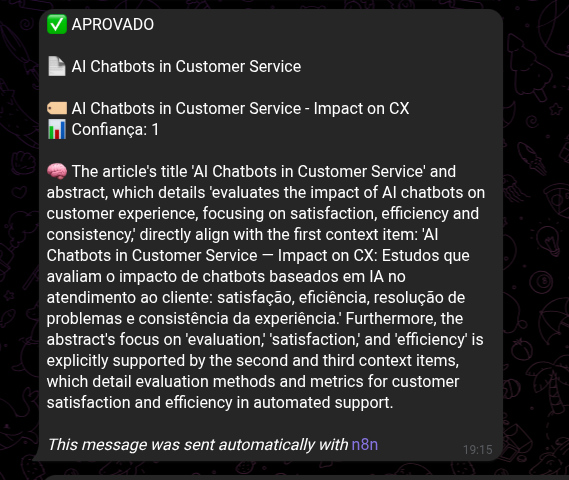
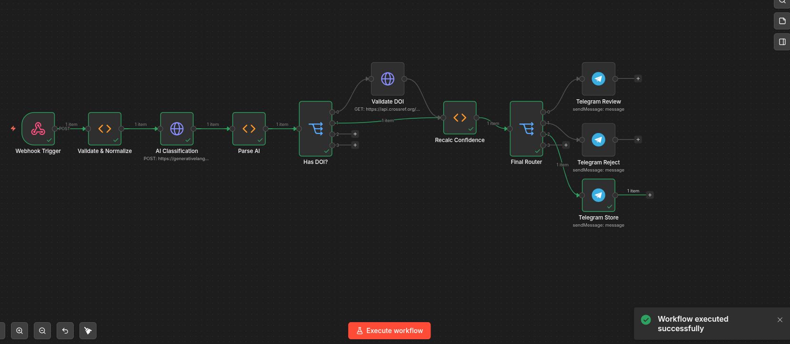
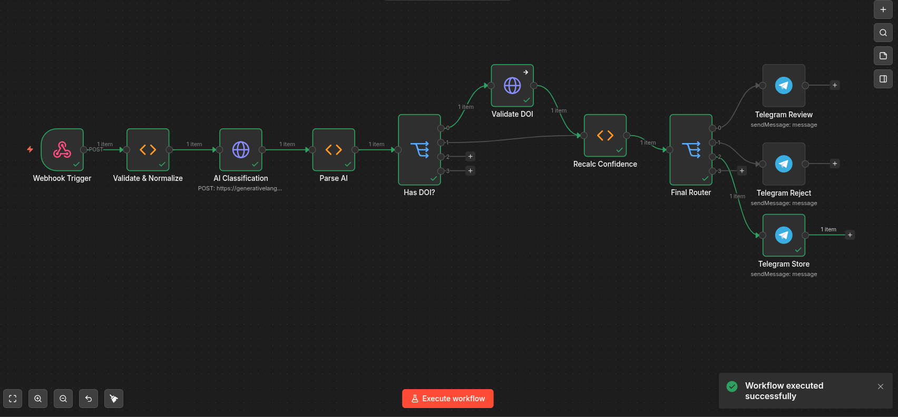
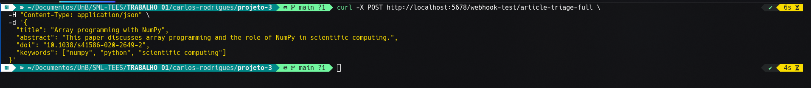

# Evidence - Evidências de Funcionamento

Registros visuais da execução das três soluções de curadoria automática.

---

## Solution A - Prompt Simples

---

## Solution B - RAG com Retriever Local

---

## Solution C - Multi-etapas com Validação DOI (Chosen)

