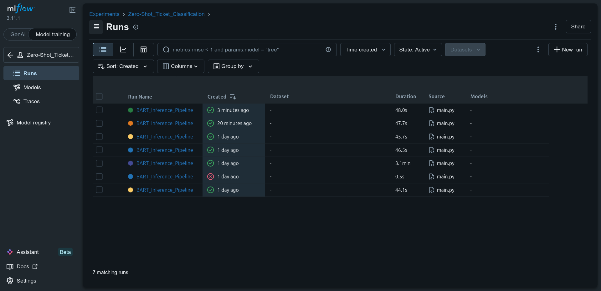
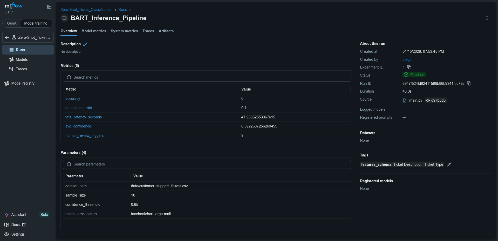
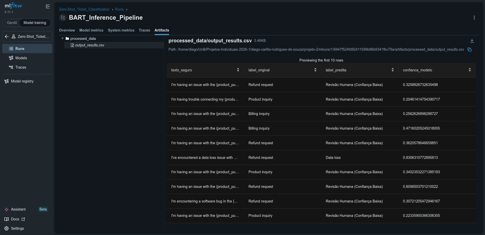

# Relatório de Entrega — Projeto Individual 2: Sistema de ML com MLflow

> **Alunos:** <br>
    Diego Carlito Rodrigues de Souza **Matrícula:** 221007690<br>
    Marcos Antonio Teles de Castilhos **Matrícula:** 221008300 <br>
> **Data de entrega:** 15/04/2026

---

## 1. Resumo do Projeto

O projeto consiste na automação da triagem e roteamento de chamados de suporte ao cliente. O foco arquitetural do sistema não foi o treinamento de um modelo, mas a construção de um pipeline de Machine Learning resiliente e auditável. Utilizamos a abordagem Zero-Shot Classification com o modelo facebook/bart-large-mnli, permitindo a categorização de textos sem a necessidade de fine-tuning prévio.

O principal resultado obtido foi um sistema de inferência modular, protegido por Guardrails rígidos: um filtro pré-inferência baseado em Regex para ofuscação de dados sensíveis (PII) e um filtro pós-inferência que encaminha predições de baixa confiança para revisão humana. Todo o ciclo de vida, incluindo o trade-off entre a taxa de automação e a acurácia, além da latência operacional, é rastreado via MLflow.

---

## 2. Escolha do Problema, Dataset e Modelo

### 2.1 Problema

O roteamento manual de tickets de suporte em centrais de atendimento gera gargalos operacionais e quebra de SLAs. A classificação automatizada resolve a latência de triagem, porém, a adoção de IA neste domínio apresenta riscos de vazamento de dados de clientes e falhas de direcionamento por "falsa confiança" do modelo. O sistema ataca este problema automatizando as predições óbvias e retendo analistas humanos apenas para casos ambíguos.

A resolução do problema se mostrou relevante também porque ambos os alunos envolvidos estagiam em TI em ambientes que possuem triagem de chamados. A execução deste projeto será relevante para aplicarmos em um ambiente real.

### 2.2 Dataset

| Item | Descrição |
|------|-----------|
| **Nome do dataset** | Customer Support Ticket Dataset |
| **Fonte** | Kaggle (Autor: suraj520) |
| **Tamanho** | 8.470 linhas (com suporte a amostragem dinâmica no pipeline) |
| **Tipo de dado** | Tabular contendo texto livre (Strings) |

### 2.3 Modelo pré-treinado

| Item | Descrição |
|------|-----------|
| **Nome do modelo** | facebook/bart-large-mnli |
| **Fonte** | Hugging Face Transformers |
| **Tipo** (ex: classificação, NLP) | NLP (Inferência de Linguagem Natural / Zero-Shot |
| **Fine-tuning realizado?** | Não |

---

## 3. Pré-processamento

O módulo de ingestão (src/ingest.py) assegura a tipagem rigorosa e a sanitização estrutural antes de os dados alcançarem o modelo:

- Isolamento de Features: Descarte de colunas operacionais do CSV original, retendo exclusivamente Ticket Description (Input) e Ticket Type (Gabarito para validação).

- Tratamento de Nulos (Drop NaN): Remoção de instâncias com descrições nulas para evitar falhas silenciosas na conversão de tensores do Hugging Face.

- Amostragem Configurável: Implementação de um limitador de amostras (sample_size) para controle de latência durante o desenvolvimento e testes do pipeline.

---

## 4. Estrutura do Pipeline

O fluxo de dados foi desenhado para manter o modelo encapsulado e cego para a infraestrutura circundante.
```
Ingestão (Drop NaN) → Guardrail 1 (Mascaramento PII) → Inferência (Zero-Shot) → Guardrail 2 (Threshold de Confiança) → Avaliação (Acurácia) → Registro MLflow
```

### Estrutura do código

```
sistema-classificacao-tickets/
├── src/
│   ├── __init__.py
│   ├── ingest.py           # Sanitização estrutural 
│   ├── guardrails.py       # Regex e Limites de Confiança 
│   ├── model_engine.py     # Inicialização BART 
│   ├── evaluation.py       # Cálculo de Acurácia e Automação
│   └── main.py             # Orquestrador do Pipeline
├── data/
│   └── customer_support_tickets.csv
├── logs/
│   └── output_results.csv  # Artefato final de inferência
├── mlruns/                 # Diretório tracking MLflow
├── requirements.txt
└── README.md
```

---

## 5. Uso do MLflow

### 5.1 Rastreamento de experimentos

O MLflow foi invocado no módulo orquestrador para registrar a integridade de cada ciclo de inferência:

- **Parâmetros registrados:** dataset_path, sample_size, model_architecture e, criticamente, o confidence_threshold (variável de negócio que define o rigor da aprovação automática).

- **Métricas registradas:**
total_latency_seconds (custo computacional), human_review_triggers (acionamento de guardrails), accuracy (acurácia técnica sobre o gabarito original) e automation_rate (percentual de tickets resolvidos sem intervenção humana).

- **Artefatos salvos:**
O arquivo output_results.csv, contendo o rastreamento linha a linha da predição contra o input original mascarado.

### 5.2 Versionamento e registro

Como a arquitetura não envolve treinamento de pesos customizados, a reproducibilidade não depende de um .pkl ou .pt salvo no registry. O versionamento garante a integridade anotando o nome do modelo público (bart-large-mnli) como parâmetro, e arquivando os dados processados na pasta de artefatos da run respectiva do experimento "Zero-Shot_Ticket_Classification".

### 5.3 Evidências

Abaixo estão as evidências do rastreamento do pipeline na interface do MLflow, comprovando a orquestração bem-sucedida do MLOps e o funcionamento das travas de segurança.

**1. Visão Geral do Experimento e Histórico de Execuções (Runs):**


**2. Rastreabilidade de Parâmetros de Negócio e Métricas de Performance:**


**3. Versionamento de Artefatos (Comprovação visual do Guardrail de Confiança em ação):**


---

## 6. Deploy

O sistema não opera como um servidor síncrono para usuários finais, mas sim como um pipeline de inferência em lote (batch inference) acionado via linha de comando. A arquitetura viabiliza que rotinas de CRON executem o sistema periodicamente contra novos arquivos CSV extraídos do banco de dados do suporte.

- **Método de deploy:** Script orquestrador local encapsulado com dependências congeladas no requirements.txt.
- **Como executar inferência:**

```bash
python src/main.py
```

---

## 7. Guardrails e Restrições de Uso

O módulo de segurança (src/guardrails.py) isola os riscos inerentes a modelos estocásticos em domínio de atendimento:

- **Prevenção de Vazamento (PII Masking):** Antes da inferência, o texto é higienizado via Expressões Regulares (re). Padrões numéricos longos (11 a 16 dígitos, como CPFs e Cartões de Crédito) e formatos de e-mail são substituídos por [DADO SENSÍVEL OCULTADO], impedindo que o LLM processe dados sigilosos.<br>
- **Prevenção contra Falsa Confiança:** O modelo Zero-Shot é forçado a classificar, mesmo textos ambíguos. O sistema implementa uma trava determinística na saída: predições cujo score de probabilidade seja inferior a 0.65 são descartadas, e o ticket tem seu label alterado compulsoriamente para Revisão Humana.<br>
- **Prevenção Estrutural:** O modelo rejeita execuções caso o contrato de dados não seja cumprido na etapa de ingestão (falta de colunas essenciais), lançando um ValueError e paralisando o pipeline antes de consumir recursos computacionais.

---

## 8. Observabilidade

O monitoramento explora as métricas consolidadas pelo módulo evaluation.py:

- **Comparação de execuções:**
Utilizando a UI do MLflow, é possível cruzar o parâmetro confidence_threshold contra as métricas geradas. Isso permite à área de negócios decidir se prefere uma alta taxa de resolução automática com menor precisão, ou uma precisão clínica repassando mais chamados para os atendentes.
- **Análise de métricas:**
O tracking de latência (total_latency_seconds) evidencia gargalos no processamento do modelo, crucial para escalabilidade de Transformers grandes.
- **Capacidade de inspeção:**
O arquivo CSV registrado como artefato no MLflow permite auditoria reversa (ex: verificar porque o ticket X foi classificado erroneamente como Hardware Issue).

---

## 9. Limitações e Riscos

- **Latência do Zero-Shot:** Ao contrário de modelos TF-IDF com Regressão Logística ou XGBoost, arquiteturas transformer-based pesadas (como o BART) possuem alto tempo de inferência, encarecendo o processamento de grandes volumes (big data).

- **Vulnerabilidade de Regex:** A ofuscação de PII por Expressão Regular é frágil contra tentativas deliberadas de evasão (ex: cliente digita o CPF como "um dois três, quatrocinco...").

- **Dissonância Semântica:** A acurácia depende de como os rótulos (labels) escolhidos dialogam semanticamente com o vocabulário base do modelo; sarcasmo ou dialetos muito regionais nos tickets podem degradar as métricas bruscamente.

---

## 10. Como executar

_Instruções passo a passo para rodar o projeto:_

```bash
# 1. Instalar dependências
pip install -r requirements.txt

# 2. Executar o orquestrador do pipeline (ingestão, segurança, inferência e métricas)
python src/main.py

# 3. Iniciar o servidor de tracking e abrir a interface (http://127.0.0.1:5000)
mlflow ui --backend-store-uri sqlite:///mlflow.db

```

---

## 11. Referências

1. HUGGING FACE. Zero-Shot Classification with Transformers. Disponível em: https://huggingface.co/tasks/zero-shot-classification.
2. MLFLOW. MLflow Tracking Documentation. Disponível em: https://mlflow.org/docs/latest/ml/tracking/.
3. KAGGLE. Customer Support Ticket Dataset. Disponível em: https://www.kaggle.com/datasets/suraj520/customer-support-ticket-dataset.

---

## 12. Checklist de entrega

- [X] Código-fonte completo

- [X] Pipeline funcional

- [X] Configuração do MLflow

- [X] Evidências de execução (logs, prints ou UI)

- [X] Modelo registrado

- [X] Script ou endpoint de inferência

- [X] Relatório de entrega preenchido

- [X] Pull Request aberto
