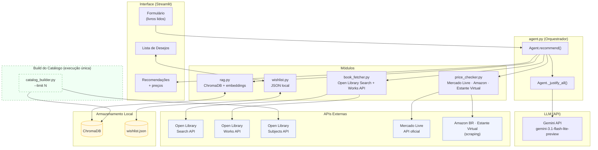

# Documento de Engenharia — Projeto Individual 1

> **Aluno:** Felipe Amorim de Araujo
> **Matrícula:** 221022275
> **Domínio:** Cultura
> **Função do agente:** Recomendação
> **Restrição obrigatória:** Integração com API externa

---

## 1. Problema e Contexto

Leitores frequentemente enfrentam dois problemas separados: dificuldade em descobrir novos livros alinhados ao seu gosto, e falta de visibilidade sobre os preços praticados pelas livrarias brasileiras. Ferramentas de recomendação existentes (como Goodreads ou Amazon) operam de forma isolada e não oferecem integração entre descoberta e comparação de preços em um único fluxo.

O agente proposto resolve ambos os problemas em uma única interface: o usuário informa os livros que já leu, recebe recomendações personalizadas com justificativa e visualiza os preços atuais nas principais livrarias brasileiras. Títulos de interesse podem ser salvos em uma lista de desejos com verificação de preço sob demanda.

O público-alvo são leitores brasileiros que buscam descobrir novos livros e otimizar suas compras.

---

## 2. Stakeholders

| Stakeholder | Papel | Interesse no sistema |
|-------------|-------|----------------------|
| Leitor | Usuário final | Descobrir livros relevantes e encontrar os melhores preços |
| Livrarias (Mercado Livre, Amazon BR, Estante Virtual) | Fonte de dados de preço | Dados de preço e disponibilidade consumidos via API/scraping |
| Open Library (Internet Archive) | Provedor de dados bibliográficos | Metadados de livros consumidos via API pública |
| Mantenedor do sistema | Desenvolvedor | Garantir funcionamento, atualização do catálogo e qualidade das recomendações |

---

## 3. Requisitos Funcionais (RF)

| ID | Descrição | Prioridade |
|----|-----------|------------|
| RF01 | O agente deve receber uma lista de títulos de livros já lidos pelo usuário | Alta |
| RF02 | O agente deve buscar metadados dos livros informados via Open Library Search API e Works API | Alta |
| RF03 | O agente deve recuperar livros candidatos a partir de um catálogo vetorial (RAG) com base nos gêneros e descrições dos livros lidos | Alta |
| RF04 | O agente deve filtrar candidatos já lidos pelo usuário antes de apresentar as recomendações | Alta |
| RF05 | O agente deve verificar preços dos candidatos nas livrarias Mercado Livre, Amazon BR e Estante Virtual | Alta |
| RF06 | O agente deve gerar uma justificativa em português para cada recomendação, explicando a relação com o histórico de leitura do usuário | Alta |
| RF07 | O usuário deve poder adicionar livros recomendados a uma lista de desejos persistente | Média |
| RF08 | O usuário deve poder verificar o preço atual de qualquer livro na lista de desejos sob demanda | Média |
| RF09 | O usuário deve poder remover livros da lista de desejos | Média |
| RF10 | O catálogo de livros deve ser construído a partir da Open Library Subjects API, com suporte a parâmetro `--limit` para controle do tamanho | Média |

---

## 4. Requisitos Não-Funcionais (RNF)

| ID | Descrição | Categoria |
|----|-----------|-----------|
| RNF01 | A interface deve ser apresentada inteiramente em português (pt-BR) | Usabilidade |
| RNF02 | O agente deve processar uma requisição de recomendação em menos de 60 segundos | Desempenho |
| RNF03 | O histórico de leitura e a lista de desejos do usuário devem ser armazenados exclusivamente em disco local, sem persistência remota | Privacidade |
| RNF04 | Falhas em fontes de preço individuais não devem interromper o fluxo; o agente deve retornar resultados parciais | Resiliência |
| RNF05 | As justificativas devem ser geradas em português (pt-BR) sem alternar para outros idiomas | Qualidade |
| RNF06 | O catálogo vetorial deve ser persistido em disco e reutilizado entre sessões | Desempenho |

---

## 5. Casos de Uso

### Caso de uso 1: Obter recomendações personalizadas

- **Ator:** Leitor
- **Pré-condição:** O catálogo RAG foi construído (`catalog_builder.py` executado ao menos uma vez) e a variável `GEMINI_API_KEY` está configurada no `.env`
- **Fluxo principal:**
  1. O usuário informa uma lista de livros já lidos no formulário
  2. O agente busca metadados de cada livro via Open Library (Search + Works API)
  3. O agente constrói uma query de similaridade e recupera candidatos do ChromaDB
  4. Os preços são verificados nas livrarias para cada candidato
  5. O LLM (Gemini API) gera justificativas para todas as recomendações em uma única chamada
  6. O usuário visualiza as recomendações com justificativas e preços
- **Pós-condição:** Lista de recomendações exibida com justificativas e preços por loja

### Caso de uso 2: Gerenciar lista de desejos

- **Ator:** Leitor
- **Pré-condição:** Ao menos uma recomendação foi gerada
- **Fluxo principal:**
  1. O usuário clica em "Adicionar à lista de desejos" em uma recomendação
  2. O título é salvo localmente em `data/wishlist.json`
  3. O usuário navega para a aba "Lista de Desejos"
  4. O usuário clica em "Verificar preço" para um título da lista
  5. O agente consulta as livrarias e exibe os preços encontrados
- **Pós-condição:** Preços exibidos para o título selecionado. O usuário pode remover o item da lista.

### Caso de uso 3: Construir o catálogo de livros

- **Ator:** Mantenedor
- **Pré-condição:** Dependências instaladas
- **Fluxo principal:**
  1. O mantenedor executa `python src/catalog_builder.py --limit N`
  2. O script consulta a Open Library Subjects API para 40 assuntos pré-definidos
  3. Os livros retornados são indexados no ChromaDB com embeddings multilíngues
  4. O catálogo fica disponível para o agente em `data/chroma_db/`
- **Pós-condição:** Catálogo vetorial populado e pronto para uso

---

## 6. Fluxo do Agente

```
Formulário (livros lidos)
    │
    ▼
book_fetcher: Open Library Search API → obtém metadados + work_key
    │
    ▼
book_fetcher: Open Library Works API → enriquece com descrição e subjects
    │
    ▼
rag: ChromaDB → busca livros similares por embedding (exclui lidos)
    │
    ▼
price_checker: Mercado Livre API + Amazon BR + Estante Virtual → preços por loja
    │
    ▼
agent._justify_all: Gemini API (gemini-3.1-flash-lite-preview) → justificativas em pt-BR em chamada única
    │
    ▼
Saída: recomendações ranqueadas com justificativa + preços + ofertas
```

---

## 7. Arquitetura do Sistema

- **Tipo de agente:** RAG + tool-using pipeline sequencial

- **LLM utilizado:** Gemini API — `gemini-3.1-flash-lite-preview` (configurável via `GEMINI_MODEL` no `.env`)

- **Componentes principais:**
  - [x] **Módulo de entrada:** Formulário Streamlit com lista de livros lidos e quantidade de recomendações desejadas
  - [x] **Processamento / LLM:** `agent.py` orquestra o pipeline; `_justify_all()` chama a Gemini API para geração de justificativas em chamada única
  - [x] **Ferramentas externas (tools):**
    - `book_fetcher.py`: Open Library Search API e Works API
    - `catalog_builder.py`: Open Library Subjects API (build do catálogo)
    - `price_checker.py`: Mercado Livre API (oficial), Amazon BR e Estante Virtual (scraping)
  - [x] **Memória:** ChromaDB (catálogo vetorial persistido em disco) e `wishlist.json` (lista de desejos local)
  - [x] **Módulo de saída:** Interface Streamlit com recomendações, justificativas, preços por loja e lista de desejos

- **Diagrama de arquitetura:**



---

## 8. Estratégia de Avaliação

- **Métricas definidas:**
  - *Relevância das recomendações:* contagem manual de recomendações compatíveis com o gênero e histórico do perfil (0 = irrelevante, 1 = relevante por livro; resultado final: número de acertos em 5 recomendações)
  - *Qualidade da justificativa:* avaliação manual de coerência (escala 1 a 5): a justificativa menciona livros lidos, conecta tematicamente ao candidato e está escrita em português sem trocas de idioma
  - *Cobertura de preços:* percentual de recomendações com ao menos um preço encontrado
  - *Latência:* tempo total de resposta do pipeline (medido com `time.time()` no `agent.py`)

- **Conjunto de testes:**
  - 5 perfis de leitura distintos (ficção científica, literatura brasileira, mistério, filosofia, fantasia)
  - Cada perfil com 3–5 livros lidos informados
  - Total: 5 execuções de avaliação (uma por perfil)

- **Método de avaliação:** Manual para relevância e qualidade. Automático para cobertura de preços e latência.

---

## 9. Referências

1. Open Library API Documentation — https://openlibrary.org/developers/api
2. Mercado Livre API — Busca de itens: https://developers.mercadolivre.com.br/pt_br/itens-e-buscas
3. ChromaDB Documentation — https://docs.trychroma.com
4. Sentence Transformers — `paraphrase-multilingual-MiniLM-L12-v2`: https://www.sbert.net
5. Google Gemini API — https://ai.google.dev/gemini-api/docs
