# Documento de Engenharia — Projeto Individual 1

> **Aluno(a):** Leonardo Fernandes Padre
> **Matrícula:** 200067036
> **Domínio:** Educação
> **Função do agente:** Resumo
> **Restrição obrigatória:** Baixo Custo

---

## 1. Problema e Contexto

_O agente proposto visa atuar como um tutor inteligente para auxiliar estudantes do ensino superior na compreensão de conteúdos acadêmicos, especialmente diante de conceitos novos e complexos que frequentemente geram dúvidas. Embora os professores sejam capacitados, a alta demanda limita o atendimento individualizado, prejudicando alunos com maior dificuldade. Nesse contexto, o agente busca resolver a falta de suporte contínuo, oferecendo acompanhamento 24 horas por dia, 7 dias por semana, para esclarecer dúvidas, reforçar o aprendizado e reduzir a sobrecarga docente, tendo como público-alvo estudantes e instituições de ensino interessadas em melhorar o processo educacional._

---

## 2. Stakeholders

| Stakeholder            | Papel                                                              | Interesse no sistema                                                                  |
| ---------------------- | ------------------------------------------------------------------ | ------------------------------------------------------------------------------------- |
| Estudantes             | Usuários finais que utilizam o agente para estudar e tirar dúvidas | Melhorar o aprendizado, esclarecer dúvidas rapidamente e ter suporte contínuo         |
| Professores            | Mediadores do ensino e possíveis usuários indiretos do sistema     | Reduzir a sobrecarga de atendimento e melhorar o desempenho geral dos alunos          |

---

## 3. Requisitos Funcionais (RF)

| ID   | Descrição                                                                                    | Prioridade |
| ---- | -------------------------------------------------------------------------------------------- | ---------- |
| RF01 | O agente deve permitir que o aluno faça perguntas sobre conteúdos específicos da disciplina | Alta       |
| RF02 | O agente deve fornecer respostas claras, contextualizadas e didáticas para as dúvidas       | Alta       |
| RF03 | O agente deve estar disponível para acesso 24 horas por dia, 7 dias por semana              | Baixa      |
| RF04 | O agente deve ser capaz de gerar testes para o aluno              | Média      |
| RF05 | O agente deve ser capaz de consumir dados externos providos por um profissional qualificado              | Alta      |
| RF06 | O agente deve permitir interação em linguagem natural (texto)              | Alta      |
| RF07 | O agente deve adaptar o nível de dificuldade das respostas conforme o conhecimento do aluno              | Baixa      |
| RF08 | O agente deve fornecer explicações passo a passo para resolução de problemas              | Média      |
| RF09 | O agente deve gerar feedback sobre o desempenho do aluno em testes e exercícios              | Média      |

---

## 4. Requisitos Não-Funcionais (RNF)

| ID    | Descrição                                                                                  | Categoria        |
| ----- | ------------------------------------------------------------------------------------------ | ---------------- |
| RNF01 | O sistema deve ser de facil entendimento e acesso                  | Usabilidade |
| RNF02 | O sistema deve garantir integridade dos dados durante armazenamento e processamento        | Segurança        |
| RNF03 | O sistema deve responder às solicitações do usuário em tempo adequado        | Desempenho        |

---

## 5. Casos de Uso

### Caso de uso 1: Realizar pergunta ao agente

- **Ator: Estudante** 
- **Pré-condição: O estudante deve estar com acesso ao sistema** 
- **Fluxo principal:**
  1. O estudante insere uma pergunta sobre um conteúdo da disciplina
  2. O agente processa a pergunta e identifica o contexto
  3. O agente fornece uma resposta clara e didática
- **Pós-condição: O estudante recebe a explicação e pode compreender melhor o conteúdo** 

### Caso de uso 2: Gerar exercício/teste

- **Ator: Estudante** 
- **Pré-condição: O estudante deve pedir um tópico dentro da área de conhecimento do agente** 
- **Fluxo principal:**
  1. O estudante solicita a geração de exercícios ou um teste
  2. O agente cria questões com base no conteúdo selecionado
  3. O agente apresenta os exercícios ao estudante
  4. O estudante manda as respostas
  5. O agente confere e retorna um feedback
- **Pós-condição: O estudante recebe atividades para praticar e reforçar o aprendizado** 

### Caso de uso 3: Gerar resumo

- **Ator: Estudante** 
- **Pré-condição: O estudante deve pedir um tópico dentro da área de conhecimento do agente** 
- **Fluxo principal:**
  1. O estudante solicita a geração do resumo
  2. O agente cria o resumo com base no tópico selecionado
  3. O agente apresenta o resumo ao estudante
- **Pós-condição: O estudante recebe o resumo e pode compreender melhor o conteúdo** 

---

## 6. Fluxo do Agente

_Descreva ou desenhe o fluxo de funcionamento do agente. Pode ser um diagrama (imagem ou mermaid) ou uma descrição textual passo a passo._

---

## 7. Arquitetura do Sistema

_Descreva a arquitetura escolhida para o agente. Responda:_

- **Tipo de agente: RAG**
- **LLM utilizado: LLAMA3**
- **Componentes principais:**
  - [ ] Módulo de entrada
  - [x] Processamento / LLM
  - [x] Ferramentas externas (tools)
  - [x] Memória
  - [ ] Módulo de saída
- **Diagrama de arquitetura:** _(opcional, mas recomendado)_

---

## 8. Estratégia de Avaliação

_Descreva como você pretende avaliar o agente:_

* **Métricas definidas:** precisão e relevância.

* **Conjunto de testes:** na etapa de explicação, solicitou-se que o agente identificasse afirmações sutilmente incorretas. No quiz, avaliou-se a veracidade das respostas fornecidas, enquanto no resumo foi analisada a exatidão das informações apresentadas. Em todos os casos, as avaliações foram realizadas tomando como referência o conteúdo do livro.

* **Método de avaliação:** o processo consistiu na criação manual de solicitações ao agente em três frentes — quiz, resumo e dúvidas — com base nos conteúdos do PDF do livro utilizado para alimentar o FAISS no contexto de RAG.

---

## 9. Referências

_Liste artigos, documentações, repositórios ou materiais consultados._

1. https://blog.dsacademy.com.br/os-7-principais-bancos-de-dados-vetoriais-para-solucoes-de-rag-em-aplicacoes-de-ia-generativa/
2. https://aws.amazon.com/pt/what-is/retrieval-augmented-generation/
3. https://adapta.org/blog/retrieval-augmented-generation?utm_source=Google_Ads&utm_medium=Paid+g&utm_term=++dsa-41848713900&utm_content=183327031415+766002956080&utm_campaign=22835614730&hsa_acc=8669612198&hsa_cam=22835614730&hsa_grp=183327031415&hsa_ad=766002956080&hsa_src=g&hsa_tgt=dsa-41848713900&hsa_kw=&hsa_mt=&hsa_net=adwords&hsa_ver=3&gad_source=1&gad_campaignid=22835614730&gbraid=0AAAAAqJFJh5Maq1abpKr6a9XDs0PVqT58&gclid=CjwKCAjw-J3OBhBuEiwAwqZ_hwiKu6E_kgkqXl3chd-w3grDWjbWBMqweDepzN0vRrAfWutX9HFV8xoCgOIQAvD_BwE
4. https://sbert.net/
5. https://groq.com/
6. https://www.ibm.com/br-pt/think/topics/embedding