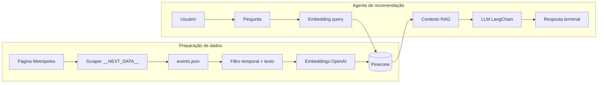

# Documento de Engenharia — Projeto Individual 1

> **Aluno(a):** Lucas Guimarães Borges
> **Matrícula:** 222015159
> **Domínio:** Cultura
> **Função do agente:** Recomendação
> **Restrição obrigatória:** Integração com API externa

---

## 1. Problema e Contexto

Moradores e visitantes do **Distrito Federal** frequentemente descobrem eventos culturais de forma fragmentada (redes sociais, sites diversos), sem uma busca **personalizada** que una tipo de experiência (teatro, exposição, comédia), data, local e informações práticas (gratuidade, faixa etária, link de ingresso).

O problema endereçado é **reduzir o esforço de descoberta** de eventos culturais futuros no DF, a partir de uma **fonte editorial consolidada** (agenda Metrópoles), com um agente que **recomenda** opções alinhadas à pergunta do usuário e **não inventa** dados fora do que foi indexado.

**Relevância:** fortalece o acesso à cultura local e pode ser estendido a outras fontes oficiais. **Público-alvo:** pessoas interessadas em lazer cultural no DF, com acesso a terminal e credenciais das APIs utilizadas (uso educacional / protótipo).

---

## 2. Stakeholders

| Stakeholder | Papel | Interesse no sistema |
|-------------|-------|----------------------|
| Usuário final | Interage com o agente no terminal | Obter sugestões rápidas, confiáveis e no DF, com detalhes úteis (data, local, preço/link) |
| Desenvolvedor / mantenedor | Implementa e opera scrape, sync e chat | Código modular, configuração por `.env`, baixo acoplamento ao layout do site |
| Metrópoles (fonte) | Publica a agenda cultural na web | Tráfego e reconhecimento da marca; o sistema apenas consome dados públicos da página |
| Provedores de API (OpenAI, Pinecone) | Infraestrutura de modelo e vetores | Uso dentro de limites de serviço, faturamento conforme plano |

---

## 3. Requisitos Funcionais (RF)

| ID | Descrição | Prioridade |
|----|-----------|------------|
| RF01 | Coletar automaticamente a agenda cultural a partir da página do Metrópoles (JSON `__NEXT_DATA__`) e persistir em `events.json` | Alta |
| RF02 | Filtrar eventos por janela temporal configurável (ex.: próximos 14 dias), deduplicar por `id` e indexar no Pinecone com embeddings OpenAI (512 dim.) | Alta |
| RF03 | Permitir conversação em português no terminal: pergunta do usuário → recuperação semântica (RAG) → resposta do LLM com formato definido no system prompt | Alta |
| RF04 | Restringir recomendações ao **Distrito Federal** e a eventos **futuros** em relação à data do sistema, conforme regras do prompt | Alta |
| RF05 | Integrar **APIs externas** obrigatoriamente: OpenAI (embeddings e chat) e Pinecone (vetores) | Alta |
| RF06 | Expor interface de linha de comando unificada (`main.py scrape`, `sync`, `chat`) | Média |
| RF07 | Permitir sincronização do índice sem novo scrape (`sync --skip-scrape`) e simulação de contagem (`sync --dry-run`) | Média |
| RF08 | Ajustar o modelo de chat OpenAI (ex.: `OPENAI_AGENT_MODEL`) via variável de ambiente, sem alterar o núcleo do runner | Baixa |

---

## 4. Requisitos Não-Funcionais (RNF)

| ID | Descrição | Categoria |
|----|-----------|-----------|
| RNF01 | Chaves de API e segredos apenas em `.env`, nunca versionados; uso de `.env.example` como modelo | Segurança |
| RNF02 | Dependências em `pyproject.toml` + lock `uv.lock`; ambiente e instalação com **uv** (`uv sync`); Python 3.12+ | Manutenibilidade |
| RNF03 | Respostas legíveis no terminal (Rich + Markdown) e mensagens de erro compreensíveis em falhas de rede ou API | Usabilidade |
| RNF04 | Latência aceitável para protótipo: dependente de rede e modelo; pipeline de chat evita custos desnecessários em modo `--dry-run` | Desempenho |
| RNF05 | Código organizado em `src/` (`scraper`, `rag`, `agent`, `utils`) com ponto de entrada único `main.py` | Manutenibilidade |

---

## 5. Casos de Uso

### Caso de uso 1: Atualizar base local e índice vetorial

- **Ator:** Mantenedor ou usuário técnico
- **Pré-condição:** `.env` com `OPENAI_API_KEY` e `PINECONE_API_KEY`; índice Pinecone `events` criado com dimensão 512 e métrica cosine; conectividade com a internet
- **Fluxo principal:**
  1. Executar `uv run python main.py scrape` para baixar e gravar `events.json`
  2. Executar `uv run python main.py sync` para embeddar eventos na janela temporal e atualizar o Pinecone (limpeza + *upsert*)
  3. Verificar mensagem de sucesso no stderr (quantidade de eventos reindexados)
- **Pós-condição:** Arquivo `events.json` atualizado e vetores no índice alinhados à janela configurada (`EVENTS_FORWARD_DAYS`, etc.)

### Caso de uso 2: Obter recomendações culturais via chat

- **Ator:** Usuário final
- **Pré-condição:** Índice Pinecone populado; `.env` com `OPENAI_API_KEY` válida (embeddings e chat)
- **Fluxo principal:**
  1. Executar `uv run python main.py chat`
  2. Digitar uma pergunta em linguagem natural (ex.: tipo de evento, gratuito/pago, região do DF)
  3. O sistema recupera trechos relevantes no Pinecone e o LLM gera a resposta formatada
  4. Opcionalmente, enviar novas perguntas na mesma sessão (histórico em memória)
  5. Encerrar com `sair`, `exit`, `fim` ou Ctrl+C
- **Pós-condição:** Usuário recebe recomendações ancoradas no RAG; cada turno (pergunta + resposta) pode ser gravado em `chat_memory.json` na raiz do projeto (desligável com `CHAT_MEMORY_DISABLE=1`), permitindo retomar o diálogo em execuções futuras

---

## 6. Fluxo do Agente

O fluxo do **chat** (núcleo do agente de recomendação) é:

1. Carregar system prompt (com data atual substituída), turnos anteriores de `chat_memory.json` (se existir) e histórico do turno atual.
2. Receber a pergunta do usuário.
3. Gerar embedding da pergunta (OpenAI) e consultar o Pinecone (*top_k* fixo).
4. Montar o contexto textual com metadados dos trechos recuperados.
5. Enviar ao LLM (LangChain): system + histórico + mensagem humana (contexto + pergunta).
6. Exibir a resposta formatada no terminal, atualizar o histórico em memória e persistir o par pergunta/resposta no JSON (se a memória estiver ativa).

Fluxo global (incluindo preparação de dados):



Forma linear resumida:

```
Pergunta (texto) → Embedding → Pinecone (similaridade) → Contexto
    → LLM (system + histórico + pergunta enriquecida) → Saída Markdown (terminal)
```

---

## 7. Arquitetura do Sistema

- **Tipo de agente:** **RAG** (*Retrieval-Augmented Generation*): recuperação vetorial + geração condicionada ao contexto; pipeline sequencial para ingestão (scrape → filtro → embed → *upsert*).
- **LLM utilizado:** **OpenAI** `gpt-5-nano` por padrão (`ChatOpenAI` via LangChain); nome do modelo ajustável por `OPENAI_AGENT_MODEL`.
- **Componentes principais:**
  - [x] Módulo de entrada (stdin / Rich `console.input` no loop do chat)
  - [x] Processamento / LLM (LangChain + políticas em `event_agent_system.md`)
  - [ ] Ferramentas externas (tools) — não utilizadas nesta versão
  - [x] Memória — histórico em LangChain; **persistência** opcional em `chat_memory.json` (pares usuário/assistente, sem duplicar o contexto RAG; `CHAT_MEMORY_DISABLE=1` desliga)
  - [x] Módulo de saída (Rich: painel inicial, regra, `Markdown` da resposta)

**Diagrama lógico (camadas):**

```text
┌─────────────────────────────────────────────────────────┐
│                    main.py (CLI)                        │
├─────────────────────────────────────────────────────────┤
│  scraper.py          │  rag/sync.py      │ agent/runner │
│  HTTP + JSON         │  Filtro + embed   │  RAG + chat  │
├──────────────────────┴───────────────────┴──────────────┤
│  APIs externas: OpenAI │ Pinecone                      │
└─────────────────────────────────────────────────────────┘
```

---

## 8. Estratégia de Avaliação

- **Métricas definidas:**
  - **Correção operacional:** `scrape` e `sync` concluem sem exceção com chaves e índice válidos.
  - **Aderência ao domínio:** respostas citam apenas fatos plausivelmente presentes nos trechos (avaliação **manual** por inspeção).
  - **Cobertura qualitativa:** variedade de perguntas (gratuito/pago, tipo de evento, região) e coerência temporal (sem eventos passados intencionais).
  - **Latência e custo:** observação informal (tempo até resposta; consumo de tokens nas dashboards dos provedores), sem benchmark automatizado neste ciclo.

- **Conjunto de testes:** cenários manuais descritos no relatório de entrega; **demonstração gravada em vídeo** com `scrape`, `sync` (carga no Pinecone) e exemplo de conversa pedindo **próximos eventos** no chat — link: https://youtu.be/i3IxOos8NFI. Dados reais vindos da agenda publicada no momento da gravação.

- **Método de avaliação:** **manual** (checklist e inspeção de saída) para o pipeline completo; **automático** com **pytest** em `tests/` (filtros de data/deduplicação, memória JSON, substituição de data no system prompt, formatação de trechos RAG). Extensão futura: testes com HTTP mockado no scraper e métricas IR (precisão@k) com *labels* de relevância.

---

## 9. Referências

1. OpenAI. *API Reference — Embeddings, Chat Completions / Responses*. https://platform.openai.com/docs  
2. Pinecone. *Indexes, upsert, query, delete*. https://docs.pinecone.io  
3. LangChain. *Python documentation — Chat models, messages*. https://python.langchain.com  
4. Metrópoles. *Agenda cultural* (fonte de dados). https://www.metropoles.com/agenda-cultural  
5. Rich. *Terminal rendering*. https://rich.readthedocs.io  
