# Documento de Engenharia — Projeto Individual 1

> **Aluno(a):** Lucas Martins Gabriel
> **Matrícula:** 221022088
> **Domínio:** Compras públicas
> **Função do agente:** Detecção de anomalias
> **Restrição obrigatória:** Integração com API externa

---

## 1. Problema e Contexto

Órgãos de controle e equipes de auditoria precisam acompanhar grande volume de licitações publicadas diariamente, o que dificulta identificar rapidamente processos com sinais iniciais de risco. Em compras públicas, atrasos na triagem aumentam a chance de irregularidades passarem despercebidas ou só serem detectadas após a contratação.

O projeto propõe um agente auditor para apoiar a análise preventiva de licitações do Portal Nacional de Contratações Públicas (PNCP). O agente consulta dados reais das contratações, enriquece a análise com dados cadastrais do CNPJ via Brasil API, aplica regras objetivas de risco e produz um relatório com priorização dos casos mais sensíveis.

O público-alvo principal são auditores, controladorias, analistas de conformidade e equipes de apoio à fiscalização que precisam transformar dados públicos dispersos em uma fila de investigação mais explicável e rastreável.

---

## 2. Stakeholders

| Stakeholder | Papel | Interesse no sistema |
|-------------|-------|----------------------|
| Auditor / Controladoria | Usuário principal | Priorizar licitações com maior chance de irregularidade |
| Gestor público / comissão de contratação | Parte auditada ou interessada | Melhorar a qualidade do cadastro e antecipar correções |
| Órgãos de controle externo e sociedade | Fiscalização e transparência | Aumentar rastreabilidade e visibilidade sobre compras públicas |

---

## 3. Requisitos Funcionais (RF)

| ID | Descrição | Prioridade |
|----|-----------|------------|
| RF01 | Consultar licitações do PNCP a partir de intervalo de datas, modalidade e paginação configuráveis | Alta |
| RF02 | Selecionar e ordenar as licitações por valor estimado para focar nos casos mais relevantes | Alta |
| RF03 | Enriquecer cada licitação com dados de CNPJ do fornecedor via API externa | Alta |
| RF04 | Aplicar regras determinísticas para detectar red flags, como capital social baixo, empresa recente, possível incompatibilidade CNAE-objeto e concentração por órgão | Alta |
| RF05 | Gerar score objetivo e classificar o grau de risco em baixo, médio, alto ou crítico | Alta |
| RF06 | Produzir relatório final em Markdown com evidências, score e parecer consolidado | Média |
| RF07 | Permitir leitura opcional de PDF relacionado ao processo para ampliar contexto | Média |
| RF08 | Gerar parecer consolidado com LLM a partir das evidências estruturadas calculadas | Alta |

---

## 4. Requisitos Não-Funcionais (RNF)

| ID | Descrição | Categoria |
|----|-----------|-----------|
| RNF01 | O sistema deve manter rastreabilidade das decisões, exibindo score e evidências objetivas por licitação | Auditabilidade |
| RNF02 | O agente deve usar apenas dados públicos e chave de API configurada por variável de ambiente ou arquivo `.env` local | Segurança |
| RNF03 | As chamadas HTTP devem ter timeout, retentativas e backoff para reduzir falhas transitórias | Confiabilidade |
| RNF04 | A saída deve ser legível por humanos e adequada para revisão manual por auditores | Usabilidade |
| RNF05 | O parecer textual deve ser gerado de forma consistente pelo LLM, sem contradizer as evidências determinísticas calculadas | Confiabilidade |

---

## 5. Casos de Uso

### Caso de uso 1: Auditar licitações de maior valor em um período

- **Ator:** Auditor ou analista de controle
- **Pré-condição:** Ambiente configurado com dependências instaladas e acesso às APIs públicas
- **Fluxo principal:**
  1. O usuário informa intervalo de datas e, opcionalmente, modalidade, número máximo de páginas e quantidade de licitações a auditar.
  2. O sistema consulta o PNCP, coleta as licitações e ordena os itens por valor estimado.
  3. Para cada item selecionado, o sistema consulta dados de CNPJ, aplica regras de risco e gera o relatório consolidado.
- **Pós-condição:** O usuário recebe um relatório com priorização dos casos e justificativas objetivas para investigação.

### Caso de uso 2: Aprofundar auditoria com contexto documental

- **Ator:** Auditor
- **Pré-condição:** A licitação possui URL de PDF acessível
- **Fluxo principal:**
  1. O usuário executa o agente com a opção `--incluir-pdf`.
  2. O sistema baixa o PDF, extrai as primeiras páginas e resume o texto para uso contextual.
  3. O parecer final incorpora o contexto documental disponível e registra limitações caso a leitura falhe.
- **Pós-condição:** O relatório final inclui contexto adicional do processo e melhor base para análise manual.

---

## 6. Fluxo do Agente

O fluxo adotado é sequencial, com etapas determinísticas de coleta, enriquecimento, análise e geração de relatório.

```mermaid
flowchart LR
    A["Parâmetros de execução"] --> B["Consulta ao PNCP"]
    B --> C["Normalização e extração de metadados"]
    C --> D["Ordenação por valor estimado"]
    D --> E["Consulta de CNPJ na Brasil API"]
    E --> F["Leitura opcional de PDF"]
    F --> G["Regras determinísticas de red flags"]
    G --> H["Classificação de risco"]
    H --> I["Parecer consolidado com LLM"]
    I --> J["Relatório Markdown"]
```

---

## 7. Arquitetura do Sistema

- **Tipo de agente:** pipeline sequencial com uso de ferramentas externas
- **LLM utilizado:** Gemini 2.5 Flash para consolidar o parecer textual e complementar a análise com explicação estruturada
- **Componentes principais:**
  - [x] Módulo de entrada
  - [x] Processamento / LLM
  - [x] Ferramentas externas (tools)
  - [ ] Memória
  - [x] Módulo de saída
- **Descrição dos componentes:**
  - `main.py`: recebe os argumentos, orquestra a execução e salva o relatório
  - `clients.py`: integra PNCP, Brasil API, download de PDF e cliente Gemini
  - `utils.py`: normaliza dados, extrai metadados e converte tipos
  - `rules.py`: calcula red flags e score de risco de forma determinística
  - `reporting.py`: monta o prompt do LLM, renderiza o relatório e salva a saída
  - `models.py`: define as estruturas `AuditResult` e `RedFlag`

---

## 8. Estratégia de Avaliação

- **Métricas definidas:**
  - Cobertura de processamento: proporção de licitações coletadas que geram saída auditável
  - Explicabilidade: presença de score e evidências objetivas no relatório final
  - Utilidade para triagem: capacidade de separar casos de maior risco para revisão humana
  - Robustez operacional: comportamento do agente diante de falhas transitórias nas APIs consultadas
- **Conjunto de testes:**
  - Execuções reais sobre licitações do PNCP no período de março de 2026
  - Amostra priorizada de 5 licitações de maior valor por execução
  - Relatório de exemplo gerado em `relatorio_auditoria.md`
- **Método de avaliação:**
  - Avaliação manual dos relatórios gerados
  - Comparação entre score determinístico, flags acionadas e coerência do parecer consolidado
  - Verificação do alinhamento entre score, red flags e parecer gerado pelo LLM

---

## 9. Referências

1. Portal Nacional de Contratações Públicas (PNCP). API de consulta de contratações públicas.
2. Brasil API. Serviço público de consulta de CNPJ.
3. Google Gen AI SDK para Python.
4. PyMuPDF. Biblioteca para leitura de PDF em Python.
