# Relatório de Entrega — Projeto Individual 1

> **Aluno(a):** Lucas Martins Gabriel
> **Matrícula:** 221022088
> **Data de entrega:** 30/03/2026

---

## 1. Resumo do Projeto

O projeto implementa um agente de auditoria para compras públicas, com foco em identificar sinais iniciais de anomalia em licitações publicadas no PNCP. O agente consulta dados reais do portal, enriquece cada registro com informações cadastrais de CNPJ via Brasil API e aplica regras determinísticas para detectar red flags como capital social incompatível, empresa muito recente, possível incompatibilidade entre objeto e CNAE e concentração de fornecedor no mesmo órgão. Em seguida, gera um relatório estruturado com score objetivo, grau de risco e parecer consolidado via LLM. O principal resultado obtido foi um pipeline funcional e explicável, capaz de processar lotes reais de licitações e transformar dados públicos em uma saída auditável para priorização de investigação humana.

---

## 2. Combinação Atribuída

| Item | Valor |
|------|-------|
| **Domínio** | Compras públicas |
| **Função do agente** | Detecção de anomalias |
| **Restrição obrigatória** | Integração com API externa |

---

## 3. Modelagem do Agente

### 3.1 Entrada (Input)

O agente recebe parâmetros de linha de comando para data inicial e data final, além de opções complementares como modalidade, número máximo de páginas, quantidade de licitações, timeout, retries e a flag `--incluir-pdf` para ampliar o contexto documental. Os parâmetros operacionais `max_paginas`, `http_timeout` e `http_retries` passaram a ser opcionais e usam defaults razoáveis quando não são informados.

### 3.2 Processamento (Pipeline)

O processamento é dividido em coleta, enriquecimento, avaliação determinística e geração de relatório.

```mermaid
flowchart LR
    A["Argumentos CLI"] --> B["Consulta ao PNCP"]
    B --> C["Extração de itens e metadados"]
    C --> D["Ordenação por valor"]
    D --> E["Consulta de CNPJ na Brasil API"]
    E --> F["Extração opcional de PDF"]
    F --> G["Cálculo de red flags e score"]
    G --> H["Classificação de risco"]
    H --> I["Parecer com Gemini"]
    I --> J["Relatório Markdown"]
```



### 3.3 Decisão

A lógica de decisão prioriza regras explícitas, não apenas geração livre por LLM. O agente calcula um score a partir de evidências estruturadas:

- `CAPITAL_SOCIAL_BAIXO`: adiciona 3 pontos
- `EMPRESA_RECENTE`: adiciona 3 pontos
- `CNAE_POSSIVEL_INCOMPATIBILIDADE`: adiciona 2 pontos
- `CONCENTRACAO_FORNECEDOR`: adiciona 1 ou 3 pontos, conforme a recorrência

Com base no score, o risco é classificado em `Baixo`, `Médio`, `Alto` ou `Crítico`. O LLM não substitui as regras principais, mas é parte obrigatória do pipeline para transformar os dados estruturados em um parecer textual curto, seguindo um prompt que exige:

- uso das flags determinísticas como base
- proibição de inventar fatos
- indicação explícita de insuficiência de dados
- saída em quatro seções: grau de risco, evidências, recomendação e limitações

### 3.4 Saída (Output)

A saída principal é um relatório em Markdown contendo:

- resumo executivo do lote auditado
- metadados de cada licitação
- score objetivo e grau de risco
- lista de evidências objetivas
- URL de PDF, quando disponível
- parecer consolidado do LLM

---

## 4. Implementação

### 4.1 Tecnologias utilizadas

| Tecnologia | Versão | Finalidade |
|------------|--------|------------|
| Python | 3.10.12 | Linguagem principal |
| requests | 2.33.0 | Chamadas HTTP para PNCP, Brasil API e download de PDFs |
| google-genai | 1.69.0 | Integração obrigatória com o modelo Gemini |
| PyMuPDF | 1.27.2.2 | Extração de texto de PDFs |
| python-dotenv | instalada no ambiente do projeto | Carregamento da chave `KEY` a partir de arquivo `.env` |
| argparse | biblioteca padrão | Interface de linha de comando |

### 4.2 Estrutura do código

```text
projeto-1/
├── auditor.py
├── auditor/
│   ├── main.py
│   ├── clients.py
│   ├── models.py
│   ├── reporting.py
│   ├── rules.py
│   └── utils.py
├── README.md
├── requirements.txt
├── relatorio_auditoria.md
├── documento-engenharia.md
└── relatorio-entrega.md
```

### 4.3 Como executar

Instruções para rodar o projeto a partir da pasta `projeto-1`:

```bash
# 1. Criar e ativar ambiente virtual
python3 -m venv .venv
source .venv/bin/activate

# 2. Instalar dependências
pip install -r requirements.txt

# 3. Configurar chave do Gemini em um arquivo .env
cat <<'EOF' > .env
KEY=SUA_CHAVE
EOF

# 4. Executar auditoria
python auditor.py \
  --data-inicial 20260320 \
  --data-final 20260329 \
  --modalidade 5 \
  --top-n 5 \
  --saida-md relatorio_auditoria.md
```

---

## 5. Avaliação e Testes

### 5.1 Métricas definidas

| Métrica | Descrição | Resultado obtido |
|---------|-----------|------------------|
| Cobertura de processamento | Percentual de itens priorizados que geraram relatório auditável | 5 de 5 licitações processadas nas execuções documentadas |
| Explicabilidade | Presença de score e evidências objetivas na saída | 100% dos casos com flags listadas e score explícito |
| Capacidade de triagem | Separação dos casos por prioridade de revisão | Distribuição observada: 1 alto e 4 médios em um lote real |
| Coerência do parecer final | Alinhamento entre flags e texto consolidado gerado pelo LLM | Avaliação manual satisfatória nos relatórios analisados |

### 5.2 Exemplos de teste

#### Teste 1

- **Entrada:** Licitação "Contratação de empresa de engenharia para construção de arquibancada e readequações no CDC Cecília Meireles", presente em `relatorio_auditoria.md`
- **Saída esperada:** Identificar ao menos capital social incompatível, concentração do fornecedor e classificar o caso como prioritário
- **Saída obtida:** Score 6, risco `Alto`, flags `CAPITAL_SOCIAL_BAIXO` e `CONCENTRACAO_FORNECEDOR`, além de recomendação de investigação imediata
- **Resultado:** Sucesso

#### Teste 2

- **Entrada:** Licitação de concessão de água e esgoto do Município de Andradas/MG, presente em `relatorio_auditoria.md`
- **Saída esperada:** Destacar capital social incompatível e recomendar revisão humana por se tratar de contrato de alto valor
- **Saída obtida:** Score 3, risco `Médio`, flag `CAPITAL_SOCIAL_BAIXO` e parecer consolidado apontando necessidade de investigação
- **Resultado:** Sucesso

### 5.3 Análise dos resultados

O agente atingiu o objetivo principal de apoiar a triagem inicial de compras públicas com base em dados reais e regras explicáveis. O maior ponto forte do projeto é a combinação entre automação e rastreabilidade: a decisão base é sustentada por evidências objetivas, e o LLM consolida essas evidências em um parecer mais claro para o auditor. Outro ponto positivo é a integração com fontes públicas reais, o que aumenta a utilidade prática do protótipo.

Como fragilidades, a qualidade da análise depende da consistência dos dados fornecidos pelo PNCP e pela Brasil API. Em alguns casos, o próprio órgão aparece como fornecedor nos dados estruturados, o que pode representar erro de cadastro ou limitação do processo de extração. Além disso, não foi construída uma base rotulada para medir precisão de forma estatística.

---

## 6. Diferenciais implementados

_Marque os diferenciais que foram implementados:_

- [ ] RAG com base externa
- [ ] Múltiplos agentes
- [x] Uso de ferramentas (tools)
- [ ] Memória persistente
- [x] Explicabilidade
- [x] Análise crítica de limitações

---

## 7. Limitações e Trabalhos Futuros

As principais limitações do protótipo são a dependência de APIs externas, a ausência de um conjunto rotulado para avaliação quantitativa e a dificuldade de diferenciar, em todos os casos, fornecedor real e órgão contratante apenas a partir dos dados estruturados do PNCP. A leitura de PDF também é opcional e depende da disponibilidade e qualidade do arquivo remoto.

Como trabalhos futuros, seria interessante adicionar cache local para consultas, uma base histórica para detectar padrões recorrentes entre períodos, novas regras de fraude e um conjunto de testes automatizados com casos esperados. Outra evolução importante seria transformar o relatório em um painel interativo para apoio operacional à auditoria.

---

## 8. Referências

1. Portal Nacional de Contratações Públicas (PNCP). API de consulta de contratações públicas.
2. Brasil API. Endpoint de consulta pública de CNPJ.
3. Google Gen AI SDK para Python.
4. PyMuPDF Documentation.

---

## 9. Checklist de entrega

- [x] Documento de engenharia preenchido
- [x] Código funcional no repositório
- [x] Relatório de entrega preenchido
- [ ] Pull Request aberto
