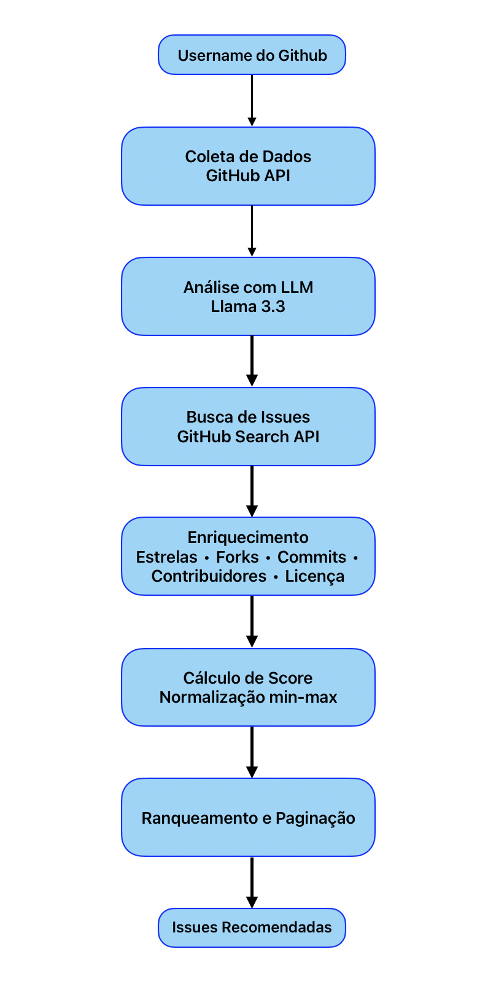

# Documento de Engenharia — Projeto Individual 1

> **Aluno(a):** Maciel Ferreira Custódio Júnior
> **Matrícula:** 190100087
> **Domínio:** Open source / comunidades
> **Função do agente:** Recomendação
> **Restrição obrigatória:** Integração com API externa

---

## 1. Problema e Contexto

Contribuir com projetos open source é uma forma eficaz para desenvolver habilidades técnicas e 
construir reputação na comunidade de software. No entanto, encontrar issues adequadas ao próprio 
nível de experiência e às linguagens que o desenvolvedor domina é uma tarefa manual e demorada. 

O público-alvo do sistema são desenvolvedores de todos os níveis que desejam iniciar ou aumentar 
sua participação em projetos open source, mas que precisam de orientação personalizada para 
encontrar contribuições relevantes e acessíveis.

---

## 2. Stakeholders

| Stakeholder                          | Papel             | Interesse no sistema                                       |
| ------------------------------------ | ----------------- | ---------------------------------------------------------- |
| Desenvolvedor                        | Usuário principal | Receber recomendações de issues compatíveis com seu perfil |
| Mantenedores de projetos open source | Beneficiário      | Receber contribuições de novos colaboradores               |

---

## 3. Requisitos Funcionais (RF)

| ID   | Descrição                                                                                                             | Prioridade |
| ---- | --------------------------------------------------------------------------------------------------------------------- | ---------- |
| RF01 | O sistema deve coletar dados do perfil público do usuário a partir do username do GitHub                              | Alta       |
| RF02 | O sistema deve identificar as linguagens de programação predominantes no perfil do usuário                            | Alta       |
| RF03 | O sistema deve classificar o nível do desenvolvedor (Iniciante, Intermediário, Avançado) com base nos dados do perfil | Alta       |
| RF04 | O sistema deve gerar keywords de contexto baseadas no perfil analisado                                                | Alta       |
| RF05 | O sistema deve buscar issues abertas em repositórios open source compatíveis com o perfil                             | Alta       |
| RF06 | O sistema deve ranquear as issues encontradas por relevância usando um score de popularidade                          | Alta       |
| RF07 | O sistema deve filtrar apenas repositórios com licença open source reconhecida                                        | Média      |
| RF08 | O sistema deve permitir paginação dos resultados                                                                      | Média      |
| RF09 | O sistema deve exibir informações relevantes de cada issue: título, repositório, labels, estrelas, score e link       | Alta       |


---

## 4. Requisitos Não-Funcionais (RNF)

| ID    | Descrição                                                                                                                          | Categoria     |
| ----- | ---------------------------------------------------------------------------------------------------------------------------------- | ------------- |
| RNF01 | O sistema deve utilizar autenticação via token nas chamadas à API do GitHub para evitar rate limiting                              | Segurança     |
| RNF02 | O sistema deve armazenar em cache os dados de repositório já consultados durante uma execução para reduzir o número de requisições | Desempenho    |
| RNF03 | O sistema deve funcionar via linha de comando sem necessidade de instalação de interface gráfica                                   | Usabilidade   |
| RNF04 | As chaves de API devem ser armazenadas em variáveis de ambiente, nunca no código-fonte                                             | Segurança     |
| RNF05 | O sistema deve ser executável em Python 3.9+ com dependências declaradas em requirements.txt                                       | Portabilidade |

---

## 5. Casos de Uso

### Caso de uso 1: [Nome]

- **Ator:** Desenvolvedor
- **Pré-condição:** O usuário possui um perfil público no GitHub e o sistema está configurado com as variáveis de ambiente necessárias
- **Fluxo principal:**
   1. O usuário informa seu username do GitHub
   2. O sistema coleta dados públicos do perfil via API do GitHub
   3. O sistema envia os dados ao LLM para análise e classificação do perfil
   4. O LLM retorna nível, tipo, linguagens, resumo e keywords
   5. O sistema busca issues abertas em repositórios open source com base nas linguagens e keywords
   6. O sistema preenche cada issue com dados do repositório e calcula o score de relevância
   7. O sistema exibe as 5 issues mais relevantes para o usuário
- **Pós-condição:** O usuário visualiza uma lista ranqueada de issues compatíveis com seu perfil

### Caso de uso 2: [Nome]

- **Ator:** Desenvolvedor
- **Pré-condição:** A primeira página de resultados já foi exibida
- **Fluxo principal:**
  1. O sistema pergunta ao usuário se deseja carregar mais 5 issues
  2. O usuário confirma
  3. O sistema exibe as próximas 5 issues da lista já processada
- **Pós-condição:** O usuário visualiza mais opções de issues sem nova chamada à API

---

## 6. Fluxo do Agente



*Figura 1 — Fluxo de funcionamento do agente*

```
Username → [Coleta GitHub API] → [Análise LLM] → [Busca GitHub Search API] → [Enriquecimento + Score] → Ranqueamento → Issues recomendadas
```

---

## 7. Arquitetura do Sistema

- **Tipo de agente:** Pipeline sequencial com uso de ferramentas externas (tool-using)
- **LLM utilizado:** Llama 3.3 70B Versatile via Groq API
- **Componentes principais:**
  - [x] Módulo de entrada - coleta de dados via GitHub API (github_client.py)
  - [x] Processamento / LLM - análise de perfil e geração de keywords (analyzer.py)
  - [x] Ferramentas externas - GitHub Search API e GitHub REST API (issue_finder.py)
  - [ ] Memória - não implementado nesta versão
  - [x] Módulo de saída - exibição formatada em CLI (main.py)
- **Diagrama de arquitetura:** _(opcional, mas recomendado)_

---

## 8. Estratégia de Avaliação


- **Métricas definidas:** relevância das issues recomendadas em relação ao perfil do usuário, cobertura de resultados (número de issues encontradas), e precisão da classificação de nível pelo LLM
- **Conjunto de testes:** perfis reais do GitHub com características distintas — desenvolvedor iniciante, intermediário e avançado — incluindo perfis conhecidos como Linus Torvalds para validar cenários extremos
- **Método de avaliação:** avaliação manual da pertinência dos resultados, verificando se as linguagens, labels e repositórios sugeridos são condizentes com o perfil analisado

---

## 9. Referências

1. GitHub REST API Documentation - https://docs.github.com/en/rest
2. Groq API Documentation - https://console.groq.com/docs
3. Meta Llama 3.3 - https://ai.meta.com/blog/meta-llama-3
