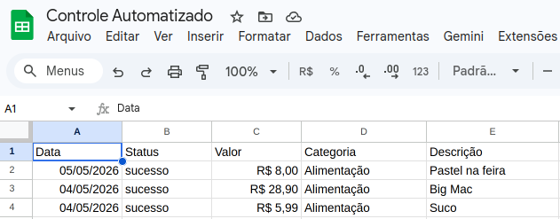

# Merge-Readiness Pack

> **Projeto:** logFinanceiro -Automação Financeira Pessoal com n8n e Agentes de IA<br>
> **Aluno(a):** Marcos Antonio Teles de Castilhos<br>
> **Data:** 05/05/2026

---

## 1. Resumo da solução escolhida

Workflow desenvolvido no n8n recebendo inputs via Telegram. Processa áudio e texto utilizando a infraestrutura Groq (Whisper e Llama) sob restrições estritas de System Prompt e formatação estruturada. O roteamento condicional bloqueia exceções, garantindo que o Google Sheets receba apenas dados sanitizados.

---

## 2. Comparação entre as três alternativas

| Critério | Solution A (Prompt Simples) | Solution B (RAG) | Solution C (JSON + Roteador) |
|----------|-----------|-----------|-----------|
| Abordagem | Extração livre | Contextual | Validação estrita (Compilador) |
| Custo | Baixo | Alto | Baixo |
| Complexidade | Baixa | Alta | Média |
| Qualidade da resposta | Inconsistente | Arriscada (Alucinação) | Determinística |
| Riscos | Quebra de integração | Invenção de dados | Falha no pre-parse de áudio |
| Manutenibilidade | Ruim | Péssima | Excelente |
| Adequação ao problema | Baixa | Baixa | Máxima |  Solução escolhida: C  Justificativa: Garantia arquitetural de persistência limpa e tratamento holístico de erros sem complexidade acidental.  

---

## 3. Testes executados

| Teste | Descrição | Expectativa | Resultado |
|-------|-----------|-----------|-----------|
| Extração de Texto | Input de texto com valor e categoria. | Sucesso | Passou |
| Exceção de Valor (texto) | Input de texto sem valor monetário claro. | Falha | Passou |
| Spoofing de Áudio | Input de voz (.oga) via Telegram convertido para Whisper. | Sucesso | Passou |
| Exceção de Valor (audio) | Input de voz (.oga) sem valor monetário declarado | Falha | Passou |


---

## 4. Evidências de funcionamento




---

## 5. Limitações conhecidas

- O sistema é stateless (não mantém contexto conversacional para correções parciais).  

- Dependência de spoofing manual do formato .oga em nó de código.

---

## 6. Riscos

| Risco | Probabilidade | Impacto | Mitigação |
|-------|---------------|---------|-----------|
| Falha na API Groq | Baixa | Alto | Loop dando a possibilidade ao usuário de tentar novamente |  

---

## 7. Decisões arquiteturais

_Liste as principais decisões de arquitetura (ou referencie os ADRs)._

- [ADR-001: Arquitetura de Roteamento Determinístico e Extração Estrita](/projeto-3/docs/adr/ADR-001.md)

---

## 8. Instruções de execução

```
# 1. Importar o arquivo workflow.json para o ambiente do n8n.
# 2. Configurar a credencial "Telegram API" criando um novo bot via @BotFather.
# 3. Configurar a credencial "Groq API" (ou OpenAI compatível) com uma API Key válida.
# 4. Configurar a credencial "Google Sheets" e atualizar o nó com o ID da sua planilha.
# 5. Ativar o workflow (Toggle Active).
# 6. Enviar uma mensagem de áudio ou texto para o bot no Telegram contendo um gasto e um valor.
```

---

## 9. Checklist de revisão

- [X] Mission brief atendido
- [X] Três soluções implementadas/prototipadas
- [X] Testes executados e documentados
- [X] Evidências registradas em `docs/evidence/`
- [X] ADR(s) registrado(s) em `docs/adr/`
- [X] Commits com mensagens claras e racionalidade
- [X] Código funcional em `src/`
- [X] Agent.md preenchido
- [X] Mentorship Pack preenchido
- [X] Workflow Runbook seguido

---

## 10. Justificativa para merge

_Por que esta entrega está pronta para ser revisada e aceita?_

A arquitetura atende a 100% dos requisitos técnicos e metodológicos da disciplina, combinando orquestração low-code com controle absoluto das alucinações de modelos generativos, suportada por auditoria robusta.