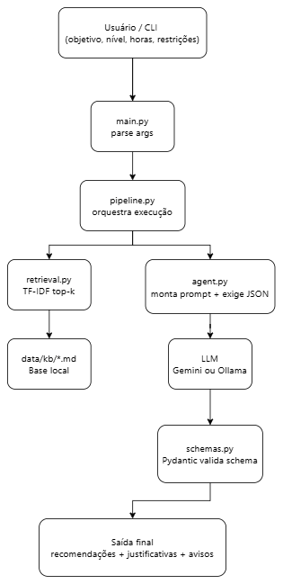

# Documento de Engenharia — Projeto Individual 1

> **Aluno(a):** Patricia Helena Macedo da Silva 
> **Matrícula:** 221037993
> **Domínio:** Educação [2]
> **Função do agente:** Recomendação [2]
> **Restrição obrigatória:** Explicabilidade obrigatória  [4]

---

## 1. Problema e Contexto

Estudantes frequentemente não sabem **por onde começar**, **em que ordem estudar** nem **quais recursos** usar, dado um objetivo (ex.: passar em uma disciplina, aprender uma linguagem) e restrições de tempo e nível. No domínio da **educação**, recomendações genéricas (“estude mais”) pouco ajudam; é necessário um plano acionável e **justificado**.

O problema endereçado por este trabalho é: **apoiar a decisão do aluno com recomendações personalizadas de trilha de estudo**, de modo que cada sugestão traga uma **justificativa explícita** ligada ao perfil informado (objetivo, nível, carga horária semanal e preferências).

**Público-alvo:** estudantes de ensino superior ou autodidatas que buscam organizar o aprendizado com transparência sobre o raciocínio do sistema.

---

## 2. Stakeholders

| Stakeholder | Papel | Interesse no sistema |
|-------------|-------|----------------------|
| Estudante (usuário final) | Informa objetivo e restrições; consome recomendações | Obter plano claro, priorizado e compreensível |
| Mantenedor do conteúdo (futuro) | Atualiza base textual local usada no RAG | Manter base alinhada a boas práticas pedagógicas |

---

## 3. Requisitos Funcionais (RF)

| ID | Descrição | Prioridade |
|----|-----------|------------|
| RF01 | O sistema deve aceitar objetivo de aprendizagem, nível declarado, tempo semanal e restrições opcionais | Alta |
| RF02 | O sistema deve recuperar trechos relevantes de uma base local (Markdown) para contextualizar o LLM (RAG leve) | Alta |
| RF03 | O sistema deve gerar entre 2 e 6 recomendações, cada uma com **justificativa obrigatória** vinculada ao perfil | Alta |
| RF04 | A saída deve ser validada estruturalmente (schema) para garantir campos de explicabilidade | Alta |
| RF05 | Deve existir interface de linha de comando (CLI) para executar o agente | Média |

---

## 4. Requisitos Não-Funcionais (RNF)

| ID | Descrição | Categoria |
|----|-----------|-----------|
| RNF01 | Explicabilidade: toda recomendação inclui `justificativa` com comprimento mínimo e conteúdo não vazio | Confiabilidade / Transparência |
| RNF02 | Latência aceitável para protótipo: resposta em até alguns segundos com API Gemini; local com Ollama pode ser mais lento | Desempenho |
| RNF03 | Chaves e segredos apenas via variáveis de ambiente (`.env`), sem commit de credenciais | Segurança |
| RNF04 | Testes automatizados para recuperação e validação de schema (sem depender de rede para regressão básica) | Manutenibilidade |

---

## 5. Casos de Uso

### Caso de uso 1: Obter plano de estudo explicado

- **Ator:** Estudante  
- **Pré-condição:** Ambiente configurado (`GEMINI_API_KEY` ou Ollama em execução); dependências instaladas  
- **Fluxo principal:**
  1. O estudante informa objetivo, nível, horas/semana e opcionalmente restrições via CLI  
  2. O sistema monta consulta textual e recupera trechos da base local  
  3. O LLM gera JSON com recomendações e justificativas  
  4. O sistema valida o JSON com Pydantic e exibe resultado  
- **Pós-condição:** Lista de recomendações com justificativas e possíveis avisos de limitação  

### Caso de uso 2: Reexecutar com outro perfil

- **Ator:** Estudante  
- **Pré-condição:** Mesmo ambiente do caso 1  
- **Fluxo principal:**
  1. O estudante altera parâmetros (ex.: menos horas semanais)  
  2. Executa novamente o comando  
  3. Compara saídas (manualmente ou salvando JSON)  
- **Pós-condição:** Novo plano coerente com o novo perfil  

---

## 6. Fluxo do Agente

```mermaid
  Entrada: [objetivo, nível, horas, restrições] --> 1: [Montagem da consulta textual]
  1 --> 2: [RAG: TF-IDF + top-k trechos da KB Markdown]
  2 --> 3: [Prompt: perfil + contexto recuperado]
  3 --> 4: [LLM: JSON estruturado]
  4 --> 5: [Validação Pydantic + retry opcional]
  5 --> Saída: [recomendações + justificativas + avisos]
```

Descrição textual: o usuário fornece dados estruturados na CLI; o pipeline concatena esses dados em uma consulta; o recuperador ranqueia parágrafos da base local; o prompt de sistema exige explicabilidade; o modelo retorna JSON; a aplicação valida e materializa objetos Python.

---

## 7. Arquitetura do Sistema

- **Tipo de agente:** Pipeline sequencial com **RAG leve** (recuperação lexical TF-IDF sobre ficheiros locais) + **LLM** gerador com saída JSON  
- **LLM utilizado:** Google **Gemini** (`gemini-2.5-flash` por padrão; lista de fallback em `agent.py` se o modelo não existir na API) ou **Ollama** local  

- **Componentes principais:**
  - [x] Módulo de entrada (CLI + `EntradaUsuario`)
  - [x] Processamento / LLM (`agent.py`)
  - [ ] Ferramentas externas (tools) — não usado neste protótipo
  - [ ] Memória — não persistente entre execuções
  - [x] Módulo de saída (serialização JSON + validação `AgenteSaida`)

**Diagrama de arquitetura (componentes):**



---

## 8. Estratégia de Avaliação

- **Métricas definidas:**
  - **Cobertura de explicabilidade:** fração de recomendações com `justificativa` não vazia e com tamanho mínimo (garantido pelo schema).
  - **Relevância subjetiva:** escala 1–5 por um avaliador humano em 3–5 cenários (perfil + objetivo).
  - **Latência:** tempo médio de uma execução completa (CLI até JSON).
  - **Custo (quando Gemini):** consultar cotas/preços na documentação Google AI (opcional no relatório).

- **Conjunto de testes:**  
  - Automatizado: testes de KB não vazia, ranqueamento do recuperador e validação de schema.  
  - Manual: 2–3 perfis distintos (iniciante com poucas horas; intermediário com projeto; objetivo técnico específico).

- **Método de avaliação:** misto — regressão automática para componentes determinísticos; julgamento humano para utilidade e coerência das justificativas.

---

## 9. Referências

1. Google AI Studio / Gemini API: https://ai.google.dev/gemini-api/docs  
2. Scikit-learn — `TfidfVectorizer`, similaridade coseno: https://scikit-learn.org/  
3. Pydantic v2 — validação de modelos: https://docs.pydantic.dev/  
4. Ollama — API HTTP local: https://github.com/ollama/ollama  
