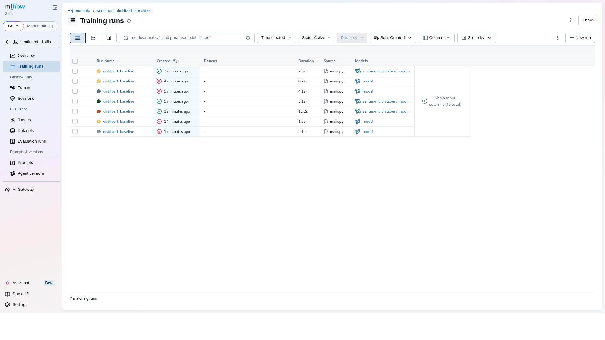
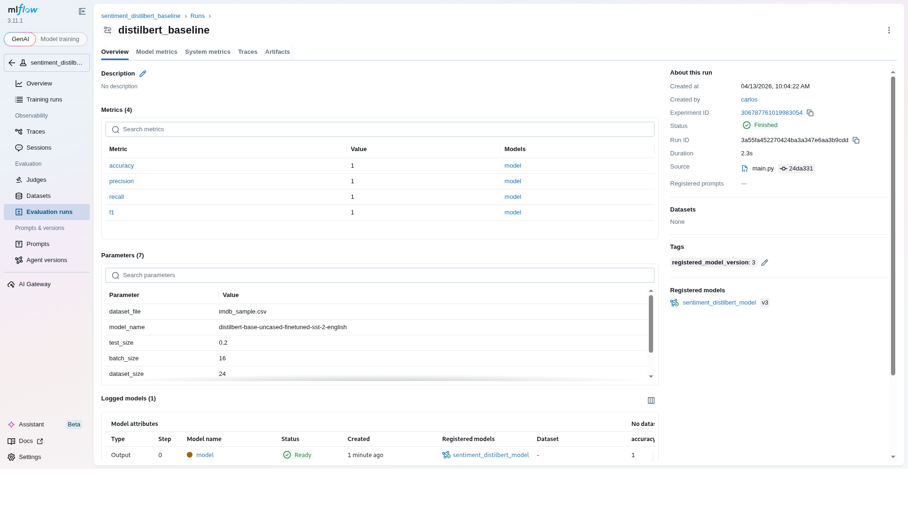
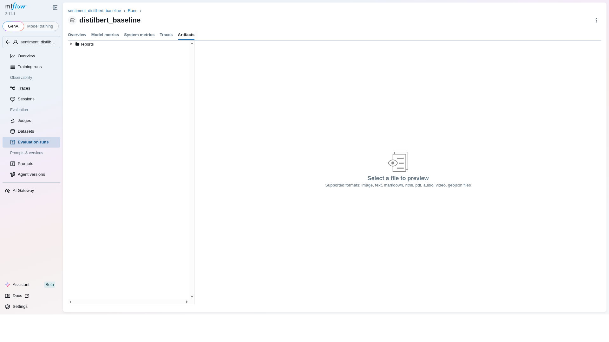
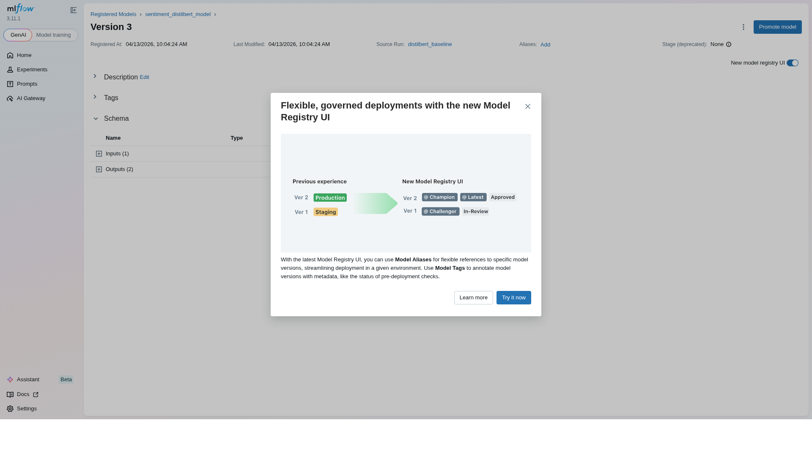

# Relatorio de Entrega - Projeto Individual 2: Sistema de ML com MLflow

> **Aluno(a):** [Seu nome completo]
> **Matricula:** [Sua matricula]
> **Data de entrega:** [DD/MM/AAAA]

---

## 1. Resumo do Projeto

Este projeto implementa um sistema de machine learning end-to-end para classificacao de sentimento de reviews de filmes (positivo/negativo). O modelo reutilizado foi o distilbert-base-uncased-finetuned-sst-2-english, disponibilizado no Hugging Face. O pipeline foi estruturado de forma modular, com etapas claras de ingestao, preprocessamento, avaliacao, registro de experimentos no MLflow e inferencia. Como resultado principal, o sistema permite comparar execucoes, inspecionar metricas e artefatos, registrar versoes de modelo e executar predicoes de forma reproduzivel. Tambem foram implementados guardrails para reduzir uso indevido, incluindo validacao de entrada e abstencao por baixa confianca.

---

## 2. Escolha do Problema, Dataset e Modelo

### 2.1 Problema

Classificacao de sentimento em texto livre (reviews de filmes), problema relevante para monitoramento de opiniao e analise de experiencia do usuario.

### 2.2 Dataset

| Item | Descricao |
|------|-----------|
| **Nome do dataset** | IMDB Sample (amostra local) |
| **Fonte** | Curadoria local inspirada em reviews de filmes |
| **Tamanho** | 24 amostras |
| **Tipo de dado** | Texto rotulado (positive/negative) |

### 2.3 Modelo pre-treinado

| Item | Descricao |
|------|-----------|
| **Nome do modelo** | distilbert-base-uncased-finetuned-sst-2-english |
| **Fonte** (ex: Hugging Face) | Hugging Face |
| **Tipo** (ex: classificacao, NLP) | NLP - classificacao de sentimento |
| **Fine-tuning realizado?** | Nao |

---

## 3. Pre-processamento

Decisoes aplicadas aos dados:

- Normalizacao de espacos em branco e limpeza de texto
- Padronizacao de labels para minusculo
- Validacao de schema (colunas obrigatorias e labels permitidos)

---

## 4. Estrutura do Pipeline

Pipeline implementado:

```text
Ingestao -> Pre-processamento -> Carregamento do modelo -> Avaliacao -> Registro MLflow -> Deploy local
```

### Decisoes de engenharia

- Modularizacao por responsabilidade: ingestao/preprocessamento, modelo, avaliacao, guardrails e orquestracao
- Configuracoes centralizadas em `src/config.py` para facilitar reproducibilidade
- Registro de execucao em MLflow com parametros, metricas e artefatos versionados
- Registro de modelo no Model Registry para desacoplar treino e inferencia
- Inferencia com fallback seguro: valida entrada, aplica limite de confianca e pode retornar abstencao

### Estrutura do codigo

```text
sistema-mlflow-sentimento/
├── src/
│   ├── config.py
│   ├── data_pipeline.py
│   ├── model_pipeline.py
│   ├── evaluation.py
│   ├── guardrails.py
│   ├── main.py
│   └── inference.py
├── data/
│   └── imdb_sample.csv
├── mlruns/
├── reports/
├── requirements.txt
└── README.md
```

---

## 5. Uso do MLflow

### 5.1 Rastreamento de experimentos

- **Parametros registrados:** modelo, arquivo de dados, tamanho de split, batch size, tamanhos de treino/teste
- **Metricas registradas:** accuracy, precision, recall, f1
- **Artefatos salvos:** matriz de confusao (png) e tabela de predicoes (csv)

### 5.2 Versionamento e registro

O modelo e logado com flavor transformers no MLflow e registrado no Model Registry local com nome `sentiment_distilbert_model`. O versionamento foi validado com 3 versoes publicadas (v1, v2, v3), permitindo rastreabilidade entre run, modelo e inferencia.

### 5.3 Evidencias

Prints gerados da UI do MLflow:

- Runs: `docs/evidencias/01-runs.png`
- Metricas e parametros da run: `docs/evidencias/02-run-metricas.png`
- Artifacts da run: `docs/evidencias/04-run-artifacts.png`
- Model Registry (versao registrada): `docs/evidencias/03-model-registry.png`

Imagens:









---

## 6. Deploy

- **Metodo de deploy:** script local de inferencia com carregamento via MLflow
- **Como executar inferencia:**

```bash
python src/inference.py --text "This movie was amazing and emotional"
```

---

## 7. Guardrails e Restricoes de Uso

Mecanismos implementados:

- Validacao de tipo e conteudo da entrada
- Limite minimo e maximo de tamanho de texto
- Rejeicao de entrada fora de escopo textual
- Abstencao quando confianca da predicao fica abaixo do limiar

---

## 8. Observabilidade

- **Comparacao de execucoes:** 3 runs finalizadas e comparaveis no mesmo experimento
- **Analise de metricas:** accuracy, precision, recall e f1 por run
- **Capacidade de inspecao:** parametros, artefatos e versao de modelo por execucao

Resumo das 3 execucoes (tambem salvo em `reports/runs_comparison.csv`):

| Run ID | Inicio (UTC) | Accuracy | Precision | Recall | F1 | Batch | Test Size | Model Version |
|---|---|---:|---:|---:|---:|---:|---:|---:|
| 3a55fa452270424ba3a347e6aa3b9cdd | 2026-04-13 13:04:22 | 1.0 | 1.0 | 1.0 | 1.0 | 16 | 0.2 | 3 |
| bdf64f61ab4b46508125ab39051c13cc | 2026-04-13 13:01:30 | 1.0 | 1.0 | 1.0 | 1.0 | 16 | 0.2 | 2 |
| 9782797c6cdc4e359f0cdc6f3f421ce6 | 2026-04-13 12:55:05 | 1.0 | 1.0 | 1.0 | 1.0 | 16 | 0.2 | 1 |

---

## 9. Limitacoes e Riscos

- **Risco de sobreajuste por amostra pequena (alto impacto):** dataset com 24 linhas pode inflar metricas.
- **Risco de dominio/idioma (medio impacto):** modelo em ingles pode perder desempenho em textos fora do dominio esperado.
- **Risco de falsa confianca (alto impacto):** mesmo com limiar, previsoes erradas com score alto podem ocorrer.
- **Risco operacional de backend local (medio impacto):** backend file do MLflow e suficiente para projeto, mas nao ideal para escala/producao.
- **Risco de cobertura de guardrails (medio impacto):** regras atuais sao baselines; nao cobrem todos os tipos de uso indevido.

---

## 10. Como executar

```bash
# 1. Instalar dependencias
pip install -r requirements.txt

# 2. Executar o pipeline
python src/main.py

# 3. Iniciar o MLflow UI
mlflow ui --backend-store-uri file:./mlruns --port 5000

# 4. Executar inferencia
python src/inference.py --text "This movie was amazing and emotional"

# 5. (Opcional) Gerar 3 runs comparaveis para observabilidade
python src/main.py
python src/main.py
python src/main.py
```

---

## 11. Referencias

1. https://mlflow.org/docs/latest/index.html
2. https://huggingface.co/distilbert-base-uncased-finetuned-sst-2-english
3. https://scikit-learn.org/stable/modules/model_evaluation.html

---

## 12. Checklist de entrega

- [x] Codigo-fonte completo
- [x] Pipeline funcional
- [x] Configuracao do MLflow
- [x] Evidencias de execucao (logs, prints ou UI)
- [x] Modelo registrado
- [x] Script de inferencia
- [x] Relatorio de entrega preenchido
- [ ] Pull Request aberto
