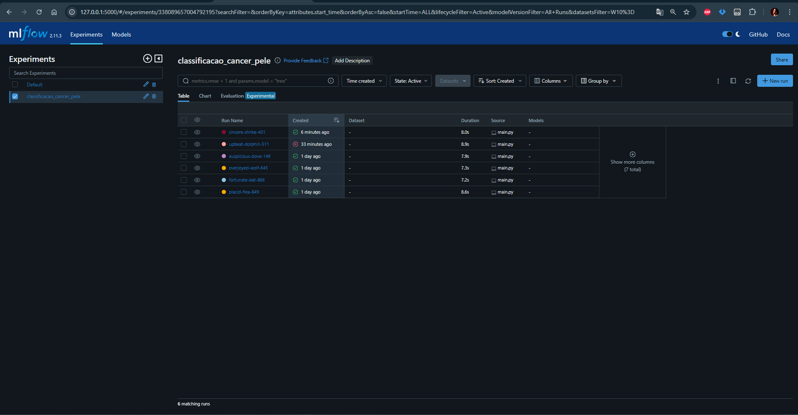
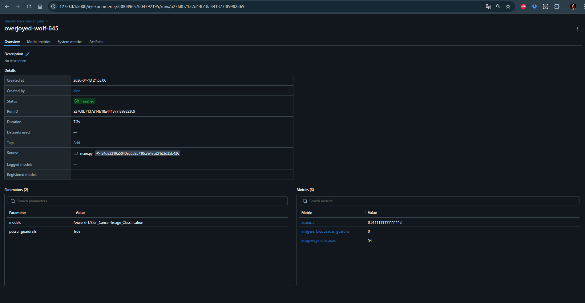
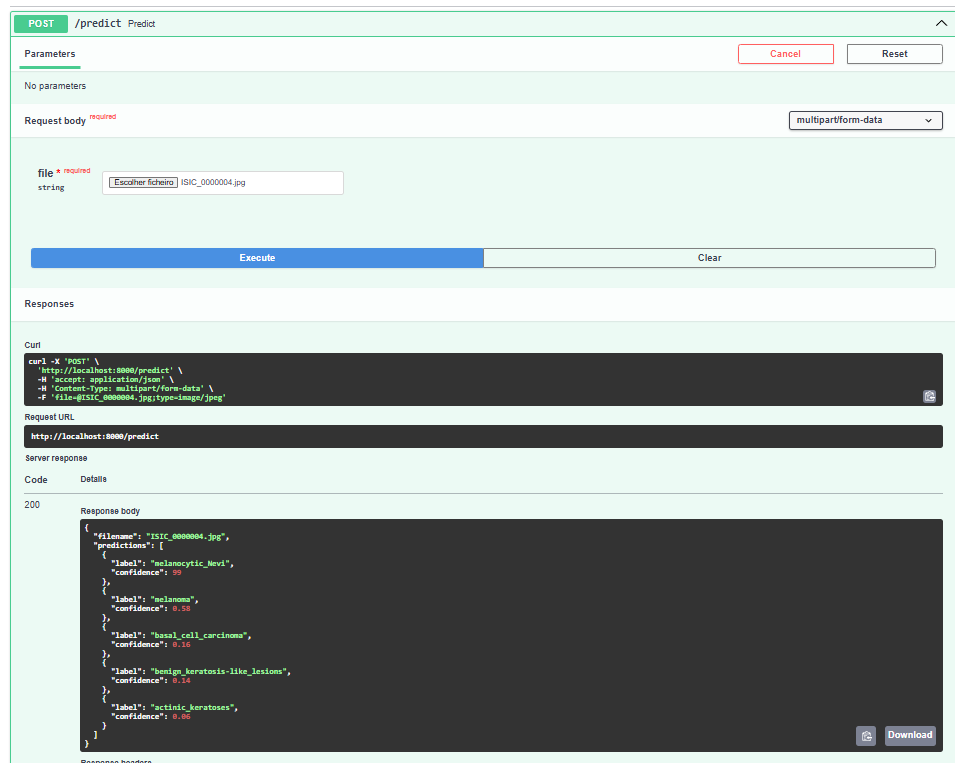

# Relatório de Entrega — Projeto Individual 2: Sistema de ML com MLflow

> **Aluno(a):** Alex Gabriel Alves Faustino  
> **Matrícula:** 2000056603  
> **Data de entrega:** 15/04/2026

---

## 1. Resumo do Projeto

Este projeto implementa um pipeline de ML orientado a engenharia para a tarefa ilustrativa de detecção/classificação de câncer de pele a partir de imagens dermatoscópicas. O pipeline ingere imagens e metadados, aplica validações (guardrails), carrega um modelo pré-treinado disponibilizado no Hugging Face (quando possível), executa inferência em lote, registra parâmetros/métricas no MLflow e tenta registrar o artefato do modelo no Model Registry.

---

## 2. Escolha do Problema, Dataset e Modelo

### 2.1 Problema

Classificação binária (benign vs malignant) de lesões de pele a partir de imagens dermatoscópicas. O objetivo é demonstrar um pipeline reprodutível, rastreável e protegido por guardrails para reduzir risco de uso indevido.

### 2.2 Dataset

| Item | Descrição |
|------|-----------|
| **Nome do dataset** | Subconjunto ilustrativo (ISIC-like) presente em `data/` |
| **Fonte** | Arquivos locais incluídos no repositório (pastas `data/benign` e `data/malignant`) |
| **Tamanho** | ~60 imagens (varia conforme os metadados) |
| **Tipo de dado** | Imagens (JPG/PNG) + `metadata.csv` por subpasta |

### 2.3 Modelo pré-treinado

| Item | Descrição |
|------|-----------|
| **Nome do modelo** | Anwarkh1/Skin_Cancer-Image_Classification (Hugging Face) |
| **Fonte** (ex: Hugging Face) | Hugging Face Hub (repo público) |
| **Tipo** (ex: classificação, NLP) | Classificação de imagens |
| **Fine-tuning realizado?** | Não (modelo pré-treinado reutilizado sem novo fine-tuning neste pipeline) |

---

## 3. Pré-processamento

- Leitura das imagens em RGB usando PIL/transformers utilities.
- Dimensionamento/resizing é delegado ao modelo/pipeline carregado (ou ao wrapper Keras quando aplicável) para garantir a mesma resolução esperada pelo modelo.
- Aplicação de guardrails (filtragem por `image_type == dermoscopic`, validação de `isic_id` presente no metadata, bloqueio para `age_approx < 18`).

---

## 4. Estrutura do Pipeline

Fluxo:

Ingestão → Pré-processamento/validação (guardrails) → Carregamento do modelo → Inferência em lote → Registro de métricas/artifacts no MLflow

### Estrutura do código

```
projeto-2/
├── src/
│   ├── main.py        # pipeline principal
│   ├── api.py         # (esqueleto) endpoint recomendado
├── data/
│   ├── benign/
│   ├── malignant/
├── docs/              # Documentação / relatorio 
├── mlruns/
├── requirements.txt
├── .env (template)
└── README.md
```

Principais componentes:
- `src/main.py` — carrega metadados, aplica guardrails, carrega modelo (Hugging Face Keras ou fallback transformers pipeline), executa inferência e registra runs no MLflow.

---

## 5. Uso do MLflow

### 5.1 Rastreamento de experimentos

- **Parâmetros registrados:** ID do modelo (`HF_MODEL_ID`), flags de guardrail, ambiente (quando disponível).
- **Métricas registradas:** `acuracia` (quando aplicável), `imagens_processadas`, `imagens_bloqueadas_guardrail`.
- **Artefatos salvos:** tentativa de log do modelo (`mlflow.keras.log_model` ou `mlflow.pyfunc.log_model`) e tags com `model_label_preview` para inspeção.

### 5.2 Versionamento e registro

A ideia era tentar registrar automaticamente o modelo no Model Registry do MLflow usando o nome `MLFLOW_MODEL_NAME` (padrão `skin_cancer_model`). Mas houve complicações e não obtive sucesso. O servidor MLflow está configurado corretamente.

### 5.3 Evidências

- Runs locais são gravadas em `mlruns/` e podem ser visualizadas pela MLflow UI
- Prints da inteface do ml 

#### Experimentos

#### Metricas

#### Endpoint de inferencia 

---

## 6. Deploy

**Estado atual:** O modelo foi disponibilizado localmente através de uma API REST funcional, utilizando FastAPI. A aplicação expõe um endpoint interativo documentado via Swagger UI, capaz de receber imagens via formulário e retornar predições estruturadas.

- **Método de deploy:** Endpoint REST local expondo a rota `/predict`.
- **Como executar inferência:**

Com a API em execução, acesse `http://localhost:8000/docs` para testes manuais ou utilize o comando cURL:

```bash
curl -X 'POST' \\
  'http://localhost:8000/predict' \\
  -H 'accept: application/json' \\
  -H 'Content-Type: multipart/form-data' \\
  -F 'file=@data/benign/ISIC_0000004.jpg;type=image/jpeg'
```

## 7. Guardrails e Restrições de Uso

- Validação de escopo: inferência apenas para `isic_id` presentes em `metadata.csv`.
- Validação de qualidade: exige `image_type` contendo `dermoscopic`.
- Proteção por idade: bloqueio para registros com `age_approx < 18`.
- Validação de vocabulário: se as labels do modelo não incluírem `benign`/`malignant` o pipeline bloqueia por padrão (configurável via `ALLOW_LABEL_MISMATCH`).

---

## 8. Observabilidade

- **Comparação de execuções:** via MLflow UI comparando parâmetros e métricas entre runs.
- **Análise de métricas:** `acuracia` e contadores de imagens processadas/bloqueadas são registrados por run.
- **Capacidade de inspeção:** tags e artifacts no MLflow (ex.: `model_label_preview`, arquivos de confusão quando gerados) permitem inspeção manual.

---

## 9. Limitações e Riscos

- Uso clínico: o sistema é apenas ilustrativo; qualquer uso real exige validação clínica e revisão regulatória.
- Robustez: ausência de testes automatizados de robustez a variações de imagem, dispositivos e artefatos.

---

## 10. Como executar

Passos reproduzíveis usados nos testes locais:

```bash
cd alex-faustino-alves-faustino/pipeline-cancer-pele
# ativar o venv (se existir)
. venv/bin/activate
# instalar dependências
pip install -r requirements.txt
# iniciar MLflow UI (se desejar)
mlflow ui 
# executar pipeline
python src/main.py
```
---

## 11. Referências

1. Hugging Face Hub — https://huggingface.co
2. MLflow Documentation — https://mlflow.org
3. ISIC Dataset (referência conceitual)

---

## 12. Checklist de entrega

- [x] Código-fonte completo (presente no repositório)
- [x] Pipeline funcional (execução em lote com guardrails; runs criadas em `mlruns/`)
- [x] Configuração do MLflow (UI local e `mlruns/`)
- [x] Evidências de execução (logs e runs locais)
- [ ] Modelo registrado 
- [X] Script ou endpoint de inferência (recomendado: implementar `src/api.py` ou usar `mlflow models serve` após registro)
- [x] Relatório de entrega preenchido (este arquivo)
- [X] Pull Request aberto

