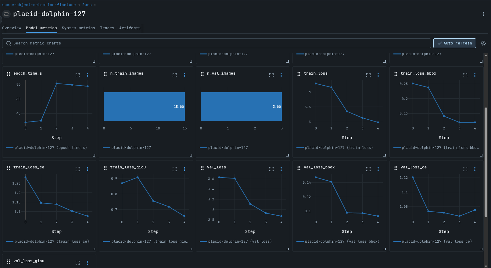
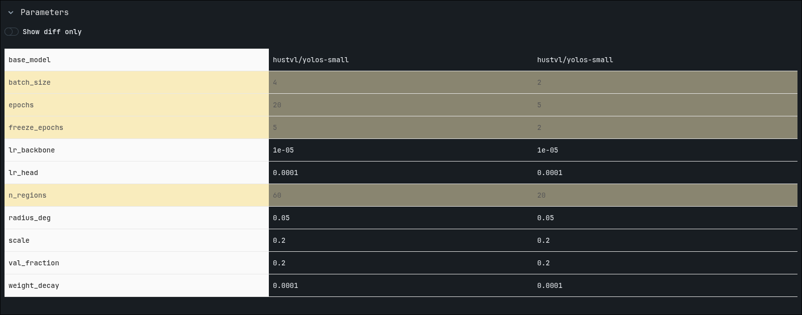
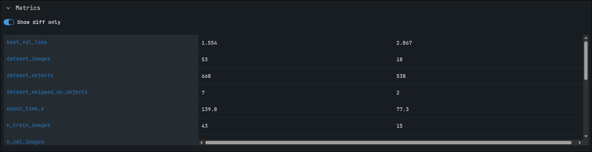
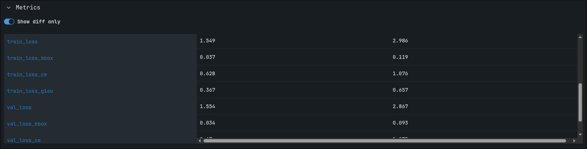
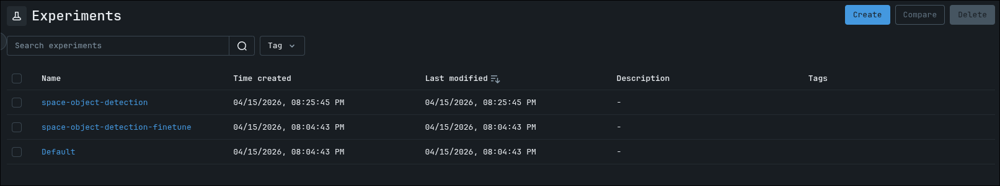
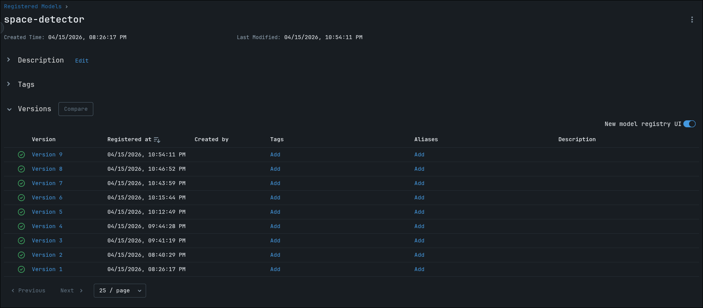
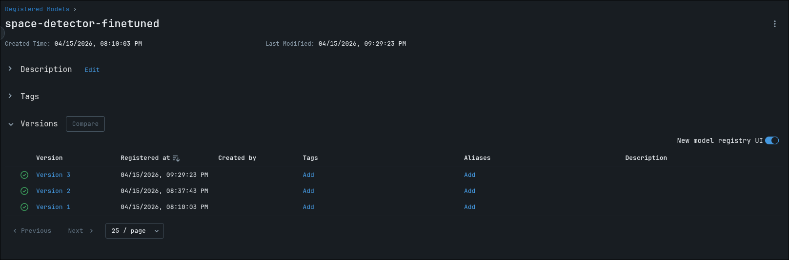
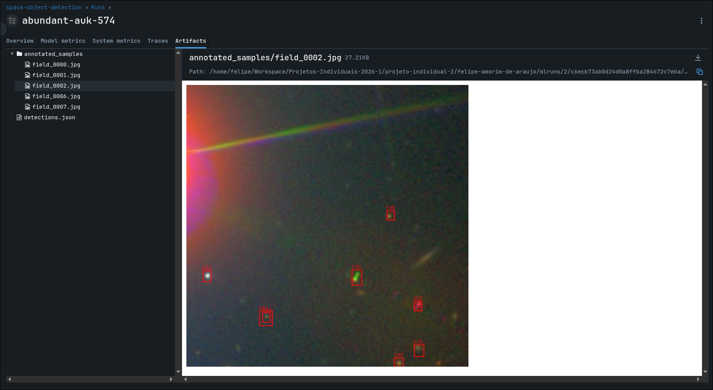
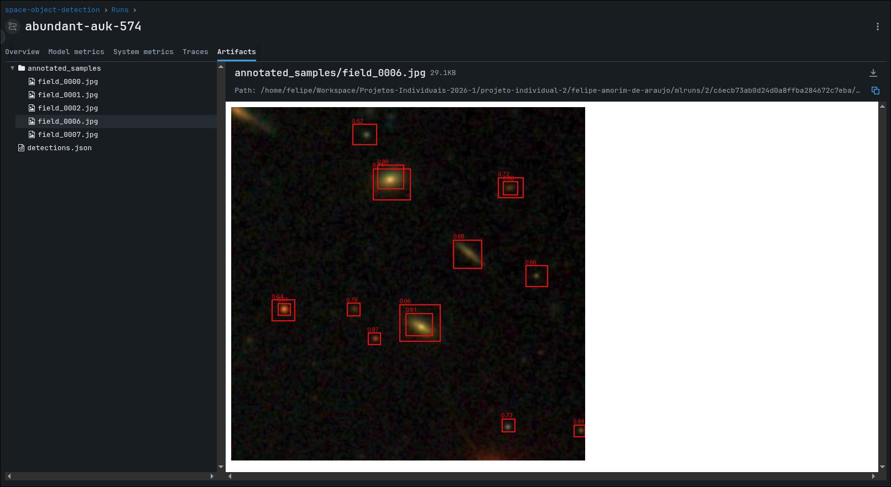

# Relatório de Entrega — Projeto Individual 2: Sistema de ML com MLflow

> **Alunos:** Felipe Amorim de Araujo e Gabryel Nicolas Soares de Sousa
> **Matrícula:** 221022275/221022570
> **Data de entrega:** 15/04/2026

---

## 1. Resumo do Projeto

Este projeto implementa um pipeline de Machine Learning end-to-end para detecção de objetos astronômicos (estrelas, galáxias e quasares) em imagens do céu provenientes do Sloan Digital Sky Survey (SDSS DR17). O sistema reutiliza o modelo pré-treinado YOLOS-small (`hustvl/yolos-small`, Hugging Face) como detector de bounding boxes, com módulo opcional de fine-tuning supervisionado por anotações automáticas geradas a partir do catálogo do SDSS.

O pipeline cobre ingestão automática de imagens via API do SDSS, pré-processamento com arcsinh stretch (técnica padrão em imageamento astronômico), guardrails de entrada e saída, rastreamento completo com MLflow (parâmetros, métricas, artefatos), registro no Model Registry como pyfunc e deploy via `mlflow models serve`. O foco está na engenharia do sistema, com rastreabilidade e observabilidade completas.

---

## 2. Escolha do Problema, Dataset e Modelo

### 2.1 Problema

Detecção automática de objetos em imagens astronômicas do SDSS. O sistema identifica e delimita objetos celestes (estrelas, galáxias, quasares) com bounding boxes.

Relevância:
- Alto volume de imagens impossibilita análise manual
- Modelos modernos de visão computacional não são amplamente testados nesse domínio
- Desafio técnico devido à alta faixa dinâmica das imagens (objetos brilhantes ao lado de fontes fracas)

### 2.2 Dataset

| Item | Descrição |
|------|----------|
| **Nome** | SDSS DR17 (Sloan Digital Sky Survey, Data Release 17) |
| **Fonte** | https://skyserver.sdss.org |
| **Tamanho (inferência)** | 20 regiões → 18 imagens 640×640 (2 regiões sem objetos descartadas) |
| **Tamanho (fine-tuning)** | 150 regiões → 86 imagens com 538 objetos anotados |
| **Tipo** | Imagens RGB JPEG + catálogo fotométrico (RA, Dec, tipo, magnitude, raio Petrosiano) |
| **Filtragem** | `mode=1` (detecções primárias), `type ∈ {3,5,6}` (galáxia, quasar, estrela), `psfMag_r < 22` |

### 2.3 Modelo pré-treinado

| Item | Descrição |
|------|----------|
| **Nome** | `hustvl/yolos-small` |
| **Fonte** | Hugging Face |
| **Arquitetura** | YOLOS (You Only Look at One Sequence) — Vision Transformer para detecção de objetos |
| **Pré-treinamento** | COCO (detecção genérica de objetos) |
| **Fine-tuning** | Sim — cabeça substituída por 3 classes (star/galaxy/quasar), treinamento em 2 fases |

---

## 3. Pré-processamento

- **Arcsinh stretch** por canal: comprime a faixa dinâmica preservando fontes fracas, técnica padrão em imageamento astronômico (`preprocess.py`)
- **Normalização per-channel** para [0, 255] após o stretch
- **Resize automático** via `YolosImageProcessor` (sem intervenção manual)
- **Filtragem no catálogo**: objetos com magnitude > 22 descartados (ruído fotométrico)
- **Particionamento**: split 80/20 treino/validação ao nível de imagem, seed=42 para reprodutibilidade

---

## 4. Estrutura do Pipeline

```
Ingestão (SDSS API)
    → Pré-processamento (arcsinh stretch)
        → Guardrail de entrada
            → Inferência (YOLOS-small)
                → Guardrail de saída
                    → Rastreamento MLflow
                        → Registro no Model Registry (pyfunc)
                            → Deploy (mlflow models serve)
```

### Fine-tuning (opcional, separado)

```
Download SDSS (150+ regiões)
    → Auto-anotação (projeção gnomônica RA/Dec → pixel)
        → Split treino/validação
            → Fine-tuning 2 fases (backbone frozen → end-to-end)
                → Registro no Model Registry (pyfunc)
```

### Estrutura do código

```
felipe-amorim-de-araujo/
├── src/
│   ├── pipeline.py              # Pipeline de inferência principal
│   ├── finetune_pipeline.py     # Pipeline de fine-tuning
│   ├── inference.py             # Cliente do endpoint REST
│   ├── data/
│   │   ├── ingest.py            # Download e query SDSS DR17
│   │   ├── preprocess.py        # Arcsinh stretch
│   │   ├── annotate.py          # Auto-anotação via catálogo
│   │   └── dataset.py           # PyTorch Dataset + collate_fn + split
│   └── model/
│       ├── detector.py          # Wrapper YOLOS-small
│       ├── guardrails.py        # Validação entrada/saída
│       ├── pyfunc_model.py      # MLflow pyfunc (pipeline completo servível)
│       └── train.py             # Loop de fine-tuning 2 fases
├── tests/
│   ├── data/
│   │   ├── test_ingest.py
│   │   ├── test_preprocess.py
│   │   ├── test_annotate.py
│   │   └── test_dataset.py
│   ├── model/
│   │   ├── test_detector.py
│   │   └── test_guardrails.py
│   └── test_pipeline.py
├── data/
│   ├── raw/                     # Imagens SDSS para inferência (18 imagens)
│   ├── processed/               # Imagens anotadas com bounding boxes
│   ├── finetune/
│   │   ├── raw/                 # Imagens SDSS para fine-tuning (86 imagens)
│   │   ├── annotations.json     # Anotações automáticas (538 objetos)
│   │   └── checkpoints/
│   │       ├── best/            # Melhor checkpoint (menor val_loss)
│   │       └── final/           # Último checkpoint
│   ├── detections.json          # Saída completa da última execução
│   └── model_config.json        # Config baked-in no pyfunc
├── mlruns/                      # Artefatos MLflow
├── mlflow.db                    # Backend SQLite
├── pyproject.toml
└── README.md
```

---

## 5. Uso do MLflow

### 5.1 Rastreamento de experimentos

**Experimentos criados:**
- `space-object-detection` — pipeline de inferência
- `space-object-detection-finetune` — pipeline de fine-tuning

**Parâmetros registrados (inferência):**

| Parâmetro | Descrição |
|-----------|-----------|
| `n_regions` | Número de regiões do SDSS |
| `radius_deg` | Raio de busca por região |
| `scale` | Escala da imagem (arcsec/pixel) |
| `confidence_threshold` | Confiança mínima de detecção |
| `nms_iou_threshold` | Threshold IoU para NMS |
| `model_name` | Modelo utilizado |

**Parâmetros registrados (fine-tuning):**

| Parâmetro | Descrição |
|-----------|-----------|
| `epochs` | Épocas totais |
| `freeze_epochs` | Épocas com backbone congelado |
| `lr_head` | Learning rate da cabeça |
| `lr_backbone` | Learning rate do backbone |
| `weight_decay` | Weight decay AdamW |
| `batch_size` | Tamanho do batch |
| `val_fraction` | Fração de validação |
| `base_model` | Modelo base HuggingFace |

**Métricas registradas (inferência):**

| Métrica | Descrição |
|---------|-----------|
| `n_images_downloaded` | Imagens baixadas |
| `n_regions_skipped` | Regiões sem objetos |
| `ingest_time_s` | Tempo de ingestão |
| `img_detections` *(step)* | Detecções por imagem |
| `img_avg_confidence` *(step)* | Confiança média por imagem |
| `img_inference_time_s` *(step)* | Latência por imagem |
| `detection_rate` | Taxa de imagens com detecções |
| `confidence_min/p25/p50/p75/p95/max` | Distribuição de confiança |
| `box_area_min/avg/max` | Distribuição de tamanho dos boxes |
| `guardrail_rejections_*` | Contagem por tipo de rejeição |

**Métricas registradas (fine-tuning):**

| Métrica | Descrição |
|---------|-----------|
| `train_loss / val_loss` *(step por época)* | Loss total |
| `train_loss_ce / val_loss_ce` *(step)* | Cross-entropy loss |
| `train_loss_bbox / val_loss_bbox` *(step)* | Bounding box regression loss |
| `train_loss_giou / val_loss_giou` *(step)* | GIoU loss |
| `epoch_time_s` *(step)* | Tempo por época |
| `best_val_loss` | Melhor val_loss obtido |

**Artefatos salvos:**
- `detections.json` — todas as predições com scores e boxes
- `annotated_samples/` — até 5 imagens com bounding boxes desenhadas
- `model/` — modelo pyfunc completo (checkpoint + config + código)

### 5.2 Versionamento e registro

Dois modelos registrados no MLflow Model Registry:

| Modelo | Versões | Flavor | Descrição |
|--------|---------|--------|-----------|
| `space-detector` | 9 | pyfunc | Pipeline de inferência com modelo base ou fine-tuned |
| `space-detector-finetuned` | 2 | pyfunc | Checkpoint do fine-tuning |

Todos os modelos são registrados como **pyfunc**, encapsulando o pipeline completo: guardrails de entrada → arcsinh stretch → YOLOS → guardrails de saída. Isso garante que o endpoint servido seja idêntico ao pipeline de treinamento.

Cada execução recebe tag `git_commit` para rastreabilidade código-modelo.

### 5.3 Evidências de execução

**Lista de experimentos:**


---

#### Runs de fine-tuning (`space-object-detection-finetune`)

| Run ID | Nome | Status | Imagens | Objetos | Épocas | best_val_loss |
|--------|------|--------|---------|---------|--------|---------------|
| `56567171` | big-doe-293 | FINISHED | 4 | 45 | 1 | 2.7323 |
| `754a9fa8` | placid-dolphin-127 | FINISHED | 18 | 538 | 5 | 2.8672 |
| `586651e6` | receptive-ram-241 | FAILED | 95 | 3229 | 30 | — |
| `90bd4966` | capable-cod-85 | FINISHED | 53 | 668 | 20 | **1.5543** |

A run `90bd4966` (`capable-cod-85`) produziu o checkpoint usado em produção. Dataset: 53 imagens, 668 objetos anotados, split 43 treino / 10 validação, ~140s por época.

**Progressão do loss por época — run `90bd4966`:**

| Época | train_loss | val_loss |
|-------|-----------|---------|
| 0 | 3.0474 | 2.6573 |
| 1 | 2.8877 | 2.5489 |
| 2 | 2.7241 | 2.5108 |
| 3 | 2.6678 | 2.4230 |
| 4 | 2.6688 | 2.4465 |
| **5** *(backbone descongelado)* | **2.3292** | **2.0510** |
| 6 | 2.1250 | 1.9518 |
| 7 | 2.0277 | 1.8976 |
| 8 | 1.9565 | 1.7889 |
| 9 | 1.8288 | 1.7048 |
| 10 | 1.7686 | 1.7287 |
| 11 | 1.6844 | 1.6221 |
| 12 | 1.6590 | 1.5955 |
| 13 | 1.5950 | 1.5718 |
| 14 | 1.6283 | 1.5672 |
| 15 | 1.5761 | 1.5728 |
| 16 | 1.5908 | 1.5564 |
| 17 | 1.5856 | 1.5657 |
| 18 | 1.5427 | 1.5586 |
| 19 | 1.5489 | **1.5543** ← best |

O impacto do descongelamento do backbone é claro na época 5: `val_loss` cai de 2.447 para 2.051 em uma única época, confirmando a eficácia do treinamento em 2 fases.

**Breakdown do loss final (run `90bd4966`, época 19):**

| Componente | train | val |
|-----------|-------|-----|
| `loss_ce` (classificação) | 0.6283 | 0.6704 |
| `loss_bbox` (regressão L1) | 0.0372 | 0.0341 |
| `loss_giou` (sobreposição) | 0.3673 | 0.3567 |
| **loss total** | **1.5489** | **1.5543** |

Treino e validação com losses muito próximos indicam boa generalização sem overfitting relevante.

**Run de fine-tuning (`90bd4966`) — curvas de loss visualizadas na MLflow UI:**



**Comparação entre runs de fine-tuning na MLflow UI:**





---

#### Runs de inferência (`space-object-detection`)

| Run ID | Modelo | threshold | detection_rate | n_detections | confidence_p50 | confidence_avg |
|--------|--------|-----------|----------------|--------------|----------------|----------------|
| `d5e3debd` | **base COCO** | 0.6 | **5.6%** | **1** | 0.661 | 0.661 |
| `dd4443bd` | fine-tuned | 0.4 | 100% | 772 | 0.566 | 0.598 |
| `e3b287ef` | fine-tuned | 0.5 | 100% | 359 | 0.652 | 0.691 |
| `fdf5bbca` | fine-tuned | 0.6 | 100% | 233 | 0.754 | 0.769 |
| `3e443f8e` | fine-tuned | 0.6 | 100% | 233 | 0.754 | 0.769 |
| `c6ecb73a` | fine-tuned | 0.6 | 100% | 233 | 0.754 | 0.769 |

**Impacto do fine-tuning:** Com `confidence_threshold=0.6`, o modelo base COCO detecta apenas 1 objeto em 18 imagens (5.6%). O modelo fine-tuned com os mesmos parâmetros detecta objetos em 100% das imagens (233 detecções, `confidence_p50=0.754`). O fine-tuning aumentou a taxa de detecção em **18×**.

**Sensibilidade ao threshold de confiança (modelo fine-tuned):**

| threshold | detecções | detection_rate | confidence_p50 |
|-----------|-----------|----------------|----------------|
| 0.4 | 772 | 100% | 0.566 |
| 0.5 | 359 | 100% | 0.652 |
| 0.6 | 233 | 100% | 0.754 |

Threshold=0.6 elimina ~70% das detecções de baixa confiança mantendo 100% de cobertura, sendo o ponto de operação escolhido para o modelo em produção.

**Run de inferência (`9fde6658`):**



---

#### Model Registry

**Model Registry — `space-detector` (9 versões) e `space-detector-finetuned` (2 versões), todos com flavor `pyfunc`:**




---

## 6. Deploy

O modelo é registrado como **MLflow pyfunc**, que encapsula todo o pipeline de inferência. Isso permite que o endpoint servido execute guardrails, pré-processamento e pós-processamento sem dependência de código externo.

```bash
# Verificar versão mais recente registrada
uv run python -c "
import mlflow
client = mlflow.tracking.MlflowClient()
versions = client.get_latest_versions('space-detector')
print(versions[-1].version)
"

# Iniciar o servidor (substituir N pela versão)
uv run mlflow models serve -m "models:/space-detector/N" --port 5001 --no-conda
```

**Chamada ao endpoint:**

```bash
uv run python -m src.inference --image data/raw/field_0000.jpg
```

**Formato da requisição (JSON):**

```json
{
  "dataframe_records": [
    {"b64_image": "<base64-encoded JPEG>"}
  ]
}
```

**Formato da resposta:**

```json
{
  "predictions": [
    {
      "result": "{\"detections\": [{\"box\": [x1, y1, x2, y2], \"score\": 0.72}], \"warnings\": [], \"error\": null}"
    }
  ]
}
```

---

## 7. Guardrails e Restrições de Uso

Implementados em `src/model/guardrails.py` e aplicados em três pontos do pipeline: cliente (`inference.py`), pipeline batch (`pipeline.py`) e dentro do pyfunc servido.

**Validação de entrada (`validate_input`):**

| Verificação | Critério | Razão |
|-------------|----------|-------|
| Modo da imagem | RGB obrigatório | Grayscale/RGBA inválidos para o modelo |
| Dimensão mínima | ≥ 100px no menor lado | Imagem pequena demais para análise |
| Dimensão máxima | ≤ 4096px no maior lado | Limites de memória e API |
| Imagem em branco | média de pixel < 2 | Sem sinal (céu escuro ou arquivo corrompido) |
| Superexposição | média de pixel > 250 | Saturada (lua, artefato brilhante) |

**Validação de saída (`validate_output`):**

| Verificação | Critério | Ação |
|-------------|----------|------|
| Confiança mínima | score < threshold (padrão: 0.6) | Descarta detecção |
| Box muito grande | área > 25% da imagem | Descarta (trilhas de satélite, spikes) |
| Nenhuma detecção | 0 detecções após filtros | Warning `no_detections` |
| Excesso de detecções | > 150 detecções | Warning `too_many_detections` |

Rejeições de guardrail são registradas como métricas MLflow (`guardrail_rejections_blank`, `guardrail_rejections_overexposed`, etc.) para monitoramento.

---

## 8. Observabilidade

- **MLflow UI** (`mlflow ui --port 5000`): comparação de runs, gráficos de métricas por step (curvas de loss por época, confiança por imagem), inspeção de artefatos
- **Step metrics**: `img_avg_confidence`, `img_inference_time_s` por imagem permitem identificar imagens problemáticas; `train_loss`/`val_loss` por época permitem analisar convergência
- **Distribuição de confiança**: percentis p25/p50/p75/p95 por execução permitem detectar drift na qualidade das detecções entre runs
- **Rastreabilidade**: tag `git_commit` em cada run vincula modelo à versão de código; `model_name` identifica qual checkpoint foi usado
- **Artefatos inspecionáveis**: `detections.json` com todas as predições + imagens anotadas permitem análise qualitativa por run

**Exemplos de imagens anotadas com bounding boxes detectados:**




---

## 9. Limitações e Riscos

- **Transferência de domínio**: YOLOS-small foi pré-treinado no COCO (objetos cotidianos), não em imagens astronômicas. O fine-tuning mitiga mas não elimina esse gap
- **Ausência de métricas supervisionadas**: sem ground-truth de validação independente, não é possível calcular mAP ou F1. As métricas disponíveis (val_loss, detection_rate) são proxies
- **Auto-anotação ruidosa**: as anotações de fine-tuning são geradas automaticamente a partir do catálogo SDSS, podendo conter erros de projeção e objetos sobrepostos
- **Dependência de APIs externas**: SDSS SkyServer e Hugging Face Hub são necessários para ingestão e download do modelo base
- **Escala**: pipeline sequencial por imagem, não paralelizado; latência ~1.4s/imagem em CPU

---

## 10. Como executar

```bash
# 1. Instalar dependências
uv sync

# 2. Executar o pipeline de inferência (com modelo fine-tuned)
uv run python -m src.pipeline \
  --n-regions 20 \
  --confidence-threshold 0.6 \
  --model-path data/finetune/checkpoints/best

# 3. (Opcional) Re-executar fine-tuning
uv run python -m src.finetune_pipeline --skip-download --data-dir data/finetune

# 4. Iniciar MLflow UI
uv run mlflow ui --port 5000

# 5. Servir modelo (verificar versão mais recente antes)
uv run mlflow models serve -m "models:/space-detector/9" --port 5001 --no-conda

# 6. Executar inferência no endpoint
uv run python -m src.inference --image data/raw/field_0000.jpg

# 7. Rodar testes
uv run pytest tests/ -v
```

---

## 11. Referências

1. Fang, Y. et al. (2021). YOLOS: You Only Look at One Sequence. arXiv:2106.00666.
2. SDSS Collaboration. SDSS Data Release 17. https://www.sdss.org/dr17/
3. Hugging Face. hustvl/yolos-small model card. https://huggingface.co/hustvl/yolos-small
4. MLflow Documentation. https://mlflow.org/docs/latest/index.html
5. Lupton, R. et al. (2004). Preparing Red-Green-Blue Images from CCD Data (arcsinh stretch).

---

## 12. Checklist de entrega

- [x] Código-fonte completo
- [x] Pipeline funcional
- [x] Configuração do MLflow
- [x] Evidências de execução (runs no mlflow.db, métricas registradas)
- [x] Modelo registrado (space-detector v9, space-detector-finetuned v2)
- [x] Script ou endpoint de inferência (src/inference.py + mlflow models serve)
- [x] Relatório de entrega preenchido
- [x] Pull Request aberto
