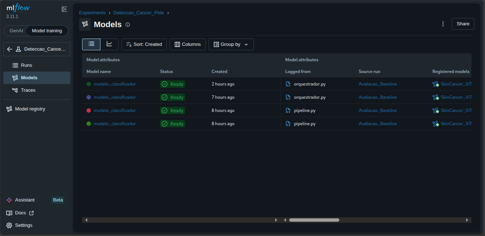
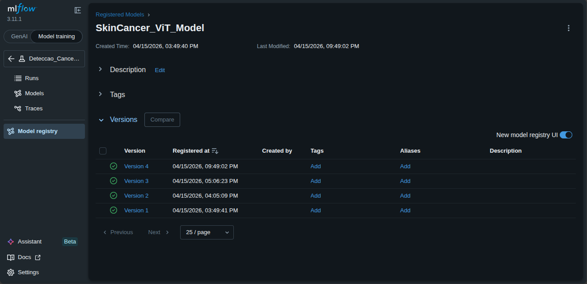
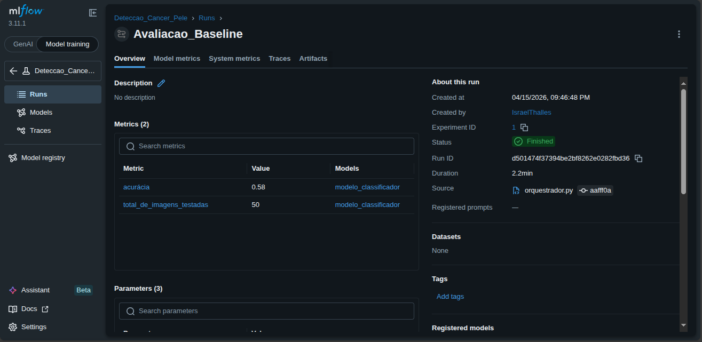

# Relatório de Entrega — Projeto Individual 2: Sistema de ML com MLflow

> **Aluno(a):** Israel Thalles Dutra dos Santos
> **Matrícula:** 190014776
> **Data de entrega:** 15/04/2026

---

## 1. Resumo do Projeto

O projeto consistiu no desenvolvimento de um sistema de Machine Learning end-to-end focado em MLOps e observabilidade, aplicado à triagem clínica de lesões de pele. Foi estruturado um pipeline modularizado que realiza a ingestão automatizada de dados, inferência zero-shot utilizando um Vision Transformer (ViT) pré-treinado, e o registro contínuo via MLflow. O principal resultado foi a estruturação de um fluxo rastreável que, após tratamentos de *label mapping* para adequar as 7 classes originais do modelo à dicotomia do dataset (Maligno vs. Benigno), mitigou o vazamento de escopo e elevou a acurácia do sistema em ambiente local de 6% para 58%, provando o valor da engenharia de dados em sistemas baseados em IA.

---

## 2. Escolha do Problema, Dataset e Modelo

### 2.1 Problema
O problema escolhido foi a classificação automatizada e triagem de lesões de pele (Câncer de Pele). É um domínio altamente sensível, ideal para demonstrar a implementação de Guardrails rígidos, tratamento de *Data Drift* e a estruturação lógica de falsos positivos em aplicações médicas voltadas à triagem e alerta precoce.

### 2.2 Dataset

| Item | Descrição |
|------|-----------|
| **Nome do dataset** | ISIC 2024 Challenge (Hugging Face Hub: `mrbrobot/isic-2024`) |
| **Fonte** | International Skin Imaging Collaboration (ISIC) / Hugging Face |
| **Tamanho** | Amostragem estratificada local (50 imagens) para homologação |
| **Tipo de dado** | Arquivos `.parquet` contendo bytes convertidos para imagens RGB |

### 2.3 Modelo pré-treinado

| Item | Descrição |
|------|-----------|
| **Nome do modelo** | `Anwarkh1/Skin_Cancer-Image_Classification` |
| **Fonte** | Hugging Face Hub |
| **Tipo** | Vision Transformer (ViT) para Image Classification |
| **Fine-tuning realizado?** | Não (Inferência zero-shot) |

---

## 3. Pré-processamento

As seguintes decisões de engenharia e pré-processamento foram aplicadas:

- **Conversão de Formato Tabular para Imagem:** Extração dos dados brutos armazenados em formato `.parquet` (bytes) e conversão em objetos de imagem `.png` com espaço de cor forçado para RGB.
- **Amostragem Estratificada:** Para evitar viés de avaliação local e tempo excessivo de inferência, o script de ingestão foi configurado para processar em *streaming* e baixar exatamente 25 amostras da classe `target=0` e 25 da classe `target=1`.
- **Mapeamento Taxonômico Clínico (Superclasses):** Observou-se que classificar a classe majoritária '0' do ISIC estritamente como 'Nevus' introduzia ruído nos rótulos. A lógica foi refatorada para uma dicotomia clínica (Maligno vs. Benigno), alinhando a taxonomia do sistema com a aplicabilidade médica de triagem.

---

## 4. Estrutura do Pipeline

O pipeline foi estruturado de forma estritamente modular, desacoplando a ingestão de dados, o processamento de ML e o serviço final ao usuário através de um orquestrador central (`main.py`). Na etapa de avaliação, foi implementado um *Label Mapping* que agrupou as 7 saídas originais do modelo nas 2 categorias do dataset local.

```text
Ingestão (extração.py) → Avaliação Zero-Shot com Label Mapping (pipeline.py) → Registro no MLflow → Deploy consumindo o Registry (inference.py)
```

### Estrutura do código

```
projeto-individual-2/
├── codigo/
│   ├── orquestrador.py  # Orquestrador das etapas 1 e 2
│   ├── extração.py      # Download e conversão Parquet -> PNG
│   ├── pipeline.py      # Rastreamento de IA e avaliação de acurácia
│   └── inferência.py    # Endpoint local (Deploy com Guardrails)
├── dados/               # Imagens baixadas (maligno/ e benigno/)
├── mlartifacts/         # Armazenamento físico dos modelos do MLflow
├── mlflow.db            # Banco de dados local de tracking
├── dependencias.txt
└── relatorio-entrega.md
```

---

## 5. Uso do MLflow

### 5.1 Rastreamento de experimentos

O ecossistema MLflow foi utilizado como *Tracking URI* persistido em banco SQLite local (`mlflow.db`).

- **Parâmetros registrados:** Nome do modelo base (`Anwarkh1/Skin_Cancer-Image_Classification`), nome do *dataset* de inferência, e tipo da tarefa.
- **Métricas registradas:** Acurácia final após o mapeamento clínico e o volume total de imagens testadas.
- **Artefatos salvos:** O diretório serializado completo do modelo Hugging Face (pesos, configuração e preprocessor), armazenados em `mlartifacts/`.

### 5.2 Versionamento e registro

O sistema não se limitou ao tracking. Foi implementado o uso ativo do *Model Registry*. O modelo validado no `pipeline.py` foi submetido via `mlflow.transformers.log_model` ao repositório central com o nome `SkinCancer_ViT_Model`, garantindo rastreabilidade das diferentes versões testadas durante o desenvolvimento (V1 a V4).

### 5.3 Evidências







---

## 6. Deploy

O modelo homologado foi disponibilizado para o usuário final fechando o ciclo de MLOps:

- **Método de deploy:** Script local de interface via linha de comando (`inferência.py`), construído para consumir de forma dinâmica a versão estipulada diretamente do *Model Registry* do MLflow local (`models:/SkinCancer_ViT_Model/4`), e não da internet.
- **Como executar inferência:**

```bash
python3 codigo/inferência.py dados/maligno/maligno_0.png
```

---

## 7. Guardrails e Restrições de Uso

Por se tratar de um domínio médico, o arquivo de deploy contém três camadas de defesa:

- **Filtro Estrito de Entrada:** Validação do *file extension* e tentativa de decodificação de imagem. Arquivos não suportados ou corrompidos são rejeitados antes de onerar a memória do modelo de IA.

- **Limiar de Confiança (*Threshold* de Segurança):** O sistema rejeita ativamente a entrega de um diagnóstico se o score probabilístico do modelo para a classe dominante for inferior a 45% (0.45), rotulando a saída como "Inconclusiva".

- ***Disclaimer* Legal e Clínico:** Todas as saídas bem-sucedidas são envelopadas com um alerta visual obrigatório de que se trata de uma ferramenta de aprendizado de máquina experimental, não substituindo a avaliação anatomopatológica profissional.


---

## 8. Observabilidade

O monitoramento e rastreamento local demonstraram extrema eficácia na correção de rota do desenvolvimento:

- **Comparação de execuções:** Através do histórico do MLflow, observou-se a evolução do sistema. A execução inicial obteve apenas 6% de acurácia (devido a incompatibilidade de strings de labels). A versão 4 do sistema atingiu 58% ao implementar a engenharia de mapeamento de features clínicas.
- **Análise de métricas:** Permitiu identificar o fenômeno de taxa elevada de Falsos Positivos, inerente à adaptação do modelo e útil em cenários clínicos de triagem de segurança.

---

## 9. Limitações e Riscos

- **Data Drift e Falsos Positivos:** O sistema atingiu uma acurácia teto de 58% em inferência zero-shot. A análise dos logs de rastreamento do MLflow indicou uma alta taxa de Falsos Positivos na classe majoritária (imagens benignas sendo classificadas como actinic keratoses ou melanoma). Isso é um sintoma claro de Data Drift: a IA foi treinada sob o escopo de imagens estritamente dermatoscópicas (iluminação e zoom controlados), enquanto o dataset ISIC 2024 de inferência contém ruídos de fotografias clínicas convencionais. Isso evidencia a limitação de utilizar modelos pré-treinados sem fine-tuning para o domínio específico da aplicação.

- **Hardware Dependency:** Durante o rastreamento local, identificou-se incompatibilidade de Compute Capability entre o PyTorch atual e arquiteturas de GPU legado (`NVIDIA GeForce MX110`). Como mitigação arquitetural para garantir alta disponibilidade, o pipeline foi fixado para fallback forçado em CPU (`device="cpu"`).

- **Semântica de Rótulos:** Alto risco identificado na generalização de classes pré-treinadas para avaliações binárias, mitigado via dicionário interno no pipeline.

---

## 10. Como executar

Instruções passo a passo para rodar o projeto na máquina local:

```bash
# 1. Instalar dependências
pip3 install -r dependências.txt

# 2. Executar o orquestrador (Faz download do dataset, avalia e registra no MLflow)
python3 codigo/orquestrador.py

# 3. Em um terminal paralelo, inicie o MLflow UI para visualizar a observabilidade
mlflow ui

# 4. Com o servidor MLflow online, execute a inferência real através do Registry
python3 codigo/inferência.py caminho/para/a/imagem.png

# Exemplo:
# python3 codigo/inferência.py dados/maligno/maligno_0.png
```

---

## 11. Referências

1. HUGGING FACE. Anwarkh1/Skin_Cancer-Image_Classification. Disponível em: https://huggingface.co/Anwarkh1/Skin_Cancer-Image_Classification
2. ISIC CHALLENGE. ISIC 2024 - Skin Cancer Detection with 3D-TBP. Disponível em: https://www.kaggle.com/competitions/isic-2024-challenge
3. MLFLOW DOCUMENTATION. Model Registry e Tracking APIs. Disponível em: https://mlflow.org/docs/latest/index.html

---

## 12. Checklist de entrega

- [x] Código-fonte completo
- [x] Pipeline funcional
- [x] Configuração do MLflow
- [x] Evidências de execução (logs, prints ou UI)
- [x] Modelo registrado
- [x] Script ou endpoint de inferência
- [x] Relatório de entrega preenchido
- [x] Pull Request aberto
