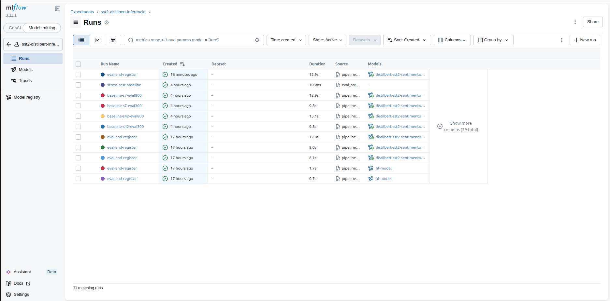
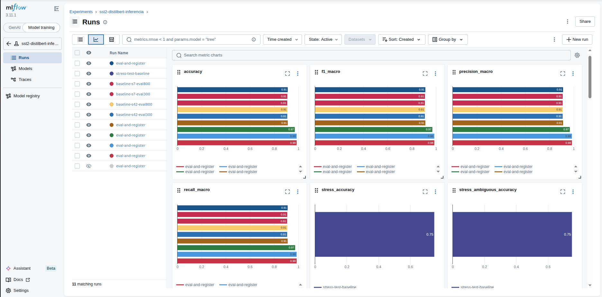
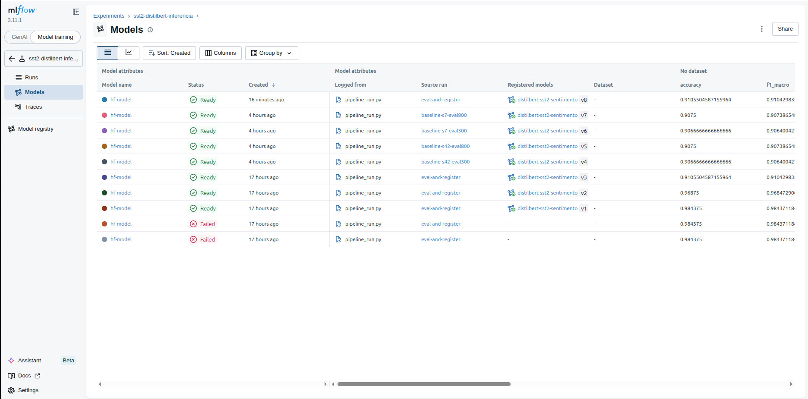
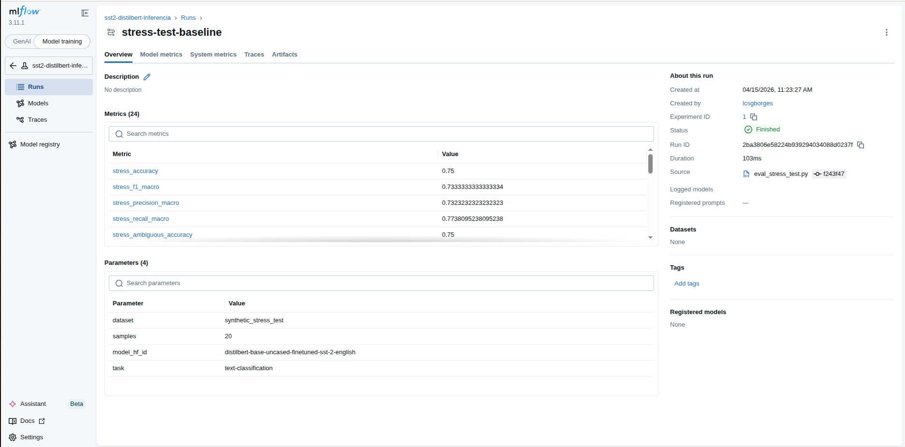

# Relatorio de Entrega - Projeto Individual 2: Sistema de ML com MLflow

> **Aluno(a):** Lucas Guimarães Borges
> **Matricula:** 222015159
> **Data de entrega:** 15/04/2026

---

## 1. Resumo do Projeto

Este projeto implementa um sistema de machine learning para classificacao de sentimento em textos curtos em ingles, usando reuso de modelo pre-treinado e rastreamento completo com MLflow. O problema escolhido foi classificacao binaria (positivo/negativo) no dataset GLUE/SST-2, relevante para monitoramento de opiniao e triagem automatizada de feedback textual. O modelo utilizado foi `distilbert-base-uncased-finetuned-sst-2-english` (Hugging Face), consumido via `transformers.pipeline`, sem treino do zero e sem fine-tuning adicional nesta entrega. O pipeline inclui ingestao de dados, geracao de manifestos e relatorios de qualidade, avaliacao em validacao, log de metricas e artefatos no MLflow, e registro de versoes de modelo no Registry. O sistema tambem oferece deploy para inferencia via API FastAPI com guardrails de entrada e tratamento de baixa confianca. No ultimo run registrado do experimento principal (`run_id: c452cb53d8ef418786fa34eeb0e9be87`), foi obtida acuracia de `0.9106` na validacao, com `f1_macro` de `0.9104`.

---

## 2. Escolha do Problema, Dataset e Modelo

### 2.1 Problema

O problema escolhido foi classificacao de sentimento binaria em frases curtas em ingles. Ele e relevante porque permite transformar grande volume de texto nao estruturado em sinal quantitativo para apoio a decisao, observabilidade de produto e analise de percepcao de usuarios.

### 2.2 Dataset

| Item | Descricao |
|------|-----------|
| **Nome do dataset** | GLUE / SST-2 |
| **Fonte** | Hugging Face Datasets (`glue`, configuracao `sst2`) |
| **Tamanho** | Train: 67.349; Validation: 872; Test: 1.821 (total: 70.042) |
| **Tipo de dado** | Texto curto (campo `sentence`) + rotulo binario (`label`) |

### 2.3 Modelo pre-treinado

| Item | Descricao |
|------|-----------|
| **Nome do modelo** | `distilbert-base-uncased-finetuned-sst-2-english` |
| **Fonte** (ex: Hugging Face) | Hugging Face Transformers |
| **Tipo** (ex: classificacao, NLP) | NLP - classificacao de sentimento |
| **Fine-tuning realizado?** | **Nao** |

---

## 3. Pre-processamento

As decisoes de pre-processamento aplicadas foram:

- Carregamento com splits oficiais (`train`, `validation`, `test`) do SST-2.
- Subamostragem opcional do treino com `MAX_TRAIN_SAMPLES` e `seed` para execucoes rapidas e reproduziveis.
- Normalizacao textual leve (remocao de espacos excedentes) para entradas de inferencia.
- Geracao de manifesto de dados (`split_manifest.json`) com fingerprint de schema/tamanho para versionamento.
- Geracao de relatorios de qualidade por split (`quality_*.json`) com distribuicao de classes, estatisticas de comprimento e amostras de texto.

---

## 4. Estrutura do Pipeline

O pipeline implementado segue o fluxo:

```text
Ingestao -> Qualidade/Manifesto -> Carregamento do modelo -> Avaliacao -> Registro MLflow -> Deploy API
```

### Estrutura do codigo

```text
lucas-guimaraes-sentinela-de-sentimento/
|-- config/
|   `-- config.yaml
|-- data/
|   |-- raw/
|   `-- processed/
|-- scripts/
|   |-- pipeline_run.py
|   |-- export_dataset_artifacts.py
|   |-- eval_stress_test.py
|   `-- run_inference_grid.sh
|-- src/
|   |-- data/
|   |-- model/
|   |-- guardrails/
|   `-- serve/
|-- mlflow.db
`-- requirements.txt
```

---

## 5. Uso do MLflow

### 5.1 Rastreamento de experimentos

O MLflow foi usado para registrar parametros, metricas e artefatos de avaliacao no experimento `sst2-distilbert-inferencia`.

- **Parametros registrados:** `seed`, `model_hf_id`, `dataset`, `task`, `max_train_samples` (quando aplicavel), `eval_validation_max` (quando aplicavel).
- **Metricas registradas:** `accuracy`, `f1_macro`, `precision_macro`, `recall_macro`.
- **Artefatos salvos:**
  - `artifacts/dataset_metadata.json`
  - `artifacts/quality_train.json`
  - `artifacts/quality_validation.json`
  - `data/split_manifest.json`
  - `metrics/confusion_matrix.json`
  - modelo no artifact path `hf-model`

### 5.2 Versionamento e registro

O modelo e registrado no MLflow Model Registry com nome `distilbert-sst2-sentimento`. No estado atual, ha multiplas versoes ja registradas; a mais recente observada no banco local e a versao **8**, associada ao run `c452cb53d8ef418786fa34eeb0e9be87`.

### 5.3 Evidencias

Evidencias textuais observadas:

- **Run mais recente (experimento principal):** `c452cb53d8ef418786fa34eeb0e9be87` (FINISHED)
- **Metricas do run:**
  - `accuracy = 0.9105504587155964`
  - `f1_macro = 0.9104298356510746`
  - `precision_macro = 0.9112916842549599`
  - `recall_macro = 0.9101835480340154`
- **Matriz de confusao:** `[[381, 47], [31, 413]]`

Imagens anexadas na pasta `assets`:









---

## 6. Deploy

O modelo foi disponibilizado para inferencia por API REST com FastAPI.

- **Metodo de deploy:** endpoint REST local (`uvicorn` + FastAPI).
- **Como executar inferencia:**

```bash
# subir API
uvicorn src.serve.app:app --reload --host 127.0.0.1 --port 8000

# healthcheck
curl -s http://127.0.0.1:8000/health

# inferencia
curl -s -X POST http://127.0.0.1:8000/predict \
  -H "Content-Type: application/json" \
  -d '{"text":"This movie is surprisingly good"}'
```

Tambem existe avaliacao de robustez por script:

```bash
python3 scripts/eval_stress_test.py
```

---

## 7. Guardrails e Restricoes de Uso

Foram implementados mecanismos explicitos para reduzir uso indevido e saidas enganosas:

- Validacao de entrada por tamanho (`min_chars`, `max_chars`) e rejeicao de texto vazio.
- Heuristica para bloquear entrada claramente fora de escopo (ruido/simbolos/language mismatch).
- Bloqueio de padroes simples de prompt injection (ex.: `ignore previous instructions`).
- Guardrail de confianca minima (`min_confidence`): quando abaixo do limiar, resposta retorna status `uncertain`.
- Endpoint `/limitations` com escopo e nao-escopo declarados (nao uso medico/juridico/decisao critica).

---

## 8. Observabilidade

A observabilidade foi estruturada no MLflow e em scripts auxiliares:

- **Comparacao de execucoes:** script `scripts/run_inference_grid.sh` roda bateria de variacoes de seed e tamanho de validacao, gerando varios runs comparaveis.
- **Analise de metricas:** metricas de classificacao e matriz de confusao por run no MLflow.
- **Capacidade de inspecao:** artefatos de qualidade, metadados, manifesto de split e predicoes de stress test em `data/processed`.

---

## 9. Limitacoes e Riscos

- O modelo e especializado em ingles e pode degradar fora do dominio SST-2.
- Classificacao binaria simplifica sentimentos complexos (sarcasmo, ambiguidade, opinioes mistas).
- Scores nao devem ser interpretados como certeza absoluta; por isso existe status `uncertain`.
- Risco de drift de dados em cenarios reais sem monitoramento continuo.
- API local nao contempla autenticacao, rate-limit ou hardening de producao.

---

## 10. Como executar

Instrucoes passo a passo para rodar o projeto:

```bash
# 1. Entrar na pasta do projeto
cd projeto-individual-2/lucas-guimaraes-sentinela-de-sentimento

# 2. Criar ambiente virtual (opcional, recomendado)
python3 -m venv .venv
source .venv/bin/activate

# 3. Instalar dependencias
pip install -r requirements.txt

# 4. Exportar artefatos de dados (opcional)
python3 scripts/export_dataset_artifacts.py

# 5. Executar pipeline principal (avalia e registra no MLflow)
python3 scripts/pipeline_run.py

# 6. Abrir interface do MLflow
mlflow ui --backend-store-uri sqlite:///$(pwd)/mlflow.db --host 127.0.0.1 --port 5000

# 7. Rodar stress test (opcional)
python3 scripts/eval_stress_test.py

# 8. Subir API de inferencia
uvicorn src.serve.app:app --reload --host 127.0.0.1 --port 8000
```

---

## 11. Referencias

1. Hugging Face Datasets - GLUE/SST-2.
2. Hugging Face Transformers - DistilBERT e pipeline de classificacao.
3. MLflow Documentation - Tracking e Model Registry.
4. FastAPI Documentation - API REST para inferencia.

---

## 12. Checklist de entrega

- [x] Codigo-fonte completo
- [x] Pipeline funcional
- [x] Configuracao do MLflow
- [x] Evidencias de execucao (logs, prints ou UI)
- [x] Modelo registrado
- [x] Script ou endpoint de inferencia
- [x] Relatorio de entrega preenchido
- [ ] Pull Request aberto
