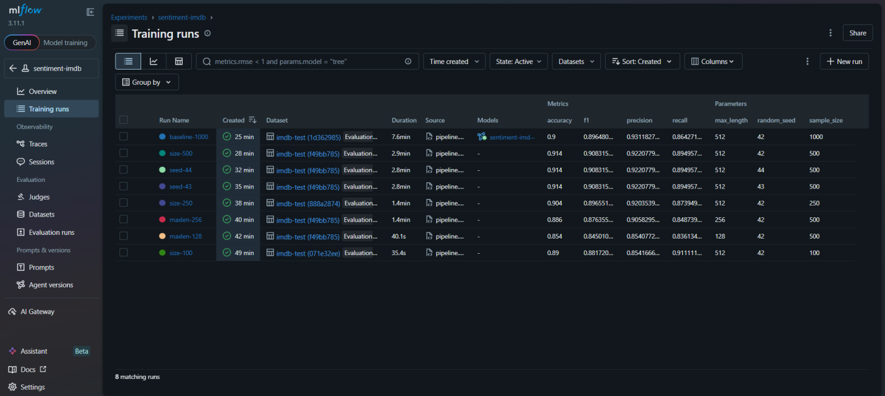
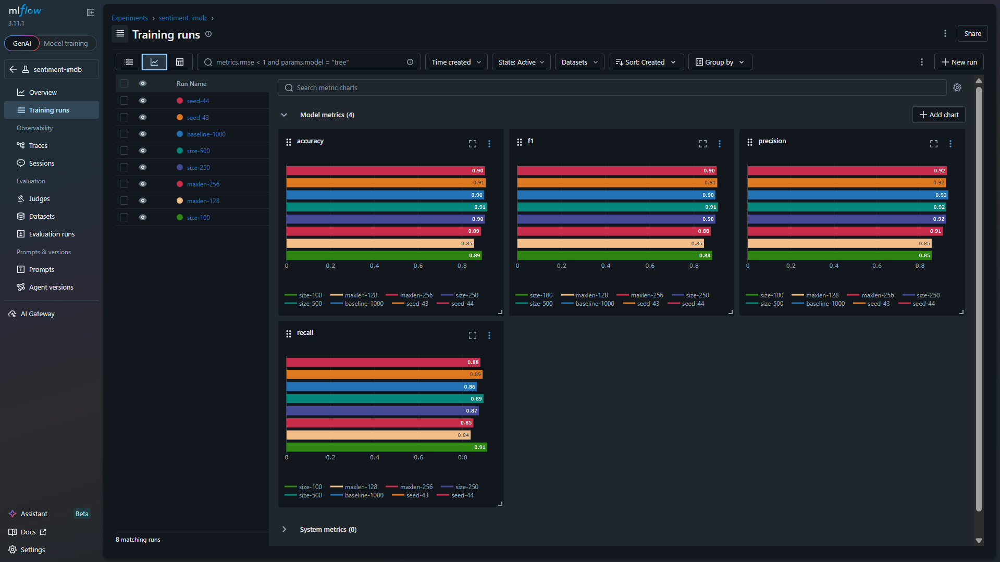
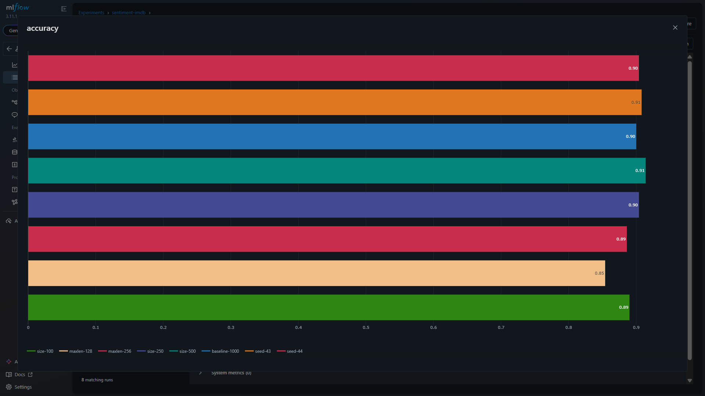
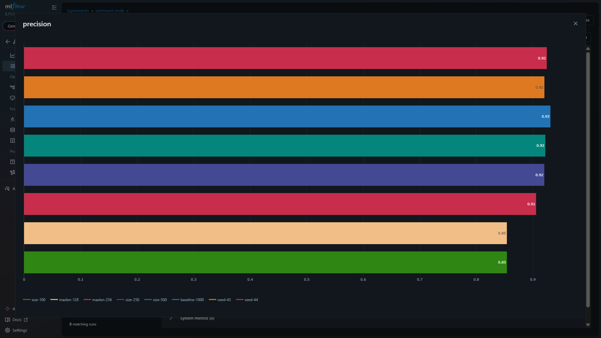
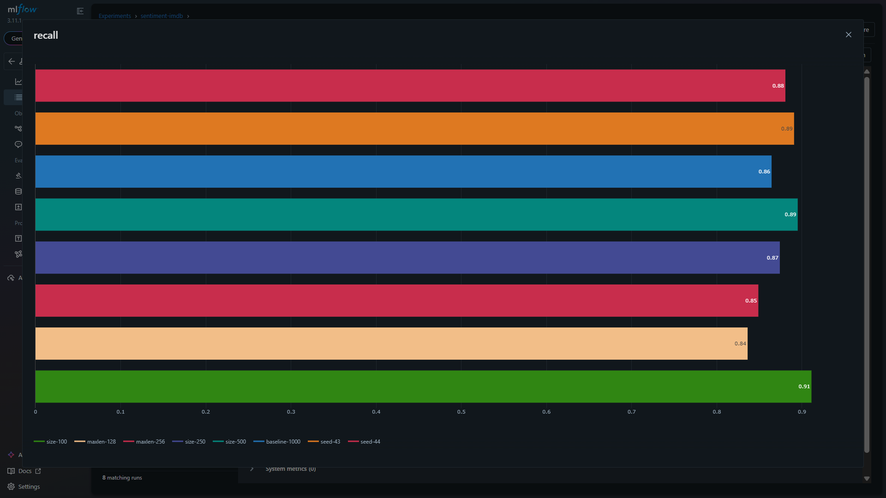
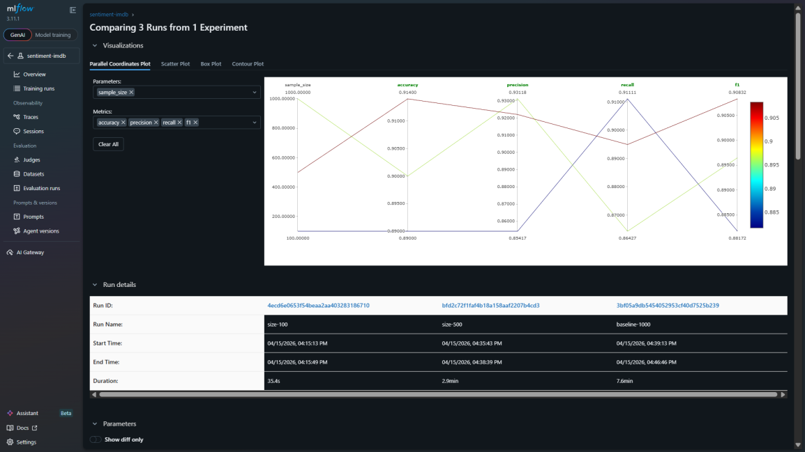
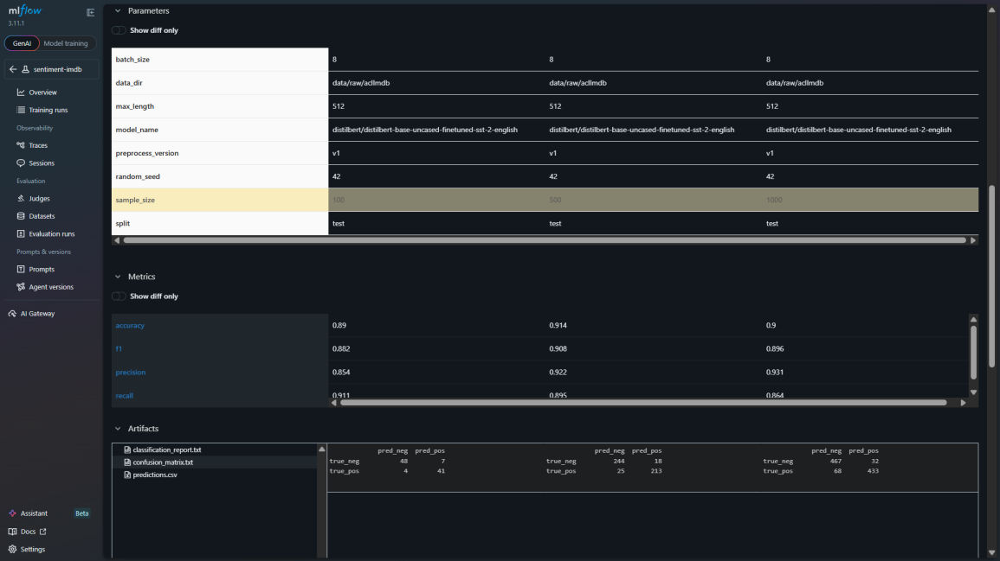
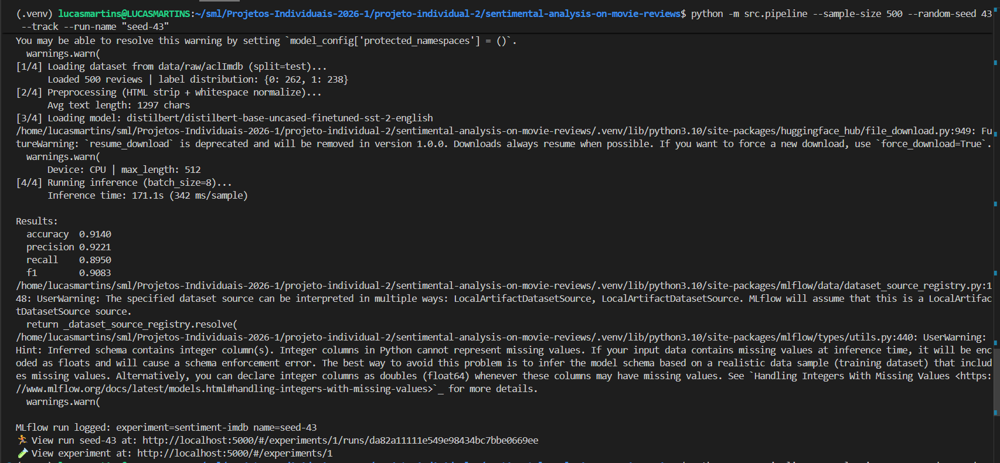

# Relatório de Entrega — Projeto Individual 2: Sistema de ML com MLflow

> **Aluno(a):** Guilherme Westphall, Lucas Martins Gabriel, Leonardo Padre
> **Matrícula:** 211061805, 221022088, 200067036
> **Data de entrega:** 15/04/2026

---

## 1. Resumo do Projeto

Este projeto implementa um sistema de classificação binária de sentimento (positivo / negativo) sobre resenhas de filmes do Stanford Large Movie Review Dataset (aclImdb). O modelo utilizado é o `distilbert/distilbert-base-uncased-finetuned-sst-2-english`, disponível no HuggingFace, aplicado diretamente sem fine-tuning adicional — o que é viável porque o modelo já foi treinado no SST-2, domínio próximo ao IMDb. O pipeline cobre ingestão, pré-processamento, inferência e coleta de métricas, com rastreamento completo via MLflow. Oito experimentos foram executados variando tamanho de amostra, comprimento máximo de tokens e semente aleatória. O melhor resultado obtido foi 91,4% de acurácia (F1 positivo de 0,9083) com 500 amostras e `max_length=512`. O deploy é suportado por uma stack Docker Compose com PostgreSQL como backend do MLflow.


## 2. Escolha do Problema, Dataset e Modelo

### 2.1 Problema

A análise de sentimento em textos é uma das tarefas mais consolidadas de NLP, com aplicações diretas em monitoramento de opinião, filtragem de conteúdo e pesquisa de mercado. A formulação binária -- classificar um texto como expressando sentimento positivo ou negativo -- reduz o problema a uma classificação supervisionada bem definida, com ground truth confiável quando o dado vem de avaliações escritas por usuários.

Resenhas de filmes são um domínio particularmente rico para essa tarefa: os textos costumam ser extensos, com argumentação subjetiva, uso de ironia e variação considerável de vocabulário. Isso torna o problema mais desafiador do que análise de tweets curtos, por exemplo, e exige um modelo com boa capacidade de compreensão contextual.

A escolha do aclImdb como dataset de avaliação é direta: é um benchmark público consolidado, balanceado entre classes e com volume suficiente para estimativas estatisticamente confiáveis. A proximidade de domínio com o SST-2, ambos cobrem sentimento em inglês, justifica a abordagem zero-shot com o modelo pré-treinado.

### 2.2 Dataset

| Item | Descrição |
|--|--|
| **Nome do dataset** | Stanford Large Movie Review Dataset (aclImdb) |
| **Fonte** | Disco local (aclImdb baixado manualmente) |
| **Tamanho** | 25.000 resenhas no split de teste, balanceado (12.500 positivas / 12.500 negativas) |
| **Tipo de dado** | Texto em inglês com rótulo binário (positivo / negativo) |
| **Link** | |

### 2.3 Modelo pré-treinado

| Item | Descrição |
|--|--|
| **Nome do modelo** | `distilbert/distilbert-base-uncased-finetuned-sst-2-english` |
| **Fonte** (ex: Hugging Face) | HuggingFace Model Hub |
| **Tipo** (ex: classificação, NLP) | Classificação de texto / NLP |
| **Fine-tuning realizado?** | Não — o modelo é usado diretamente como disponibilizado |
| **Link** | |


## 3. Pré-processamento

- Remoção de tags HTML `<br />` via expressão regular, presentes com frequência nas resenhas do aclImdb por conta do formato original dos arquivos.
- Normalização de whitespace: sequências de espaços, tabs e quebras de linha são colapsadas em um único espaço.
- Sem tokenização manual: o tokenizador do DistilBERT é invocado internamente pelo pipeline HuggingFace, mantendo consistência com o vocabulário original do modelo.
- Truncamento no final para textos com mais de 512 tokens, respeitando o limite arquitetural do DistilBERT. A alternativa de split-and-aggregate foi descartada por adicionar complexidade desnecessária ao pipeline.
- A versão do pré-processamento é registrada como parâmetro (`preprocess_version = "v1"`) no MLflow para rastreabilidade entre runs.


## 4. Estrutura do Pipeline

O pipeline segue um fluxo linear de quatro estágios, orquestrado por `src/pipeline.py`. A ingestão carrega o aclImdb do disco em um DataFrame `[text, label]`; o pré-processamento aplica a limpeza de HTML e normalização; o carregamento do modelo constrói o pipeline HuggingFace com DistilBERT; e a avaliação executa a inferência em batches e computa as métricas. Quando a flag `--track` está ativa, o módulo `src/tracking.py` envolve todo o fluxo em um MLflow run, logando parâmetros no início e métricas/artefatos ao final.

```
aclImdb (disco)
      │
      ▼
┌─────────────┐
│  1. Ingest  │  src/data/ingest.py
│  load_imdb  │  → DataFrame [text, label]
└──────┬──────┘
       │
       ▼
┌──────────────────┐
│  2. Preprocess   │  src/data/preprocess.py
│  strip HTML,     │  → DataFrame limpo
│  normalize WS    │
└──────┬───────────┘
       │
       ▼
┌───────────────────┐
│  3. Load Model    │  src/model/loader.py
│  DistilBERT       │  → HuggingFace pipeline
│  classifier       │
└──────┬────────────┘
       │
       ▼
┌───────────────────┐
│  4. Evaluate      │  src/model/evaluate.py
│  inference +      │  → métricas, preds, confs
│  compute metrics  │
└──────┬────────────┘
       │
       ▼
┌───────────────────┐
│  5. Tracking      │  src/tracking.py  (opcional, --track)
│  MLflow log       │  → params, metrics, artefatos
└───────────────────┘
```

### Estrutura do código

```
sentimental-analysis-on-movie-reviews/
├── src/
│   ├── __init__.py
│   ├── api.py
│   ├── guardrails.py
│   ├── pipeline.py
│   ├── tracking.py
│   ├── data/
│   │   ├── __init__.py
│   │   ├── ingest.py
│   │   └── preprocess.py
│   └── model/
│       ├── __init__.py
│       ├── loader.py
│       └── evaluate.py
├── data/
│   └── raw/
│       └── aclImdb/
├── mlruns/
├── Dockerfile
├── docker-compose.yml
├── requirements.txt
└── EXPERIMENTS.md
```


## 5. Uso do MLflow

### 5.1 Rastreamento de experimentos

O MLflow é utilizado para registrar cada execução do pipeline dentro do experimento `sentiment-imdb`. Os parâmetros são logados no início da run, antes da inferência começar, de modo que um crash intermediário ainda preserva o contexto da execução.

O planejamento detalhado dos oito experimentos, incluindo justificativa de cada dimensão avaliada, comandos de execução e tabela-resumo dos runs, está documentado em [`EXPERIMENTS.md`](./EXPERIMENTS.md). Esta seção do relatório resume os resultados e evidências desse plano experimental.

- **Parâmetros registrados:** `data_dir`, `split`, `sample_size`, `batch_size`, `max_length`, `random_seed`, `model_name`, `preprocess_version`
- **Métricas registradas:** `accuracy`, `precision`, `recall`, `f1`
- **Artefatos salvos:** `classification_report.txt` (precisão, recall e F1 por classe), `confusion_matrix.txt` (tabela 2×2 com labels), `predictions.csv` (texto original, label real, label predito e confiança do modelo)

### 5.2 Versionamento e registro

O modelo é serializado e registrado no MLflow Model Registry via `mlflow.transformers.log_model` com `registered_model_name="sentiment-imdb"`. A versão 1 foi registrada a partir do exp-04 (baseline de 1.000 amostras, acurácia 0,900). O backend de artefatos é file-based local, armazenado em `mlruns/` na raiz do projeto e versionado junto com o código no git.

O versionamento do projeto cobre três eixos. O **código** é rastreado via git, e o MLflow registra automaticamente o hash do commit de cada run na tag `mlflow.source.git.commit`, vinculando cada execução ao estado exato do código que a produziu. O **modelo** é versionado pelo Model Registry, que associa cada versão registrada a um run específico e seus artefatos. Os **dados** utilizam uma fonte fixa: o Stanford Large Movie Review Dataset (aclImdb) é um benchmark público com splits estáveis de treino e teste, mantido como cópia local no diretório `data/raw/aclImdb`. O dataset não é modificado pelo pipeline — a ingestão lê os arquivos de texto diretamente do disco — e o parâmetro `data_dir` é logado em cada run, garantindo rastreabilidade da origem dos dados.

### 5.3 Evidências

As evidências abaixo foram coletadas na interface do MLflow para demonstrar rastreabilidade, comparação de execuções e análise de métricas. O objetivo das capturas não é apenas mostrar que os runs existem, mas evidenciar quais parâmetros foram comparados em cada experimento.



**Figura 1 — Visão geral dos runs.** A imagem lista as oito execuções registradas no experimento `sentiment-imdb`, exibindo lado a lado as principais métricas (`accuracy`, `f1`, `precision`, `recall`) e os parâmetros variáveis (`sample_size`, `max_length`, `random_seed`). Essa visão permite confirmar que os experimentos foram executados com configurações diferentes e que os resultados ficaram centralizados no mesmo experimento.



**Figura 2 — Gráficos agregados das métricas.** O painel compara todos os runs em gráficos de barras para acurácia, F1, precisão e recall. Ele resume visualmente a estabilidade geral do modelo e destaca que as execuções com `max_length=128` e `max_length=256` tiveram desempenho inferior às execuções com `max_length=512`.



**Figura 3 — Comparação por acurácia.** A captura isola a métrica `accuracy` para facilitar a identificação dos melhores runs. A comparação mostra que o melhor resultado observado foi `0,914`, obtido com `sample_size=500`, `max_length=512` e sementes diferentes, enquanto o truncamento para `max_length=128` reduziu a acurácia para aproximadamente `0,854`.


**Figura 4 — Comparação por F1.** O gráfico de F1 confirma a mesma tendência vista na acurácia: os runs com limite de 512 tokens ficam no topo, enquanto limites menores de truncamento reduzem a qualidade geral da classificação. Essa métrica é importante porque considera conjuntamente precisão e recall.



**Figura 5 — Comparação por precisão.** A comparação de precisão mostra quantas predições positivas foram corretas entre todas as predições positivas feitas pelo modelo. O baseline de 1.000 amostras apresenta precisão alta, mas os runs de 500 amostras com 512 tokens mantêm desempenho competitivo, reforçando que a amostra de 500 já oferece uma medição estável para o projeto.



**Figura 6 — Comparação por recall.** O recall evidencia a capacidade do modelo de recuperar exemplos positivos. A comparação mostra variações maiores do que em precisão, especialmente quando o tamanho de amostra muda, o que ajuda a justificar a análise por múltiplas métricas e não apenas por acurácia.



**Figura 7 — Comparação por tamanho de amostra.** A visualização compara `sample_size=100`, `sample_size=500` e `sample_size=1000`, mantendo `max_length=512` e `random_seed=42`. A comparação mostra que 100 amostras ainda é uma medição mais ruidosa, enquanto 500 e 1.000 amostras ficam próximas, indicando estabilização das métricas.



**Figura 8 — Detalhes e artefatos por tamanho de amostra.** A imagem detalha os parâmetros e métricas dos mesmos três runs, além de permitir inspecionar artefatos como `classification_report.txt`, `confusion_matrix.txt` e `predictions.csv`. Essa evidência mostra que a comparação visual está conectada a artefatos auditáveis.


**Figura 9 — Comparação por limite de tokens.** A visualização compara `max_length=512`, `max_length=256` e `max_length=128`, mantendo `sample_size=500` e `random_seed=42`. A queda de desempenho ao reduzir o limite de tokens mostra que resenhas longas carregam informação relevante e que truncamento agressivo prejudica a classificação.


**Figura 10 — Detalhes e matriz de confusão por limite de tokens.** A captura mostra os valores exatos de métricas e matrizes de confusão para os três limites de tokens. Ela evidencia que `max_length=128` aumenta os erros em relação a `max_length=512`, validando a decisão de usar o limite arquitetural completo do DistilBERT.


**Figura 11 — Comparação por semente aleatória.** A visualização compara `random_seed=42`, `43` e `44`, mantendo `sample_size=500` e `max_length=512`. As métricas permanecem muito próximas, indicando baixa sensibilidade à amostragem nessa escala.


**Figura 12 — Detalhes e artefatos por semente aleatória.** A imagem mostra os parâmetros fixos e a variação apenas da semente, além das matrizes de confusão correspondentes. Essa evidência reforça que a diferença entre runs vem da amostragem e não de alteração no modelo ou no pré-processamento.



**Figura 13 — Execução do experimento.** A imagem mosta a execução de um experimento no terminal.

## 6. Deploy

O deploy é realizado via Docker Compose com quatro serviços em rede interna. O serviço `db` sobe um PostgreSQL 15 como backend de metadados do MLflow. O serviço `mlflow` executa o servidor MLflow na porta 5000, apontando para o PostgreSQL e montando o diretório `mlruns/` local como volume de artefatos. O serviço `pipeline` constrói a imagem a partir do `Dockerfile` (Python 3.10-slim) e executa o pipeline apontando para o MLflow via variável de ambiente `MLFLOW_TRACKING_URI=http://mlflow:5000`.

A inferência em produção local é exposta pelo serviço `api`, implementado em FastAPI (`src/api.py`). Esse serviço usa a mesma imagem Python do projeto, publica a porta `8000` e se comunica com o MLflow containerizado por meio de `MLFLOW_TRACKING_URI=http://mlflow:5000`. O modelo é referenciado por `SENTIMENT_MODEL_URI=models:/sentiment-imdb/1`, ou seja, a API consome a versão registrada no Model Registry em vez de carregar pesos diretamente de um caminho fixo. O diretório `mlruns/` também é montado no container da API em `/mlflow/mlruns`, garantindo acesso aos artefatos que o MLflow informa como origem do modelo.

O carregamento do modelo na API é feito de forma preguiçosa: o serviço sobe e responde ao endpoint `/health` mesmo que o modelo ainda não tenha sido carregado; a primeira requisição válida em `/predict` dispara o carregamento do modelo registrado. Entradas rejeitadas pelos guardrails retornam HTTP `422` antes dessa etapa, sem consumir inferência.

- **Método de deploy:** Docker Compose com imagem construída localmente a partir do `Dockerfile`
- **Serviços:** `db` (PostgreSQL), `mlflow` (tracking server e registry), `pipeline` (execução e registro do modelo), `api` (inferência HTTP com guardrails).
- **Endpoints da API:** `GET /health` para verificar disponibilidade e `POST /predict` para classificar uma resenha.
- **Como executar inferência:** o modelo deve estar registrado no MLflow; em seguida, o serviço `api` pode ser iniciado com `docker compose up --build api`. A rota `POST /predict` aplica os guardrails antes da inferência e só chama o modelo se a entrada for válida.

```bash
# Subir MLflow e banco
docker compose up -d --build mlflow

# Registrar o modelo no MLflow, se necessário
docker compose run --build pipeline python -m src.pipeline --data-dir data/raw/aclImdb --sample-size 200 --track --register-model

# Subir a API de inferência
docker compose up --build api
```

## 7. Guardrails e Restrições de Uso

Os guardrails foram implementados no nível da API FastAPI, antes da chamada ao modelo registrado no MLflow. Essa decisão evita que entradas claramente inválidas consumam inferência e impede que o modelo produza uma classificação binária para textos fora do escopo avaliado. A validação fica isolada em `src/guardrails.py` e é chamada por `src/api.py` na rota `POST /predict`.

Guardrails implementados:

- **Entrada vazia:** rejeita strings vazias ou compostas apenas por espaços. O dataset aclImdb não contém resenhas vazias, então esse tipo de entrada está fora da distribuição avaliada.
- **Comprimento mínimo:** rejeita resenhas com menos de 5 palavras. Entradas como `Great movie` são curtas demais para representar uma resenha de filme no formato usado pelo projeto.
- **Idioma não inglês:** usa `langdetect` para rejeitar textos detectados como não inglês. O modelo `distilbert-base-uncased-finetuned-sst-2-english` foi treinado para inglês, e as métricas do projeto foram calculadas apenas sobre resenhas em inglês.
- **Comprimento máximo:** usa o tokenizador do DistilBERT para rejeitar textos com mais de 512 tokens, limite arquitetural do modelo. Esse guardrail evita truncamento silencioso em uma API de inferência.

Quando um guardrail é acionado, a API retorna HTTP `422 Unprocessable Entity` com um código específico no corpo da resposta. Isso diferencia falhas esperadas de validação de falhas de infraestrutura ou de carregamento do modelo. O teste abaixo mostra três rejeições executadas no terminal: resenha curta demais, entrada vazia e resenha em português.

```
PS C:\Users\Guilherme\UnB\Sistemas-ML\Projeto-2\projeto-individual-2\sentimental-analysis-on-movie-reviews> curl.exe -i -X POST "http://127.0.0.1:8000/predict" `                                                                 
>>     -H "Content-Type: application/json" `                   
>>     --data-raw '{"text":"Great movie"}'
HTTP/1.1 422 Unprocessable Entity
date: Wed, 15 Apr 2026 21:36:41 GMT
server: uvicorn
content-length: 118
content-type: application/json

{"detail":{"code":"review_too_short","message":"Review is too short to classify reliably. Provide at least 5 words."}}
PS C:\Users\Guilherme\UnB\Sistemas-ML\Projeto-2\projeto-individual-2\sentimental-analysis-on-movie-reviews> curl.exe -i -X POST "http://127.0.0.1:8000/predict" `
>>     -H "Content-Type: application/json" `
>>     --data-raw '{"text":"   "}'
HTTP/1.1 422 Unprocessable Entity
date: Wed, 15 Apr 2026 21:36:56 GMT
server: uvicorn
content-length: 101
content-type: application/json

{"detail":{"code":"empty_review","message":"Review text is empty. Provide an English movie review."}}
PS C:\Users\Guilherme\UnB\Sistemas-ML\Projeto-2\projeto-individual-2\sentimental-analysis-on-movie-reviews> curl.exe -i -X POST "http://127.0.0.1:8000/predict" `
>>     -H "Content-Type: application/json" `
>>     --data-raw '{"text":"Este filme tem atuacoes excelentes e uma historia emocionante do comeco ao fim."}'
HTTP/1.1 422 Unprocessable Entity
date: Wed, 15 Apr 2026 21:37:20 GMT
server: uvicorn
content-length: 134
content-type: application/json

{"detail":{"code":"non_english_review","message":"Review appears to be non-English. This model only supports English movie reviews."}}
PS C:\Users\Guilherme\UnB\Sistemas-ML\Projeto-2\projeto-individual-2\sentimental-analysis-on-movie-reviews> 
```

O primeiro teste confirma o guardrail `review_too_short`, pois a entrada tem apenas duas palavras. O segundo confirma o guardrail `empty_review`, acionado após a normalização de whitespace. O terceiro confirma o guardrail `non_english_review`, porque a entrada é uma resenha em português. Em todos os casos, a API rejeita a requisição antes da inferência, mantendo a resposta do modelo restrita ao cenário validado: resenhas de filmes em inglês, com tamanho mínimo suficiente e dentro do limite de tokens do DistilBERT.

## 8. Observabilidade

O MLflow UI permite comparar todas as execuções do experimento `sentiment-imdb` lado a lado, filtrando e ordenando por qualquer parâmetro ou métrica registrada.

- **Comparação de execuções:** oito runs foram registradas cobrindo três dimensões independentes de variação: tamanho de amostra (`sample_size` de 100 a 1.000), comprimento máximo de tokens (`max_length` de 128 a 512) e semente aleatória (`random_seed` 42, 43 e 44). Cada dimensão usa as outras como âncora, permitindo isolar o efeito de cada variável.
- **Análise de métricas:** a variação de `sample_size` mostra que a acurácia estabiliza próximo a 0,90–0,91 com amostras acima de 250, sem ganho relevante ao dobrar para 1.000. A variação de `max_length` evidencia degradação clara ao truncar para 128 tokens (acurácia 0,854 vs. 0,914 com 512), confirmando que resenhas longas carregam informação discriminativa relevante. A variação de seed (42, 43, 44) produziu acurácia idêntica (0,914 nos três casos), indicando que a amostragem não introduz variância detectável nessa escala.
- **Capacidade de inspeção:** cada run armazena três artefatos — o relatório de classificação por classe, a matriz de confusão e o CSV de predições individuais com confiança — permitindo auditar casos específicos de erro sem precisar re-executar o pipeline.


## 9. Limitações e Riscos

- Resenhas com mais de 512 tokens são truncadas no final da sequência. O veredito do crítico costuma aparecer na conclusão do texto, o que significa que parte da informação mais discriminativa pode ser descartada antes da inferência.
- O modelo opera exclusivamente em inglês, por ter sido treinado no SST-2. Resenhas em outros idiomas produzirão predições sem validade.
- O modelo é estático: não foi retreinado com dados do IMDb e pode apresentar queda de desempenho em subdomínios com ironia densa, jargão técnico de crítica cinematográfica ou construções linguísticas pouco representadas no SST-2.
- A avaliação foi feita apenas no split de teste do aclImdb. Não há validação em dados externos, distribuição de produção ou resenhas coletadas após o período de criação do dataset.
- Os guardrails atuais cobrem entrada vazia, resenha curta, idioma não inglês e limite máximo de tokens. Ainda não há guardrail de saída por confiança mínima, portanto uma entrada válida ainda pode receber uma predição incorreta com alta confiança.


## 10. Como executar

```bash
# 1. Instalar dependências
pip install -r requirements.txt

# 2. Executar o pipeline sem rastreamento
python -m src.pipeline --data-dir data/raw/aclImdb --sample-size 200

# 3. Executar o pipeline com rastreamento MLflow
python -m src.pipeline --data-dir data/raw/aclImdb --sample-size 200 --track

# 4. Executar o pipeline com rastreamento e registro do modelo
python -m src.pipeline --data-dir data/raw/aclImdb --sample-size 200 --track --register-model

# 5. Iniciar o MLflow UI
mlflow ui --backend-store-uri mlruns/

# 6. Executar via Docker Compose
docker compose up --build

# 7. Subir a API FastAPI com guardrails
docker compose up --build api

# 8. Testar health check da API
curl http://127.0.0.1:8000/health
```


## 11. Referências

1. Sanh, V., Debut, L., Chaumond, J., & Wolf, T. (2019). DistilBERT, a distilled version of BERT: smaller, faster, cheaper and lighter. *arXiv:1910.01108*.
2. MLflow. (2024). MLflow: A platform for the machine learning lifecycle. https://mlflow.org


## 12. Checklist de entrega

- [x] Código-fonte completo
- [x] Pipeline funcional
- [x] Configuração do MLflow
- [x] Evidências de execução (MLflow UI e comparações em `assets/`)
- [x] Modelo registrado
- [x] Endpoint de inferência com FastAPI
- [x] Guardrails de entrada na API
- [x] Pull Request aberto
