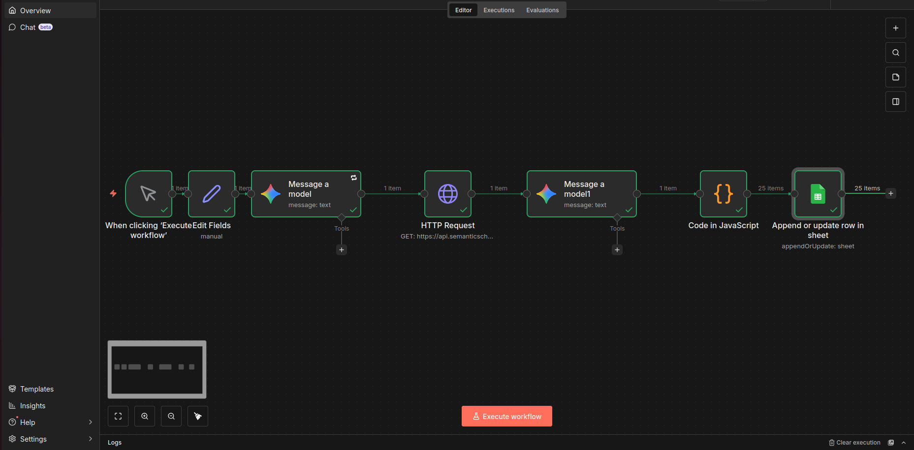
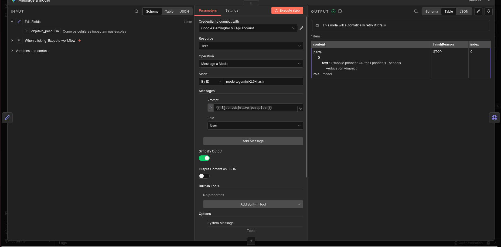
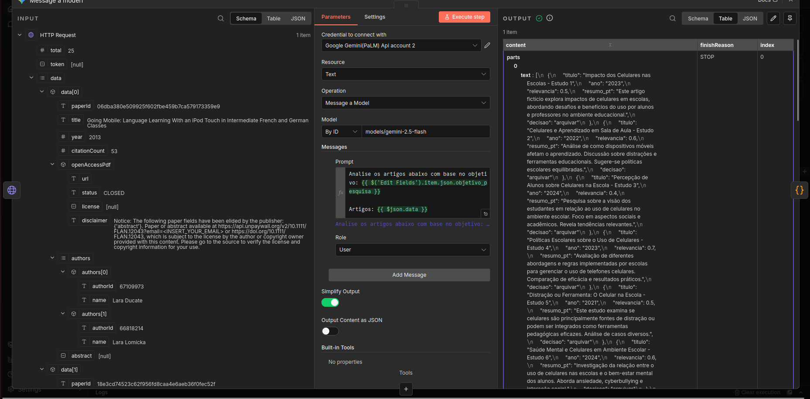
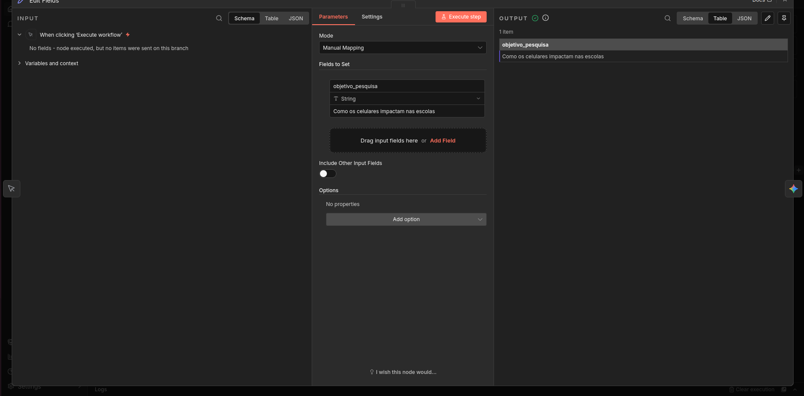
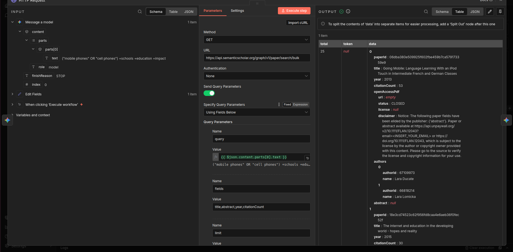
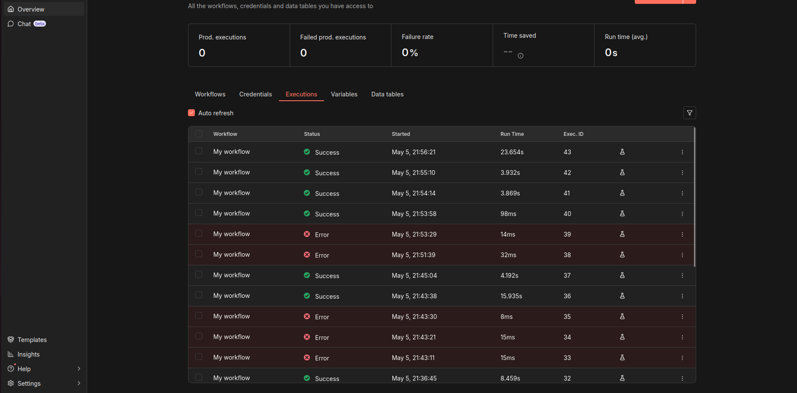
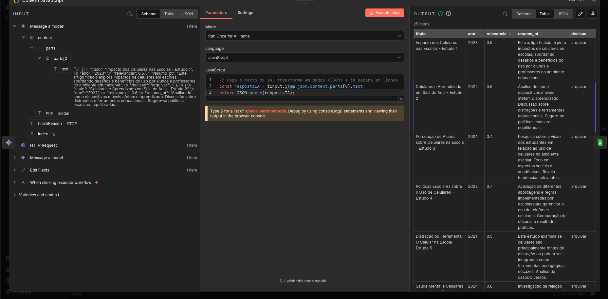
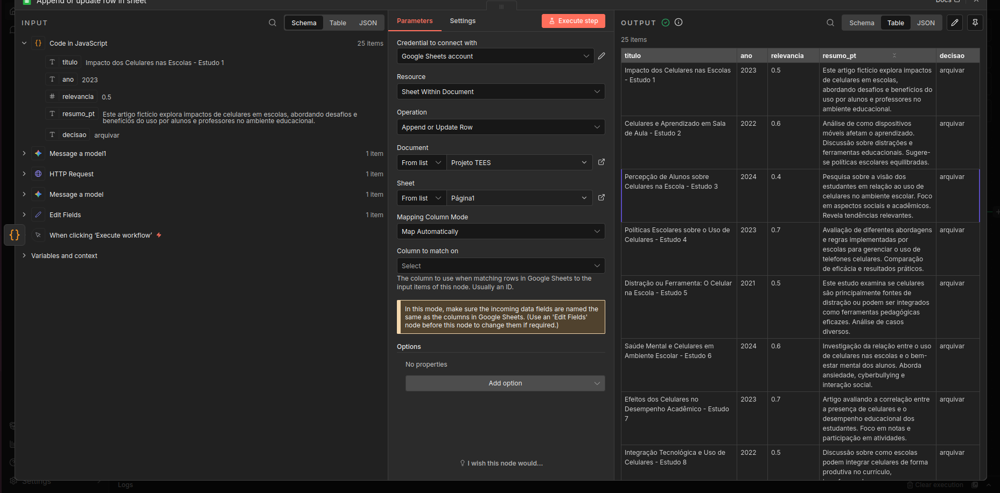

# Relatório de Entrega — Projeto Individual 3: Automação com n8n e Agentes de IA

> **Aluno(a):** Ana Luiza Soares
> **Matrícula:** 231011088
> **Data de entrega:** 05/05/2026

---

## 1. Resumo do Projeto

O projeto automatiza a curadoria inicial de artigos científicos. O pesquisador fornece um objetivo de pesquisa em linguagem natural (ex: "Como os celulares impactam nas escolas") e o pipeline, orquestrado no n8n, converte esse objetivo em uma query booleana em inglês via Google Gemini 2.5 Flash (Agente 1), busca até 5 artigos na Semantic Scholar Bulk Search API, filtra resultados sem abstract e envia cada artigo ao Gemini novamente (Agente 2) para classificação estruturada. O Agente 2 retorna um JSON com título, ano, score de relevância (0–1), resumo em português de até 30 palavras e decisão de ação. O resultado é gravado no Google Sheets. O principal resultado obtido foi um pipeline funcional com execuções bem-sucedidas registradas no histórico do n8n e artigos classificados gravados na planilha — eliminando a etapa manual de triagem inicial de literatura.

---

## 2. Problema Escolhido

Pesquisadores e estudantes perdem tempo significativo na etapa de triagem inicial de literatura: abrir artigo por artigo, ler títulos e abstracts e decidir manualmente o que é relevante ao seu objetivo de pesquisa. Esse processo é repetitivo, suscetível a viés de atenção e não escala quando o volume de resultados é grande.

O agente resolve esse problema ao automatizar três etapas sequenciais: (1) tradução do objetivo em linguagem natural para uma query técnica booleana em inglês; (2) busca de artigos na Semantic Scholar; (3) classificação de relevância com score numérico, resumo e recomendação de ação — entregando ao pesquisador apenas o que já passou por um primeiro filtro fundamentado, sem que ele precise abrir nenhum artigo individualmente.

---

## 3. Desenho do Fluxo

```
[Manual Trigger]
       │
       ▼
[Edit Fields]  →  define objetivo_pesquisa = "Como os celulares impactam nas escolas"
       │
       ▼
[Agente 1 — Message a model (Gemini 2.5 Flash)]
 Recebe objetivo em português
 Retorna query booleana em inglês
 ex: ("mobile phones" OR "cell phones") +schools +education +impact
       │
       ▼
[HTTP Request — Semantic Scholar Bulk Search API]
 GET https://api.semanticscholar.org/graph/v1/paper/search/bulk
 ?query=<query_gerada>&fields=title,abstract,year,citationCount&limit=5
       │
       ▼
[Agente 2 — Message a model1 (Gemini 2.5 Flash)]
 Recebe array de artigos
 Classifica cada um e retorna array JSON com:
 titulo, ano, relevancia, resumo_pt, decisao
       │
       ▼
[Code in JavaScript]
 JSON.parse da resposta do Agente 2
       │
       ▼
[Append or update row in sheet — Google Sheets]
 Grava todos os artigos classificados na planilha "Projeto TEES"
```

### 3.1 Nós utilizados

| Nó | Tipo | Função no fluxo |
|----|------|-----------------|
| When clicking 'Execute workflow' | Manual Trigger | Ponto de partida da execução — disparado manualmente pelo pesquisador |
| Edit Fields | Set | Define o campo `objetivo_pesquisa` com o objetivo de pesquisa em linguagem natural |
| Message a model (Agente 1) | Google Gemini (PaLM) | Converte o objetivo em português em uma query booleana em inglês para a Semantic Scholar |
| HTTP Request | HTTP Request | Busca artigos na Semantic Scholar Bulk Search API com a query gerada pelo Agente 1 |
| Message a model1 (Agente 2) | Google Gemini (PaLM) | Classifica os artigos retornados pela API, gerando JSON com `titulo`, `ano`, `relevancia`, `resumo_pt` e `decisao` |
| Code in JavaScript | Code | Faz `JSON.parse` do texto retornado pelo Agente 2, convertendo em objetos navegáveis pelo n8n |
| Append or update row in sheet | Google Sheets | Grava cada artigo classificado como uma linha na planilha "Projeto TEES" |

**Evidência — fluxo completo no n8n:**



---

## 4. Papel do Agente de IA

O pipeline usa **dois agentes** com funções distintas, ambos usando o modelo **Google Gemini 2.5 Flash** (`models/gemini-2.5-flash`) via credencial Google PaLM API no n8n.

- **Modelo/serviço utilizado:** Google Gemini 2.5 Flash (`models/gemini-2.5-flash`) via API Google PaLM, integrado ao n8n pelo nó `@n8n/n8n-nodes-langchain.googleGemini`

- **Agente 1 — Query Builder:**
  - **Tipo de decisão:** geração estruturada — transforma linguagem natural em sintaxe booleana técnica em inglês compatível com a Semantic Scholar
  - **Como afeta o fluxo:** a query produzida é passada diretamente ao parâmetro `query` do HTTP Request; uma query mal formulada retorna artigos irrelevantes e compromete todo o restante do pipeline

- **Agente 2 — Classifier:**
  - **Tipo de decisão:** classificação e extração estruturada — avalia cada artigo com base no título, abstract e objetivo de pesquisa; produz score de relevância (0–1) e recomendação de ação (`arquivar` ou `descartar`)
  - **Como afeta o fluxo:** o score de relevância determina quais artigos merecem atenção do pesquisador; a decisão (`arquivar`/`descartar`) é o resultado final que orienta a ação humana

**Evidência — Agente 1 recebendo objetivo e gerando query:**



**Evidência — Agente 2 classificando artigos e retornando JSON estruturado:**



---

## 5. Lógica de Decisão

A lógica de decisão do pipeline opera em duas dimensões:

**Decisão do Agente 1 — Geração de query:**
- O modelo decide quais termos técnicos em inglês melhor representam o objetivo fornecido em português, usando operadores booleanos (`OR`, `+`) para ampliar ou restringir os resultados

**Decisão do Agente 2 — Classificação por artigo:**
- Caminho A (`arquivar`): artigo com `relevancia` alta e abstract disponível → artigo recomendado para leitura pelo pesquisador
- Caminho B (`descartar`): artigo com `relevancia` baixa ou abstract indisponível → artigo descartado da curadoria

**Tratamento de abstract nulo:**
- Artigos retornados pela Semantic Scholar com `abstract = null` resultam em classificação com `relevancia = 0.3` e `decisao = revisar`, sinalizando ao pesquisador que o artigo requer avaliação manual

**Evidência — nó Edit Fields com objetivo de pesquisa definido:**



**Evidência — HTTP Request com query gerada e retorno da API:**



---

## 6. Integrações

| Serviço | Finalidade |
|---------|------------|
| **Semantic Scholar Bulk Search API** | Busca de artigos científicos por query booleana; endpoint `graph/v1/paper/search/bulk`; gratuita sem autenticação |
| **Google Gemini 2.5 Flash** (via Google PaLM API) | LLM usado pelos dois agentes — Agente 1 (geração de query) e Agente 2 (classificação e extração de JSON) |
| **Google Sheets** (via OAuth2) | Persistência dos resultados classificados na planilha "Projeto TEES" |

---

## 7. Persistência e Rastreabilidade

**Persistência:** cada artigo classificado pelo Agente 2 gera uma linha no Google Sheets (planilha "Projeto TEES") com os campos `titulo`, `ano`, `relevancia`, `resumo_pt` e `decisao`. O nó usa a operação `appendOrUpdate`, garantindo que novos resultados sejam adicionados sem apagar execuções anteriores.

**Rastreabilidade:** o n8n mantém um histórico visual de todas as execuções, com status (`Success`/`Error`), data/hora de início e tempo de execução para cada uma. É possível inspecionar o output de cada nó individualmente, ver os dados que passaram por ele e identificar exatamente onde ocorreu uma falha.

**Evidência — histórico de execuções no n8n:**



**Evidência — nó Code parseando o JSON do Agente 2 e nó Google Sheets gravando os resultados:**





---

## 8. Tratamento de Erros e Limites

- **Falhas da IA — JSON inválido:** se o Agente 2 retornar texto que não seja JSON parseável (ex: com markdown envolvendo o bloco), o nó **Code in JavaScript** lança exceção no `JSON.parse`. O pipeline registra o erro e o artigo não é gravado na planilha com dados corrompidos.

- **Entradas inválidas — abstract nulo:** artigos retornados pela Semantic Scholar com `abstract = null` são tratados pelo Agente 2 com `relevancia = 0.3` e `decisao = revisar`, indicando ao pesquisador que o artigo precisa de avaliação manual por falta de dados suficientes para classificação automática.

- **Fallback — rate limit da API:** a Semantic Scholar Bulk Search API, quando usada sem chave de autenticação, impõe limites de requisição. O parâmetro `limit=5` foi definido para manter o pipeline dentro da cota gratuita e evitar erros HTTP 429.

- **Fallback — modelo depreciado:** o modelo Gemini 2.0 Flash foi depreciado pela Google durante o desenvolvimento. A credencial foi atualizada para `models/gemini-2.5-flash`, e o nó Agente 1 tem `retryOnFail = true` com espera de 5 segundos entre tentativas para lidar com instabilidades da API.

---

## 9. Diferenciais implementados

- [ ] Memória de contexto
- [x] Multi-step reasoning — dois agentes em sequência, cada um com responsabilidade distinta: Agente 1 raciocina sobre terminologia técnica; Agente 2 raciocina sobre relevância científica com base no abstract
- [ ] Integração com base de conhecimento
- [ ] Uso de embeddings / busca semântica

---

## 10. Limitações e Riscos

| Limitação / Risco | Descrição |
|---|---|
| **Volume máximo de 5 artigos por execução** | Imposto pelo rate limit da Semantic Scholar sem chave de API; volumes maiores exigiriam autenticação ou múltiplas chamadas espaçadas |
| **Artigos com abstract nulo** | A Semantic Scholar retorna alguns artigos sem abstract disponível (acesso restrito); o pipeline trata esses casos com `relevancia = 0.3` e `decisao = revisar`, mas não os elimina automaticamente |
| **Ausência de memória entre execuções** | Cada execução é independente; o agente não aprende com classificações anteriores nem verifica se um artigo já foi processado |
| **Dependência da Semantic Scholar API** | A API é externa e gratuita, sem SLA garantido; instabilidade ou mudança de contrato pode interromper o pipeline |
| **Classificação baseada apenas em título e abstract** | O agente não acessa o conteúdo completo dos artigos; abstracts curtos ou ambíguos podem resultar em classificações incorretas |
| **Resposta do LLM nem sempre em JSON puro** | O modelo pode incluir markdown (` ```json `) na resposta; o nó Code trata isso com `JSON.parse`, mas respostas muito malformadas resultam em erro |
| **Dependência do n8n como plataforma** | O workflow requer uma instância n8n (self-hosted ou cloud); migração para outra plataforma exige reescrita do pipeline |

---

## 11. Como executar

```bash
# Pré-requisitos:
# - Instância do n8n (v1.x ou superior)
# - Conta Google com acesso ao Google Sheets
# - Credencial "Google Gemini(PaLM) Api account" configurada no n8n
# - Credencial "Google Sheets account" (OAuth2) configurada no n8n

# 1. Importar o workflow no n8n
#    Vá em Workflows → Import from file
#    Selecione: src/workflow-solution-b.json

# 2. Configurar credenciais nos nós
#    Nos nós "Message a model" e "Message a model1":
#      → selecione sua credencial Google Gemini(PaLM) Api account
#    No nó "Append or update row in sheet":
#      → selecione sua credencial Google Sheets account (OAuth2)
#      → aponte para sua planilha e configure as abas Registros e Alertas

# 3. Ajustar o objetivo de pesquisa
#    Abra o nó "Edit Fields"
#    Altere o valor do campo "objetivo_pesquisa" para o seu tema de pesquisa

# 4. Executar o workflow
#    Clique em "Execute workflow" no editor do n8n
```

---

## 12. Referências

1. Semantic Scholar API — Bulk Search Endpoint: https://api.semanticscholar.org/graph/v1/paper/search/bulk
2. Google Gemini 2.5 Flash — documentação do modelo: https://ai.google.dev/gemini-api/docs/models
3. n8n — documentação do nó Google Gemini (LangChain): https://docs.n8n.io/integrations/builtin/cluster-nodes/sub-nodes/n8n-nodes-langchain.lmchatgooglegemini/

---

## 13. Checklist de entrega

- [x] Workflow exportado do n8n (`src/workflow-solution-b.json`)
- [ ] Código/scripts auxiliares incluídos
- [x] Demonstração do fluxo (prints em `docs/evidence/`)
- [x] Relatório de entrega preenchido
- [X] Pull Request aberto
